# Cloud Computing — Unit 1 (Simplified Deep-Dive Notes)
### Introduction, Cloud Migration & Infrastructure Security — MCA Exam Prep

**How to use this document:** Every topic below has five parts —
1. **In plain words** — explained like a senior would explain it to a junior, no jargon-dump.
2. **Formal definition** — the "textbook line" you write first in the exam so the examiner sees the keyword.
3. **How it actually works** — the depth layer, so you understand it instead of memorizing it.
4. **Diagram** — a Mermaid diagram you can literally redraw on paper in the exam.
5. **DevOps/SRE example + Exam strategy** — a real scenario, plus how to structure the answer for marks.

---

## PART A — INTRODUCTION & CLOUD MIGRATION

---

### 1. Cloud Computing

**In plain words:**
Instead of buying your own servers and sitting them in a room, you rent computing power (CPU, storage, network) from someone else (AWS, Azure, GCP) over the internet, and you pay only for what you use — like an electricity bill instead of buying a generator.

**Formal definition (write this first):**
Cloud computing is a model for enabling ubiquitous, convenient, on-demand network access to a shared pool of configurable computing resources (networks, servers, storage, applications, services) that can be rapidly provisioned and released with minimal management effort (NIST SP 800-145).

**How it actually works — the 5 characteristics, explained:**
- **On-demand self-service** — you click a button (or run a script) and get a server; no human at AWS approves it.
- **Broad network access** — you can reach it from a laptop, phone, or another server, over standard internet protocols.
- **Resource pooling** — thousands of customers share the same physical hardware pool; the provider assigns you a slice of it, and you usually don't even know which physical machine you're on (multi-tenancy).
- **Rapid elasticity** — if traffic spikes 10x, the system can add servers in minutes and remove them once traffic drops, so you're not stuck paying for capacity you don't need.
- **Measured service** — everything is metered (per second/GB/request), so billing is exact and usage is visible to both you and the provider.

There are also **3 service models** (IaaS/PaaS/SaaS — covered in topic 3) and **4 deployment models**: Public (shared, multi-tenant, provider-owned), Private (dedicated to one organization), Hybrid (mix of both, connected), and Community (shared by a group of organizations with common concerns, e.g. government agencies).

**Diagram:**
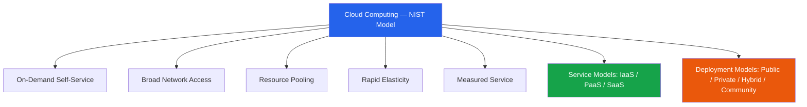

**DevOps/SRE Example:** During a Black Friday sale, an SRE team's Kubernetes cluster on AWS EKS scales from 20 to 200 nodes automatically via Cluster Autoscaler — no ticket raised to AWS (self-service), billed per second of compute used (measured service), scaled back down at midnight (elasticity).

**Exam Strategy:**
- Quote the NIST definition, then immediately list all 5 characteristics by name — this alone secures most of the marks.
- Draw the characteristics + service model + deployment model diagram.
- End with one differentiator line: "Unlike traditional data centers, cloud billing is consumption-based, not capacity-based."

---

### 2. Virtualization Fundamentals

**In plain words:**
One physical server is powerful enough to run many "virtual" computers at once. A software layer called a **hypervisor** sits between the hardware and these virtual computers, tricking each one into thinking it has its own dedicated CPU, RAM, and disk — when really they're all sharing one machine. This is *the* foundational technology that makes cloud computing possible: without virtualization, a provider would need one physical machine per customer, which is not economically viable.

**Formal definition:**
Virtualization is the abstraction of physical computing resources (CPU, memory, storage, network) into logical, software-defined instances through a hypervisor, enabling multiple isolated virtual machines (VMs) to run concurrently on one physical host.

**How it actually works:**
- **Type 1 (bare-metal) hypervisor** — installed directly on the hardware, no host OS underneath (VMware ESXi, Microsoft Hyper-V, Xen, AWS Nitro). This is what real cloud data centers use because it's faster and has a smaller attack surface — there's no general-purpose OS to compromise.
- **Type 2 (hosted) hypervisor** — installed on top of a normal OS like Windows or macOS (VMware Workstation, Oracle VirtualBox). Used for personal/dev use, not production clouds, because the extra OS layer adds overhead and attack surface.
- Each VM gets a **virtual CPU, virtual disk, virtual NIC** — the hypervisor schedules real CPU cycles among all the VMs (like an OS scheduling processes, but one level up).
- **Containers vs VMs (exam favorite comparison):** A VM virtualizes the entire hardware stack, including its own kernel — heavy but fully isolated. A container (Docker) shares the host machine's kernel and only isolates the process using Linux namespaces and cgroups — lightweight, starts in milliseconds, but weaker isolation than a VM because a kernel-level bug can affect all containers on that host.

**Diagram:**
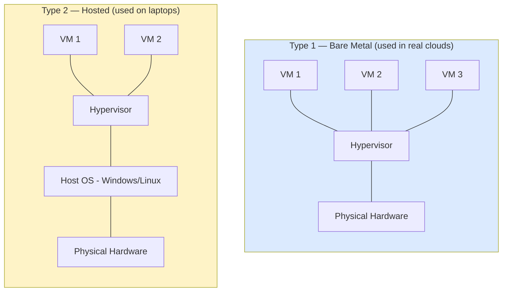

**DevOps/SRE Example:** AWS EC2 instances run on the **Nitro Hypervisor**, a lightweight, KVM-derived Type-1 hypervisor that offloads networking and storage virtualization to dedicated hardware chips (Nitro Cards). This shrinks the hypervisor's own software surface, meaning fewer things an attacker can exploit to "break out" of one customer's VM into another's.

**Exam Strategy:**
- Define virtualization, then immediately classify Type 1 vs Type 2 — this split is almost guaranteed as a 2-mark sub-part.
- Use the exact terms "hardware abstraction layer" and "guest OS isolation."
- If the question mentions "modern" or "cloud-native" virtualization, add the container vs VM comparison — this is a bonus-mark differentiator most students skip.

---

### 3. Cloud Service Models — IaaS, PaaS, SaaS

**In plain words:**
Think of it like getting food:
- **IaaS** = you rent a fully equipped kitchen (stove, fridge, gas) and cook whatever you want yourself. Maximum flexibility, maximum responsibility.
- **PaaS** = you go to a shared cooking studio — they give you the kitchen *and* pre-set recipes/tools ready to use; you just bring your ingredients (your code).
- **SaaS** = you order food from a restaurant — fully cooked, you just eat it. You don't manage anything except your own order.

**Formal definition:**
- **IaaS:** Provides virtualized compute, storage, and network over the internet; the consumer manages the OS, middleware, runtime, and application (e.g., AWS EC2, Azure VMs, Google Compute Engine).
- **PaaS:** Provides a managed platform (OS, runtime, middleware) for deploying applications; the consumer only manages application code and data (e.g., AWS Elastic Beanstalk, Azure App Service, Google App Engine, Heroku).
- **SaaS:** Delivers a complete, ready-to-use application over the internet; the consumer only manages their own data/config (e.g., Salesforce, Gmail/Google Workspace, Microsoft 365).

**How it actually works — why the layered matrix matters:**
Every cloud stack has 10 layers, from the physical data center at the bottom to the application at the top. What changes between IaaS/PaaS/SaaS is simply *where the line is drawn* between "provider manages this" and "you manage this." As you move from IaaS → PaaS → SaaS, the line moves upward: you give up control over more layers, but in exchange the provider takes on more operational burden (patching, scaling, uptime). This trade-off (**control vs. convenience**) is the single most important idea examiners want you to state explicitly.

**Diagram:**
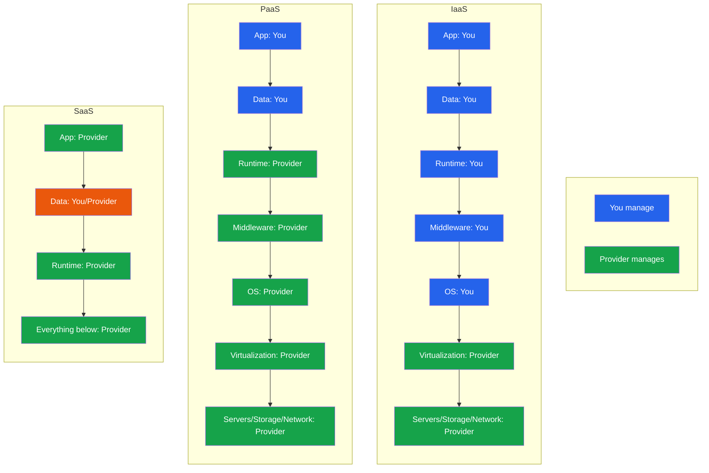

**DevOps/SRE Example:** A trading engine that needs kernel-level tuning runs on **IaaS** (EC2 with custom AMIs). Internal microservices that just need to run code without server management use **PaaS** (Elastic Beanstalk/Cloud Run). Monitoring/alerting is bought as **SaaS** (Datadog, PagerDuty) — zero infrastructure to manage at all.

**Exam Strategy:**
- Draw the 10-layer responsibility matrix — it is the single highest-yield diagram in this whole unit and reappears in the Shared Responsibility Model question too.
- Give one named commercial example per model — never leave a model without a real product name.
- State the trade-off sentence explicitly: "As you move IaaS → PaaS → SaaS, control decreases but so does operational burden."

---

### 4. Shared Responsibility Model

**In plain words:**
The cloud provider secures the *building* (physical servers, the hypervisor, the network backbone). You are responsible for securing *what you put inside the building* (your data, your app code, your access permissions, your firewall rules). If your house gets robbed because you left the door unlocked, you can't blame the security guard downstairs — same logic applies in cloud breaches.

**Formal definition:**
The Shared Responsibility Model divides security obligations between the Cloud Service Provider (CSP) — responsible for **"security OF the cloud"** (physical infrastructure, hypervisor, host OS, global network) — and the customer — responsible for **"security IN the cloud"** (guest OS, application, identity, data, and network configuration like security groups). The exact boundary shifts depending on the service model.

**How it actually works:**
- In **IaaS**, you (the customer) manage almost everything above the hypervisor: OS patches, firewall rules, IAM, application security. The provider only guarantees the hardware/hypervisor/physical layer works and is physically secure.
- In **PaaS**, the provider also takes over OS and middleware patching — you only worry about your application code and how you configure access to it.
- In **SaaS**, the provider manages nearly everything except your own user accounts, data classification, and how you configure sharing/permissions within the app.
- **Key exam trap:** most real-world breaches (Capital One, misconfigured S3 buckets) are NOT because AWS/Azure's infrastructure was hacked — they are because the *customer* misconfigured their side of the line. This is the whole point examiners are testing: can you tell the difference between a provider failure and a customer failure?

**Diagram:**
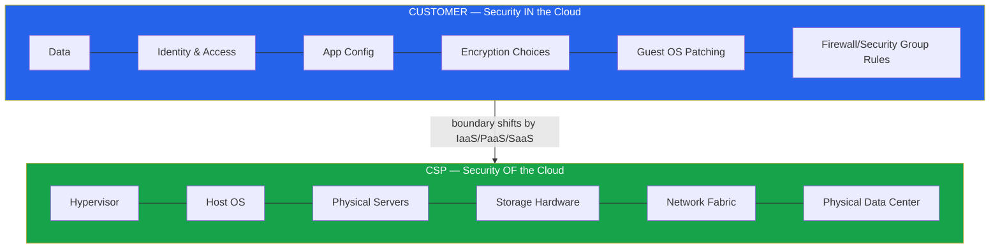

**DevOps/SRE Example:** In the **2019 Capital One breach**, AWS's physical/hypervisor layer was never compromised — the failure was Capital One's misconfigured Web Application Firewall IAM role, which had excessive permissions and was exploited via SSRF (Server-Side Request Forgery) to steal credentials. This is the textbook case of a "security IN the cloud" failure despite a fully secure CSP layer.

**Exam Strategy:**
- Use the exact AWS-coined phrase: **"security OF the cloud" vs "security IN the cloud"** — examiners specifically scan for this.
- State that the boundary moves upward as you go IaaS → PaaS → SaaS (link back to topic 3's matrix for cross-topic marks).
- Cite the Capital One case correctly attributing fault to the customer, not AWS.

---

### 5. Cloud Security Principles

**In plain words:**
These are the "rules of thumb" every secure cloud design follows — the same way a building follows fire-safety codes. You don't need every rule to remember every detail; you need to know **what each rule protects against**.

**Formal definition:**
Cloud security principles are foundational tenets guiding secure architecture design: the **CIA Triad** (Confidentiality, Integrity, Availability), extended with **Least Privilege, Defense in Depth, Zero Trust, Secure by Design, Fail Securely,** and **Economy of Mechanism.**

**How it actually works — each principle explained:**
- **Confidentiality** — only authorized people/systems can read the data (enforced via encryption + access control).
- **Integrity** — data can't be silently changed/corrupted without detection (enforced via hashing, checksums, digital signatures).
- **Availability** — systems stay up and reachable when needed (enforced via redundancy, auto-scaling, DDoS protection).
- **Least Privilege** — give every user/service the *minimum* permission needed, nothing more (e.g., a monitoring service should never have delete permissions on a database).
- **Defense in Depth** — stack multiple independent layers of security (firewall + IAM + encryption + monitoring) so that if one layer fails, others still protect you. Never rely on a single control.
- **Zero Trust** — "never trust, always verify." Don't assume something is safe just because it's inside your network perimeter; every request is authenticated and authorized regardless of location.
- **Secure by Design** — security is built in from day one of architecture, not bolted on afterward as a patch.
- **Fail Securely** — if a system crashes or errors out, it should default to *denying* access, not granting it.
- **Economy of Mechanism** — keep security designs as simple as possible; complexity is the enemy of security because it hides bugs and misconfigurations.

**Diagram:**
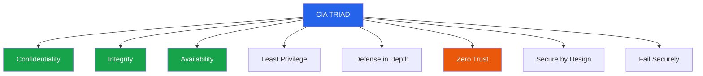

**DevOps/SRE Example:** An SRE enforces **Zero Trust** between internal microservices using mutual TLS (mTLS) via an Istio service mesh — no service is trusted just because it's inside the VPC. Combined with **least-privilege** IAM roles per microservice (no wildcard `*` permissions), confidentiality and integrity hold even if the network perimeter defense fails (**defense in depth**).

**Exam Strategy:**
- Always start with the CIA Triad — non-negotiable in any "security principles" answer.
- Name least privilege, defense in depth, and zero trust explicitly with a one-line definition each.
- Close with: "These principles are operationalized through IAM policies, encryption, and network segmentation" — this bridges nicely into later topics.

---

### 6. Secure Isolation

**In plain words:**
Because cloud providers put many different customers' workloads on the *same* physical machines (multi-tenancy), there needs to be a hard wall so that Customer A can never see, touch, or slow down Customer B's data or workload — even though they're technically "roommates" on the same hardware.

**Formal definition:**
Secure isolation is the set of mechanisms ensuring that multiple tenants sharing the same physical cloud infrastructure cannot access, infer, or interfere with each other's data or workloads. It is enforced at the **compute** (hypervisor/VM), **network** (VPC/VLAN/micro-segmentation), and **storage** (logical partitioning/encryption-key separation) layers.

**How it actually works:**
- **Compute isolation:** the hypervisor enforces that VM A's memory and CPU cycles are never directly accessible to VM B. If this fails, it's called a **VM escape** (topic 11).
- **Network isolation:** each tenant gets its own logically separate network (a VPC, or in Kubernetes, a Namespace + NetworkPolicy) so traffic can't cross tenant boundaries unless explicitly allowed.
- **Storage isolation:** even if two tenants' data physically sits on the same disk array, each tenant's data is encrypted with a *different* key, and logical partitioning ensures one tenant's storage API calls can never return another tenant's data.
- **Why this matters (the "noisy neighbor" problem):** without good isolation, one tenant's heavy CPU/disk usage could slow down another tenant sharing the same host — this is a *performance* isolation failure, distinct from a *security* isolation failure, and examiners like when you mention both.

**Diagram:**
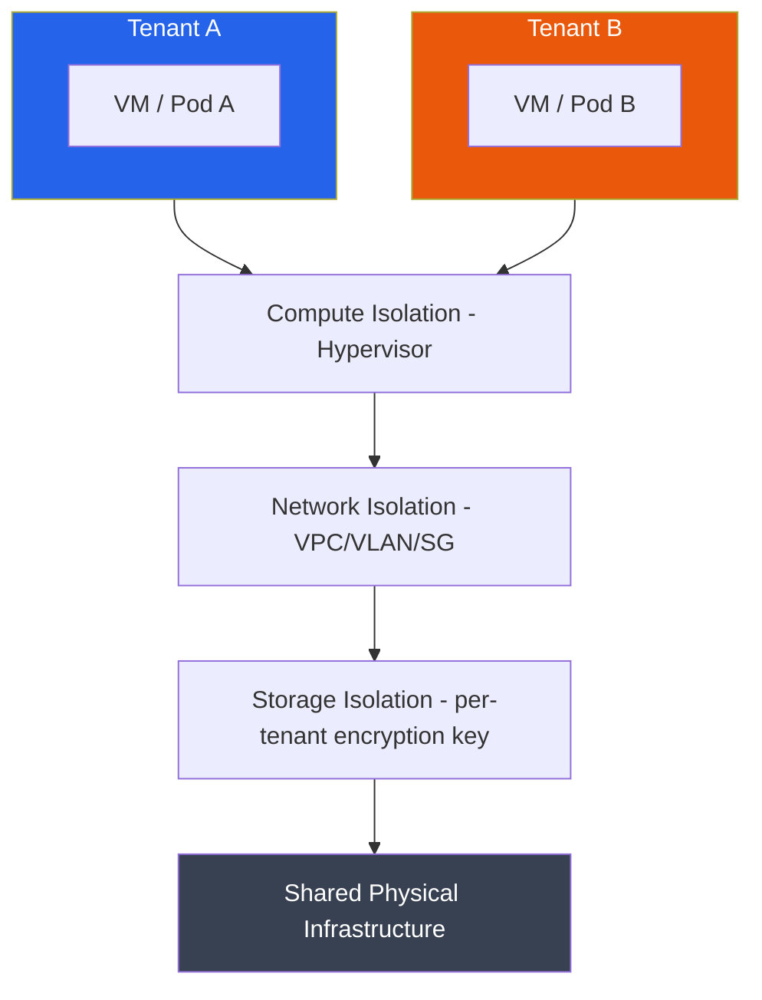

**DevOps/SRE Example:** A multi-tenant SaaS platform running Kubernetes enforces isolation using **Namespaces + NetworkPolicies** (network isolation) plus **per-tenant KMS-encrypted PersistentVolumes** (storage isolation) — a compromised pod in Tenant A's namespace still cannot reach Tenant B's services, even though both share the same physical nodes.

**Exam Strategy:**
- Say the word "multi-tenancy" explicitly as the root cause — examiners scan for it.
- List all three isolation layers (compute, network, storage) — an answer naming only one loses marks.
- Mention "noisy neighbor" and "VM escape" as the two consequences of isolation *failure*.

---

### 7. Comprehensive Data Protection

**In plain words:**
This is the "big umbrella" topic — it's not one single control, it's the *combination* of everything (encryption, access control, monitoring, backups) working together so that data is protected no matter what state it's in or what stage of its life it's at.

**Formal definition:**
Comprehensive data protection is a holistic strategy safeguarding data confidentiality, integrity, and availability across its entire lifecycle and across all states (rest, transit, use), combining encryption, access control, tokenization, masking, backup/DR, and monitoring into a unified defense-in-depth posture.

**How it actually works — the 5 layers stacked together:**
1. **Governance layer** — classify data, set policy, map to compliance requirements (what rules apply to this data?).
2. **Access control layer** — IAM, RBAC/ABAC, MFA (who is allowed to touch it?).
3. **Cryptographic layer** — encrypt at rest, in transit, and in use (even if someone gets in, can they read it?).
4. **Monitoring layer** — DLP, SIEM, audit logging, anomaly detection (can we detect misuse as it happens?).
5. **Resilience layer** — backup, replication, disaster recovery (if something goes wrong, can we recover it?).

This is why "comprehensive" is the key word — a company that only encrypts data but has no access control, or has great access control but no backups, is not comprehensively protected. Examiners want you to show that data protection is a *layered, continuous* process, not a single checkbox.

**Diagram:**
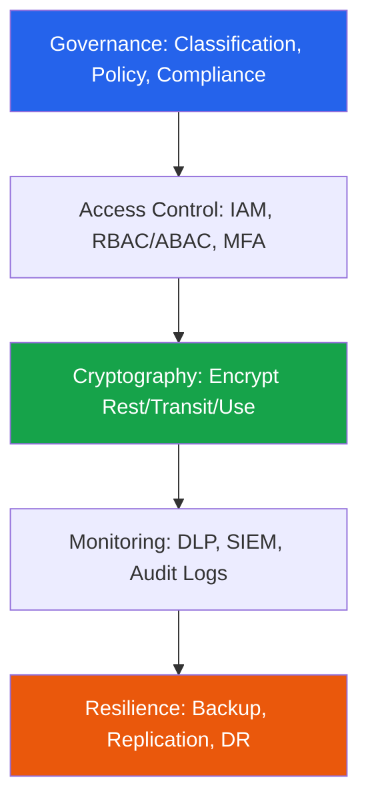

**DevOps/SRE Example:** A fintech pipeline encrypts S3 buckets with SSE-KMS (rest), enforces TLS 1.3 on all load balancer listeners (transit), processes card data inside AWS Nitro Enclaves (use), and ships CloudTrail logs to Splunk (SIEM) for continuous monitoring — hitting every layer of the stack.

**Exam Strategy:**
- Present the 5-layer stack diagram — this question is essentially "summarize what's coming later," so keep it high-level here and save deep detail for the Data States/DLP questions specifically.
- Explicitly name all three data states even in this summary answer.
- Use the word "continuous" — examiners reward lifecycle language over one-time/static language.

---

### 8. End-to-End Access Control

**In plain words:**
Security is only as strong as its weakest link. It's not enough to have a strong password at login if, once inside, anyone can call any API or query any database table freely. End-to-end means *every single hop* — from the user's login screen all the way down to the database row — checks identity and permission.

**Formal definition:**
End-to-end access control is the enforcement of consistent identity verification and authorization policies across every layer of the cloud stack — from user login through API gateway, application, and down to the data layer — ensuring no single unguarded entry point permits unauthorized access.

**How it actually works — the chain, hop by hop:**
1. User logs in → MFA/SSO verifies identity.
2. Request hits the API Gateway → OAuth2/JWT token is validated.
3. Request travels between internal microservices → mTLS in a service mesh ensures even internal traffic is authenticated.
4. Request reaches the specific microservice → RBAC check decides if this identity's role permits this action.
5. Request reaches the database → row-level security further restricts *which rows* this identity can see (e.g., a tenant can only see their own rows).
6. Every single hop above logs an audit event — so if something goes wrong, you can trace exactly where.

The exam trap here: students often think "access control" = login only. The whole point of this topic is that a single unguarded hop (e.g., a database with no row-level security) breaks the entire chain, no matter how strong the login was.

**Diagram:**
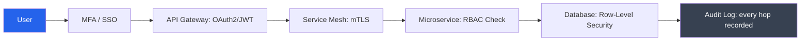

**DevOps/SRE Example:** An internal admin portal uses Okta SSO+MFA at login, short-lived JWTs validated at a Kong API Gateway, mTLS between microservices in an Istio mesh, and PostgreSQL row-level security scoping every query to the authenticated tenant's ID — with every hop emitting an event to CloudWatch.

**Exam Strategy:**
- Draw the full request chain — examiners want to see you understand access control spans the *entire* path, not just login.
- Use the phrase "least privilege enforced at every layer."
- Mention audit logging as the mechanism that *proves* end-to-end control is actually working.

---

### 9. CASB (Cloud Access Security Broker)

**In plain words:**
Imagine your company's IT security team can't see or control what happens once an employee opens Salesforce or Dropbox in their browser — that's a blind spot. A CASB sits in the middle, like a security checkpoint between your employees and any cloud app they use, giving your company visibility and control it wouldn't otherwise have.

**Formal definition:**
A CASB is a security policy enforcement point, deployed on-premises or in the cloud, positioned between cloud service consumers and cloud service providers, that enforces enterprise security policy as cloud resources are accessed. CASBs deliver four pillars: **Visibility, Compliance, Data Security, and Threat Protection.**

**How it actually works — the four pillars, explained:**
- **Visibility** — discovers *all* cloud app usage, including "Shadow IT" (apps employees use without IT's knowledge/approval, e.g., someone using their personal Dropbox for work files).
- **Compliance** — checks whether cloud app usage meets regulatory requirements (e.g., is customer PII being uploaded somewhere that violates GDPR?).
- **Data Security** — applies DLP policies to stop sensitive data from leaving through cloud apps (e.g., blocking upload of a file containing credit card numbers to an unsanctioned app).
- **Threat Protection** — detects abnormal behavior (e.g., a login from an impossible location, a sudden mass file download) that suggests a compromised account.

**Three deployment modes:**
- **Forward proxy** — sits between the user and the internet, inspecting outbound traffic in real time (needs an agent/config on user devices).
- **Reverse proxy** — sits between the internet and the cloud app, requiring no device agent, good for unmanaged/BYOD devices.
- **API-based (out-of-band)** — connects directly to the cloud app's API (e.g., Office 365 API) to scan data at rest and after the fact — doesn't inspect traffic in real time but has zero performance impact.

**Diagram:**
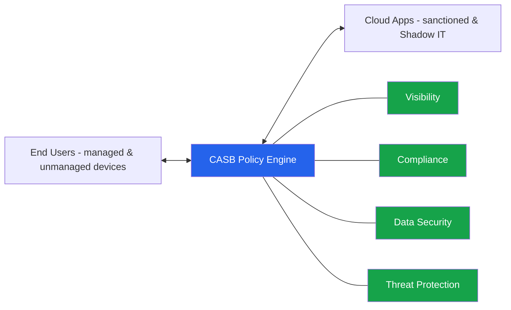

**DevOps/SRE Example:** A security team deploys Microsoft Defender for Cloud Apps (a CASB) in **API mode** to continuously scan Office 365/SharePoint for exposed sensitive files, detect Shadow IT via firewall log ingestion, and automatically quarantine files with PII uploaded outside sanctioned channels.

**Exam Strategy:**
- Always list the four pillars by name — this is the single highest-yield fact for CASB questions.
- Describe all three deployment modes in one line each.
- Mention "Shadow IT discovery" as CASB's most cited real-world use case.

---

### 10. Cloud Breach Case Studies

**In plain words:**
Real breaches are studied because they teach the same lesson over and over: it's almost never the cloud provider's fault — it's a misconfiguration, a leaked credential, or a badly-secured API on the *customer's* side.

**Formal definition:**
Cloud breach case studies are documented real-world incidents analyzed to extract root causes and lessons, typically classified as: **misconfiguration, credential compromise, insecure API, insider threat,** or **supply-chain compromise.**

**How it actually works — walk through the canonical case:**
**Capital One (2019):** A misconfigured Web Application Firewall had an IAM role with excessive permissions (including access to the EC2 instance metadata service). An attacker used **SSRF** (tricking the server into making a request on the attacker's behalf) to query that metadata endpoint and steal temporary IAM credentials. With those credentials, they queried S3 and exfiltrated 100+ million customer records.
- **Root cause:** over-permissioned IAM role.
- **Attack chain:** SSRF → metadata endpoint → stolen temporary credentials → S3 data theft.
- **Remediation:** enforce **IMDSv2** (which requires a session token to query metadata, blocking simple SSRF), apply least-privilege IAM, and harden WAF rules.

**Other examples worth naming:** Uber (2016) — AWS credentials hardcoded in a public GitHub repo, exploited to access customer data (credential compromise). SolarWinds/Codecov — attackers compromised a trusted software supply chain to distribute malicious updates (supply-chain compromise).

**Diagram:**
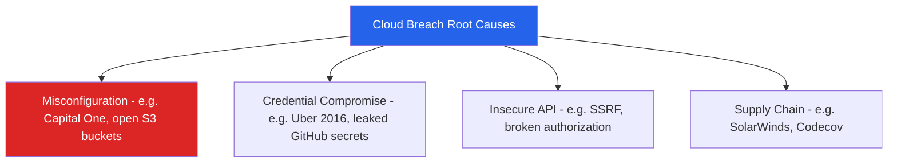

**Exam Strategy:**
- Structure every case-study answer as: **Incident → Root Cause → Attack Chain → Remediation.** This four-part structure is exactly what graders rubric for.
- Name at least two case studies to show breadth (Capital One + Uber is a safe combo).
- Tie remediation to a *named* control (IMDSv2, least privilege, secrets manager) — vague answers like "improve security" score poorly.

---

### 11. Virtualization Security Issues

**In plain words:**
Since many customers share the same physical hardware via virtualization, new attack types become possible that don't exist on a single dedicated machine — an attacker who compromises one VM might try to "jump" to the hypervisor or spy on a neighboring VM.

**Formal definition:**
Virtualization security issues are vulnerabilities from hypervisor-mediated resource sharing among VMs, including **VM escape** (breaking out of a VM to reach the hypervisor/host), **hyperjacking** (installing a rogue hypervisor beneath the legitimate one), **VM sprawl** (uncontrolled proliferation of unmanaged VMs), **side-channel attacks** (inferring data from a co-resident VM via shared hardware, e.g., cache-timing), and **stale snapshot/image vulnerabilities** (unpatched golden images being reused).

**How it actually works — each threat, one line each:**
- **VM escape** — the worst-case scenario: malicious code inside a VM exploits a hypervisor bug to gain control of the host, potentially affecting every other VM on that host.
- **Hyperjacking** — an attacker installs their own malicious hypervisor "beneath" the legitimate one, giving them invisible control over everything above it (rare, but catastrophic).
- **VM sprawl** — over time, teams spin up VMs and forget to decommission them; these forgotten VMs often run outdated, unpatched software and become easy attack entry points, and they also waste cost.
- **Side-channel attacks** — even without breaking isolation directly, an attacker VM can sometimes infer secrets (like encryption keys) from a neighboring VM by measuring shared CPU cache timing patterns (this is exactly what Spectre/Meltdown exploited).
- **Stale images** — if your "golden image" (template used to create new VMs) isn't rebuilt regularly, every new VM launched from it inherits old, unpatched vulnerabilities.

**Diagram:**
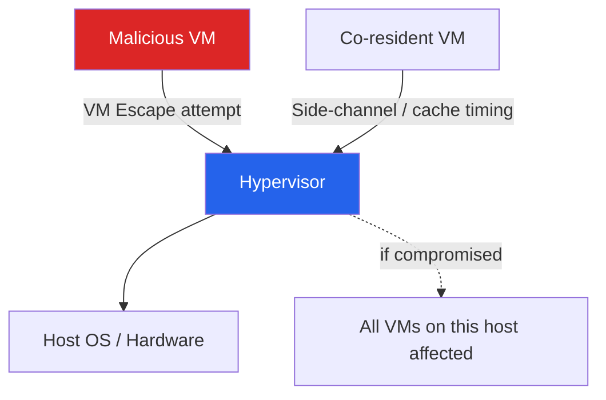

**DevOps/SRE Example:** After the Spectre/Meltdown disclosures, SRE teams applied hypervisor microcode patches, enabled **KPTI** (Kernel Page Table Isolation) on host kernels, and scheduled weekly golden-AMI rebuilds via Packer + CI to eliminate stale images and reduce VM sprawl.

**Exam Strategy:**
- List all five issue types by name — "discuss virtualization security issues" questions expect the full list, not just one or two.
- Use the Spectre/Meltdown example — it's the most commonly referenced side-channel case in Indian university syllabi.
- Give at least one mitigation per issue class to show applied understanding, not just definitions.

---

### 12. Migration Risk Assessment Methodologies   - Star

**In plain words:**
Before moving anything to the cloud, you need to figure out what could go wrong and how to handle each system — some things can be moved as-is, some need rework, and some shouldn't be moved at all yet.

**Formal definition:**
Migration risk assessment is a structured methodology for evaluating and mitigating risks (technical, security, compliance, operational, financial) before moving workloads to the cloud, commonly following the **6 R's of Migration** combined with a risk register mapping likelihood × impact per workload.

**How it actually works — the 6 R's, explained:**
1. **Rehost** ("lift and shift") — move the app as-is to the cloud, minimal changes. Fast, but doesn't take advantage of cloud-native features.
2. **Replatform** ("lift, tinker, and shift") — make small optimizations during the move (e.g., switch to a managed database) without a full rewrite.
3. **Repurchase** — drop the old app and buy a SaaS replacement (e.g., replace an on-prem CRM with Salesforce).
4. **Refactor/Re-architect** — rebuild the app to be truly cloud-native (microservices, serverless). Most effort, most long-term benefit.
5. **Retire** — decommission the app because it's no longer needed.
6. **Retain** — keep the app on-prem for now (often due to compliance/data residency/technical constraints).

The risk assessment process itself: **Discovery & Inventory** (what do we have?) → **Dependency Mapping** (what talks to what?) → **Risk Categorization** (score each system by likelihood × impact) → **Choose an R strategy per workload** → **Pilot migration** → **Validate security/compliance** → **Full migration** → **Post-migration audit.**

**Diagram:**
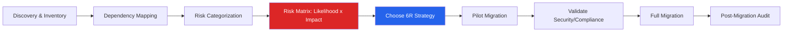

**DevOps/SRE Example:** Before migrating a monolithic ERP, an SRE team runs AWS Application Discovery Service to map dependencies, classifies the database tier as high-risk (compliance impact) and chooses "Retain" temporarily, while stateless web tiers are "Rehosted" via lift-and-shift — each decision logged in a risk register reviewed by a Change Advisory Board.

**Exam Strategy:**
- Name all 6 R's explicitly and in the right order — this is a guaranteed direct-recall question.
- Mention "risk register" and "likelihood × impact matrix" as formal risk-management vocabulary.
- Link back to the Shared Responsibility Model: misjudging the *new* responsibility boundary after migration is itself a top migration risk — this cross-linking earns extra credit.

---

### 13. OWASP Cloud Security Threats

**In plain words:**
OWASP is basically a community-maintained "most wanted list" of the most common ways applications and cloud systems get attacked. Knowing this list helps developers/SREs know what to test for before something bad happens.

**Formal definition:**
OWASP publishes threat taxonomies for cloud-native and infrastructure security, most notably the **OWASP Top 10** (application layer — e.g., Broken Access Control, Injection, Security Misconfiguration) and the **OWASP Cloud-Native Application Security Top 10**, covering insecure APIs, misconfigured storage, weak identity/credential management, and insecure serverless deployments.

**How it actually works — threats mapped by layer:**
- **Application layer:** Injection attacks, Broken Authorization, Insecure Deserialization.
- **API layer:** Broken Object-Level Authorization (one user can access another user's data by just changing an ID in the URL), Excessive Data Exposure (API returns more fields than the UI needs, leaking sensitive data).
- **Identity layer:** Weak/compromised credentials, excessive IAM permissions.
- **Config/Infra layer:** Security misconfiguration — the most common real-world cause (open S3 buckets, overly permissive security groups).
- **Serverless layer:** Insecure function permissions, event-injection attacks (malicious data injected via the event that triggers a serverless function).

**Diagram:**
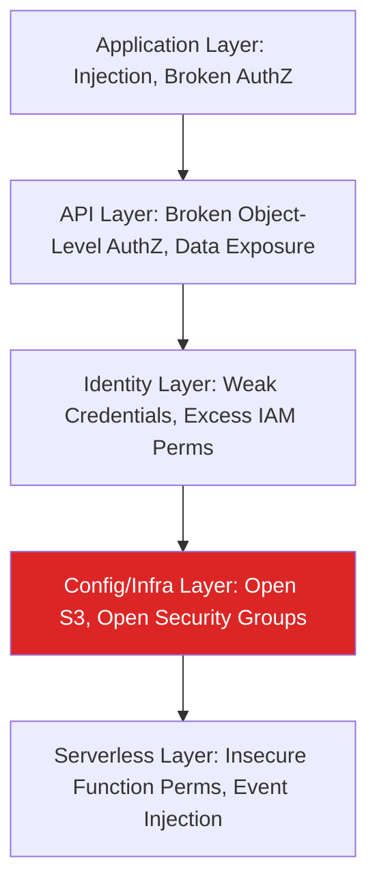

**DevOps/SRE Example:** A CI/CD pipeline integrates **OWASP ZAP** to scan staging APIs for Broken Access Control before every release, while **tfsec/Checkov** statically scan Terraform code for OWASP-mapped misconfigurations (e.g., public S3 buckets) before merge — shifting security left in the pipeline.

**Exam Strategy:**
- Name the specific OWASP list relevant to the question (Top 10 for web apps vs Cloud-Native Top 10 for infrastructure) — conflating them loses precision marks.
- Cite at least three specific threat categories with a one-line explanation each.
- Mention "shift-left security" and a named tool (ZAP, tfsec, Checkov) — this combination is consistently rewarded.

---

## PART B — CLOUD INFRASTRUCTURE SECURITY

---

### 14. Access Control Requirements

**In plain words:**
Before you can even talk about "who can access what," you need a clear set of rules defining what "properly controlled access" even means. These rules are the foundation everything else (AuthN, AuthZ, IAM policies) is built on.

**Formal definition:**
Access control requirements define the policies and mechanisms ensuring only authenticated, authorized entities perform specific actions on cloud resources, grounded in **least privilege, need-to-know, separation of duties,** and **default-deny.**

**How it actually works — the four requirement types:**
- **Identity requirement** — who is making this request? (must be verifiable, not assumed)
- **Policy requirement** — what is this identity allowed to do? (explicitly defined, not implied)
- **Context requirement** — from where, when, and what device is the request coming? (e.g., block access attempts from unusual countries or after-hours)
- **Audit requirement** — was the action logged? (every access decision must be traceable after the fact)

**Separation of duties** is worth explaining separately: no single person should have end-to-end control over a sensitive process (e.g., the person who writes deployment code shouldn't also be the only approver who can push it to production) — this prevents both fraud and accidental catastrophic mistakes.

**Diagram:**
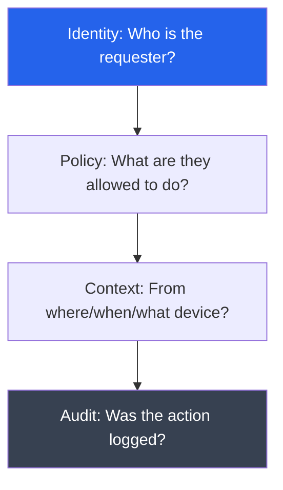

**DevOps/SRE Example:** An IAM policy grants a CI/CD deployment role `s3:PutObject` only on a specific bucket prefix, restricted to requests from the CI/CD VPC (`aws:SourceVpc` condition), with every API call logged to CloudTrail — satisfying identity, policy, context, and audit requirements at once.

**Exam Strategy:**
- Use the four keywords: least privilege, need-to-know, separation of duties, default-deny.
- Give a concrete IAM policy/condition example — graders reward seeing "how," not just "what."
- Mention access recertification (periodic review of who has access) — access control is continuous, not a one-time setup.

---

### 15. Authentication (AuthN) vs. Authorization (AuthZ)

**In plain words:**
Authentication answers **"who are you?"** Authorization answers **"what are you allowed to do?"** These are two completely separate steps that always happen in that order — you can't authorize someone whose identity you haven't first verified.

**Formal definition:**
**Authentication (AuthN)** verifies the identity of a user, system, or service (via credentials, MFA, certificates). **Authorization (AuthZ)** determines what an authenticated identity is permitted to do, enforced via **RBAC** (Role-Based Access Control) or **ABAC** (Attribute-Based Access Control).

**How it actually works:**
- AuthN produces a proof of identity — typically a signed token (e.g., a JWT) after checking username/password + MFA, or a client certificate.
- AuthZ then reads that identity's role/attributes and checks it against a policy — **RBAC** assigns permissions to *roles* (e.g., "admin", "viewer") and users are placed into roles; **ABAC** is more fine-grained, granting/denying based on *attributes* (department, time of day, resource tag) rather than a fixed role, making it more flexible for complex, dynamic rules.
- Common mistake to avoid in the exam: saying "authorization checks the password" — passwords belong entirely to authentication, never authorization.

**Diagram:**
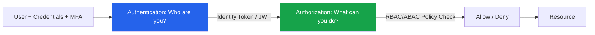

**DevOps/SRE Example:** In an OAuth2/OIDC flow, Keycloak authenticates a user via SSO+MFA and issues a signed JWT (AuthN). The API Gateway then checks the JWT's `roles` claim against an RBAC policy — e.g., `role:deployer` can trigger deployments but cannot delete production databases (AuthZ).

**Exam Strategy:**
- State the one-line distinction clearly: "AuthN = identity verification; AuthZ = permission enforcement."
- Name RBAC and ABAC explicitly with one distinguishing example each.
- Mention that AuthN always precedes AuthZ — sequencing shows conceptual clarity, and examiners specifically test whether students confuse the order.

---

### 16. Cloud Configuration Management

**In plain words:**
Most cloud breaches happen not because of some genius hacker, but because someone left a setting wrong — a storage bucket set to "public" by mistake, a firewall rule too open. Configuration management is about defining the *correct* settings once, in code, and continuously making sure nothing has drifted away from that correct state.

**Formal definition:**
Cloud configuration management is the practice of defining, deploying, and continuously enforcing the desired-state configuration of cloud resources using Infrastructure as Code (IaC) — preventing configuration drift and manual, error-prone changes.

**How it actually works:**
1. Desired state is written as code (Terraform, CloudFormation, ARM templates) — not clicked manually in a console.
2. Every change goes through a CI/CD pipeline: `plan` (preview the change) → policy-as-code check (e.g., Open Policy Agent blocking a rule that would create a public bucket) → `apply`.
3. **Configuration drift detection** continuously compares what's actually deployed against what the code says it should be — if someone manually changes a setting in the console (bypassing the pipeline), drift is detected.
4. The system either **auto-remediates** the drift (reverts it automatically) or alerts a human, depending on severity.

**Diagram:**
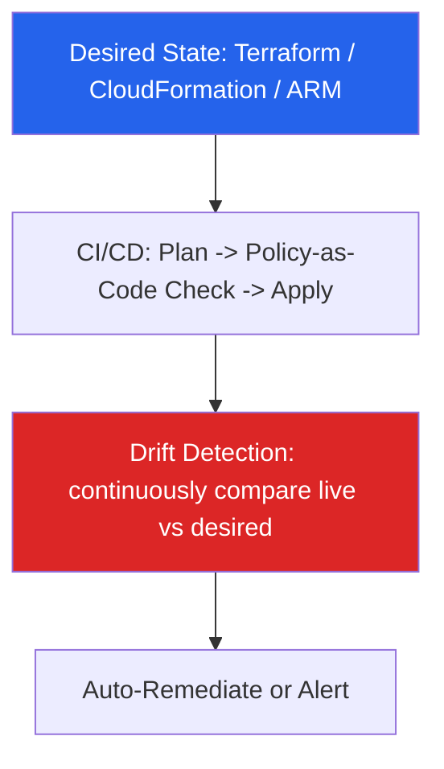

**DevOps/SRE Example:** All VPC, IAM, and EC2 configuration is defined in Terraform modules in Git. Every pull request triggers `terraform plan` plus an Open Policy Agent (OPA) check that blocks merges creating a public S3 bucket. AWS Config continuously monitors deployed resources and auto-remediates any manually-introduced open security group rule.

**Exam Strategy:**
- Name Infrastructure as Code (IaC) explicitly and at least one tool.
- Use the term "configuration drift" — the single most-scanned keyword for this topic.
- Reference a policy-as-code tool (OPA, Sentinel, AWS Config Rules) to show enforcement, not just definition.

---

### 17. Patch Management

**In plain words:**
Software has bugs, and some bugs are security holes. Patch management is the disciplined process of finding those holes and closing them quickly — without breaking or taking down the running system in the process.

**Formal definition:**
Patch management in the cloud is the systematic process of identifying, testing, and deploying software updates across cloud infrastructure and applications to remediate known vulnerabilities, minimizing exposure windows while maintaining availability.

**How it actually works — the lifecycle:**
1. **Scan** — continuously check systems against CVE (Common Vulnerabilities and Exposures) feeds.
2. **Prioritize** — score each vulnerability using CVSS (Common Vulnerability Scoring System, 0–10); critical ones (9.0+) get fixed fastest.
3. **Test** — apply the patch in a staging environment first to catch any breakage.
4. **Deploy** — roll it out using zero-downtime strategies: **rolling deployment** (replace instances a few at a time) or **blue-green deployment** (spin up a fully patched fleet, cut traffic over, then remove the old fleet) — never patch by simply taking the whole system offline.
5. **Verify & report** — confirm the patch applied correctly and didn't break anything, then loop back to step 1.

**Diagram:**
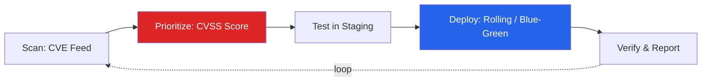

**DevOps/SRE Example:** AWS Systems Manager Patch Manager scans EC2 fleets nightly against the CVE database, applies critical (CVSS ≥ 9.0) patches within a 24-hour SLA using rolling, zero-downtime deployment across an Auto Scaling Group, while lower-severity patches follow a weekly maintenance window.

**Exam Strategy:**
- Structure the answer around the lifecycle: identify → prioritize (CVSS) → test → deploy → verify.
- Mention zero-downtime strategies (rolling, blue-green) as the DevOps-specific improvement over traditional patch management.
- Name a real automation tool (AWS SSM Patch Manager, Azure Update Management).

---

### 18. Cloud Change Management

**In plain words:**
Any change to production — a new feature, a config tweak, a scaling rule — is risky if done carelessly. Change management is the formal process ensuring changes are reviewed, approved, and reversible before they hit production.

**Formal definition:**
Cloud change management is a formal, governed process for proposing, reviewing, approving, and tracking changes to cloud infrastructure and applications, typically implemented via a **Change Advisory Board (CAB)** and enforced through **GitOps/CI-CD approval gates.**

**How it actually works:**
1. A **Request for Change (RFC)** is raised describing what's changing and why.
2. **Risk/impact assessment** — how bad is it if this goes wrong, and how likely is that?
3. **CAB approval** — a group reviews and signs off (in modern DevOps, this is often replaced by required pull-request approvals + automated checks).
4. Change is deployed in a **scheduled window** via CI/CD.
5. **Post-implementation review** — did it work as expected?
6. **Rollback plan** — if it failed, how do we revert quickly? This step is mandatory, not optional — an answer that skips it typically loses marks.

**Diagram:**
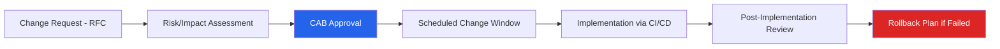

**DevOps/SRE Example:** With GitOps (ArgoCD), every infrastructure change is a pull request requiring two approvals plus an automated policy check; merges trigger automatic deployment, every change is tagged with a ticket ID, and an automated rollback (`git revert`) triggers if post-deploy health checks fail.

**Exam Strategy:**
- Mention RFC and CAB by name — the standard ITIL-aligned vocabulary examiners expect.
- Contrast slow, manual, ITIL-style change management with modern GitOps/pull-request-based automation.
- Always include a rollback/contingency step — omitting it is a very common and easily avoidable mark loss.

---

### 19. Cloud Infrastructure Auditing

**In plain words:**
Auditing is proving, with evidence, that everything was configured and accessed the way it was supposed to be. It's the "paper trail" that lets you answer "who did what, when, and was it allowed?" after the fact — critical for both security investigations and compliance certifications.

**Formal definition:**
Cloud infrastructure auditing is the continuous or periodic examination of cloud resource configurations, access logs, and API activity against security baselines, compliance standards, and organizational policy, to detect anomalies, policy violations, and unauthorized changes.

**How it actually works:**
1. Every API call/console action is logged (AWS CloudTrail, Azure Activity Log).
2. Logs are aggregated into a central SIEM (Security Information and Event Management) system for correlation and search.
3. A compliance rule engine (AWS Config, Azure Policy) continuously checks resource configurations against a benchmark (e.g., CIS AWS Foundations Benchmark).
4. Logs must be **immutable** (write-once, e.g., S3 Object Lock) — if an attacker could edit the audit log after the fact, the whole audit trail becomes worthless as evidence.

**Diagram:**
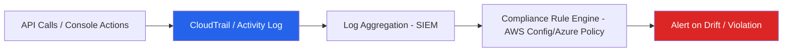

**DevOps/SRE Example:** All CloudTrail logs are shipped to a centralized S3 bucket with Object Lock (immutability), ingested into Splunk for SIEM correlation, and audited using AWS Config conformance packs against the CIS AWS Foundations Benchmark — automatically opening a Jira ticket when a resource drifts out of compliance.

**Exam Strategy:**
- Name a specific audit trail service (CloudTrail for AWS, Activity Log for Azure) — vague "logging" answers lose specificity marks.
- Mention a compliance benchmark (CIS Benchmark) as what's being audited against.
- Emphasize log immutability — a frequently-tested integrity control.

---

### 20. Platform Implementations — AWS (VPC, EC2) vs. Azure (ARM, NSG)

**In plain words:**
AWS and Azure use different names for very similar building blocks. If you learn the mapping between their terms, you can answer questions about either platform (or compare them) without memorizing everything twice.

**Formal definition:**
- **AWS VPC (Virtual Private Cloud):** a logically isolated virtual network within AWS, with subnets, route tables, security groups (stateful, instance-level firewall) and NACLs (stateless, subnet-level firewall).
- **AWS EC2:** AWS's core IaaS compute service providing resizable virtual server instances.
- **Azure ARM (Azure Resource Manager):** Azure's deployment/management layer providing a consistent template-based model (ARM templates/Bicep) for provisioning resources into Resource Groups.
- **Azure NSG (Network Security Group):** Azure's stateful, rule-based firewall filtering traffic at the subnet/NIC level (functionally equivalent to an AWS Security Group).

**How it actually works — the term-mapping table (memorize this):**

| AWS Term | Azure Term | What it does |
|---|---|---|
| VPC | Virtual Network (VNet) | Isolated virtual network |
| Security Group (stateful) | NSG (stateful) | Instance/NIC-level firewall |
| NACL (stateless) | (no direct equivalent — subnet-level rules via NSG) | Subnet-level firewall |
| EC2 | Virtual Machine (VM) | Compute instance |
| IAM | Azure AD / RBAC | Identity & access management |
| CloudFormation | ARM Templates / Bicep | Infrastructure as Code |

**Stateful vs stateless (common trap question):** A **stateful** firewall (Security Group/NSG) automatically allows return traffic for a connection you initiated — you only need to write the inbound rule once. A **stateless** firewall (NACL) evaluates every packet independently, so you must write rules for *both* inbound and outbound traffic explicitly.

**Diagram:**
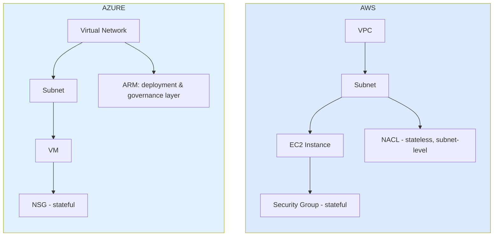

**DevOps/SRE Example:** An SRE provisions a 3-tier AWS VPC (public subnet for ALB, private subnets for app/DB) via Terraform, with Security Groups allowing port 443 only from the ALB, and NACLs blocking known malicious CIDR ranges at the subnet boundary. The Azure equivalent uses ARM/Bicep to define a Resource Group with a matching VNet, NSGs replicating the SG rules, and Azure Policy enforcing that no NSG rule permits inbound 0.0.0.0/0 on port 22.

**Exam Strategy:**
- Always present the term-mapping table — it's the highest-yield content for platform questions.
- Explicitly distinguish stateful (SG/NSG) vs stateless (NACL) — a very common trap.
- Draw the 3-tier subnet diagram for at least one platform to show applied architecture knowledge.

---

## PART C — DATA PROTECTION

---

### 21. Securing Data at Rest, in Transit, and in Use

**In plain words:**
Data isn't always in the same "state" — sometimes it's sitting on a disk doing nothing, sometimes it's traveling across a network, and sometimes it's actively being computed on in memory. Each state needs a *different* kind of protection, because the threats are different.

**Formal definition:**
- **Data at Rest:** stored on persistent media (disks, databases, object storage) — protected via encryption (AES-256) and access controls.
- **Data in Transit:** actively moving across networks — protected via transport encryption (TLS 1.2/1.3, IPsec, VPN).
- **Data in Use:** actively being processed in memory/CPU — protected via confidential computing (secure enclaves, homomorphic encryption, memory encryption).

**How it actually works — why "data in use" is the hardest and most forgotten one:**
Encrypting data at rest and in transit is now standard practice everywhere. But the moment data needs to be *processed* (e.g., a database engine running a query on it), it traditionally has to be decrypted first, sitting as plaintext in RAM — this is a real gap, because a privileged insider or a memory-scraping malware could read it right there. **Confidential computing** solves this using hardware-based **secure enclaves** (e.g., Intel SGX, AWS Nitro Enclaves) — an isolated, encrypted region of memory that even the cloud provider's own privileged admin cannot inspect. This is why "data in use" protection is the newest and most advanced of the three, and examiners specifically check whether students remember it (most forget it and only mention rest + transit).

| State | Main Threat | Named Technology |
|---|---|---|
| At Rest | Disk theft, unauthorized DB access | AES-256, KMS, tokenization |
| In Transit | Eavesdropping, Man-in-the-Middle | TLS 1.2/1.3, IPsec, mTLS, VPN |
| In Use | Memory scraping, privileged insider access, cold-boot attacks | Secure enclaves (SGX/Nitro Enclaves), homomorphic encryption |

**Diagram:**
```mermaid
flowchart LR
    R[At Rest: Disk/DB/Object Storage] -->|AES-256 + KMS| RE[Encrypted]
    T[In Transit: Network] -->|TLS 1.3 / IPsec / mTLS| TE[Encrypted]
    U[In Use: Memory/CPU] -->|Secure Enclaves / Homomorphic Enc| UE[Protected]
    style R fill:#2563eb,color:#fff
    style T fill:#16a34a,color:#fff
    style U fill:#ea580c,color:#fff
```

**DevOps/SRE Example:** A payments platform encrypts RDS storage with KMS-managed keys (rest), enforces TLS 1.3-only on all ALB listeners with HSTS (transit), and processes card-tokenization logic inside AWS Nitro Enclaves so even privileged EC2 host operators cannot inspect plaintext card data in memory (use).

**Exam Strategy:**
- Cover all three states — omitting "in use" is the single most common mark loss on this topic.
- Name a specific technology per state, not a generic word like "encryption."
- Draw the state-threat-control table — it directly mirrors most mark schemes.

---

### 22. Data/Information Lifecycle & Governance

**In plain words:**
Data isn't protected only "at one point in time" — it needs protection from the moment it's created until the moment it's permanently destroyed. Each stage of its life needs its own controls.

**Formal definition:**
Data lifecycle management is the governance framework overseeing data from creation through disposal, comprising: **Create → Store → Use → Share → Archive → Destroy**, with governance policies (ownership, stewardship, retention, quality) enforced at every stage.

**How it actually works — each stage, one control each:**
1. **Create** — classify the data immediately on ingest (is this public, confidential, restricted?).
2. **Store** — encrypt at rest.
3. **Use** — apply access control (only the right people/services can touch it).
4. **Share** — apply DLP/access control on export or sharing outside the org.
5. **Archive** — move to cheaper, cold storage tiers (e.g., Glacier) once it's no longer actively needed but must be retained.
6. **Destroy** — securely delete or **crypto-shred** (destroy the encryption key so the data becomes permanently unreadable, even though the encrypted bytes may still physically exist on disk) once the retention period ends.

**Diagram:**
```mermaid
flowchart LR
    C[Create: Classify on ingest] --> S[Store: Encrypt at rest]
    S --> U[Use: Access Control]
    U --> SH[Share: DLP/Access Control]
    SH --> A[Archive: cold-tier storage]
    A --> D[Destroy: secure deletion / crypto-shred]
    style C fill:#2563eb,color:#fff
    style D fill:#dc2626,color:#fff
```

**DevOps/SRE Example:** A data pipeline auto-classifies newly ingested customer records via AWS Macie (Create), stores them encrypted in S3 with lifecycle policies transitioning to Glacier after 90 days (Archive), applies IAM/DLP controls restricting export (Use/Share), and enforces a 7-year retention policy after which a Lambda function crypto-shreds the KMS key, permanently rendering the data unreadable (Destroy).

**Exam Strategy:**
- Name all six lifecycle stages explicitly, in the correct order — sequencing is directly graded.
- Attach one governance control to each stage rather than describing stages in isolation.
- Mention "crypto-shredding" as the modern cloud-native equivalent of physical destruction — a distinctive, high-value keyword.

---

### 23. Data Classification

**In plain words:**
Not all data deserves the same level of protection — encrypting a public marketing brochure with the same intensity as customer credit card numbers would waste effort. Classification tells you how much protection each piece of data actually needs.

**Formal definition:**
Data classification is the process of categorizing data based on sensitivity, value, and regulatory requirements — typically into tiers: **Public, Internal, Confidential,** and **Restricted/Highly Confidential** — to determine appropriate handling and protection controls.

| Tier | Example | Control Level |
|---|---|---|
| Public | Marketing materials | None/minimal |
| Internal | Internal wikis, memos | Employee-only access |
| Confidential | Financial reports, contracts | Encryption + RBAC |
| Restricted | PII, PHI, PCI card data | Encryption + strict RBAC + DLP + audit + MFA |

**Diagram:**
```mermaid
flowchart TB
    P[Public: minimal control] --> I[Internal: employee-only]
    I --> C[Confidential: encryption + RBAC]
    C --> R[Restricted: encryption + RBAC + DLP + MFA + audit]
    style P fill:#16a34a,color:#fff
    style R fill:#dc2626,color:#fff
```

**DevOps/SRE Example:** AWS Macie automatically scans and tags S3 objects containing PII/PCI patterns as "Restricted," triggering a bucket policy that enforces encryption, blocks public access, and restricts access to a specific IAM role group — while "Public" tier static website assets remain in an open, CDN-fronted bucket.

**Exam Strategy:**
- List all four classification tiers by name with one example each — this is the expected minimum for full marks.
- Map each tier to a distinct control level, showing "classification drives control."
- Mention automated classification tools (AWS Macie, Azure Information Protection) to show real DevOps application, not manual tagging.

---

### 24. Data Residency Concepts

**In plain words:**
Some countries legally require that certain data physically stay within their borders. This directly constrains where you're allowed to run your cloud infrastructure and how you replicate data across regions.

**Formal definition:**
Data residency refers to the physical/geographic location where data is stored and processed, governed by legal/regulatory requirements (e.g., GDPR) that may mandate data remain within specific national or regional boundaries — distinct from **data sovereignty** (data is subject to the laws of the country it's located in) and **data localization** (a legal mandate requiring data to be stored within a specific jurisdiction).

**How it actually works — the three terms, disambiguated (a very common exam trap):**
- **Residency** = a policy/business choice about *where* data physically sits.
- **Sovereignty** = the *legal principle* that data is governed by the laws of whatever country it physically sits in, regardless of who owns it.
- **Localization** = a *hard legal mandate* (not just a choice) forcing certain data types to stay within a country's borders.

**Diagram:**
```mermaid
flowchart LR
    EU[User Request - EU] --> EUR[eu-west-1 Region: stored & processed here, GDPR compliant]
    IN[User Request - India] --> INR[ap-south-1 Region: stored & processed here, DPDP Act compliant]
    EUR -.blocked unless legally permitted.-> INR
    style EUR fill:#2563eb,color:#fff
    style INR fill:#16a34a,color:#fff
```

**DevOps/SRE Example:** An SRE team configures S3 bucket policies with an explicit `aws:RequestedRegion` condition denying writes outside `eu-west-1` for EU customer data, and uses AWS Organizations Service Control Policies (SCPs) to prevent any engineer from provisioning resources in non-approved regions — enforcing GDPR data residency technically, not just contractually.

**Exam Strategy:**
- Clearly differentiate residency, sovereignty, and localization — testing that distinction is a common exam trap.
- Name a specific regulation (GDPR) and region-pinning mechanism (SCPs, region-locked storage).
- Mention that residency requirements directly constrain architecture decisions (multi-region design, replication restrictions).

---

### 25. Compliance and Legal Requirements

**In plain words:**
Different industries have different legal rulebooks about how data must be handled. Cloud compliance means proving — with real technical controls and audits — that you're actually following those rules, not just claiming to.

**Formal definition:**
Cloud compliance is the adherence of cloud operations to applicable legal, regulatory, and industry standards — commonly **GDPR** (EU data protection), **HIPAA** (US healthcare data), **PCI-DSS** (payment card data), **SOC 2** (service organization controls), and **ISO/IEC 27001** (information security management) — enforced through technical controls, audits, and certifications.

| Domain | Regulation/Standard | Key Requirement |
|---|---|---|
| Personal Data (EU) | GDPR | Consent, right to erasure, Data Protection Officer |
| Healthcare (US) | HIPAA | PHI encryption, Business Associate Agreement with CSP |
| Payment Cards | PCI-DSS | Cardholder data encryption, network segmentation |
| Service Trust | SOC 2 | Security, availability, confidentiality controls |
| Info Security Mgmt | ISO/IEC 27001 | ISMS (Information Security Management System), risk treatment plan |

**Diagram:**
```mermaid
flowchart TB
    GDPR[GDPR - EU Personal Data] --> HIPAA[HIPAA - US Healthcare]
    HIPAA --> PCI[PCI-DSS - Payment Cards]
    PCI --> SOC[SOC 2 - Service Trust]
    SOC --> ISO[ISO 27001 - Info Security Mgmt]
    style GDPR fill:#2563eb,color:#fff
    style ISO fill:#16a34a,color:#fff
```

**DevOps/SRE Example:** A healthcare SaaS team signs a Business Associate Agreement (BAA) with AWS, encrypts all PHI using AWS KMS with automatic key rotation, isolates PHI-processing workloads in a dedicated VPC for PCI/HIPAA scope reduction, and produces automated compliance evidence via AWS Audit Manager for annual SOC 2 Type II audits.

**Exam Strategy:**
- Name at least three regulations/standards with their domain and one key requirement each — breadth is explicitly rewarded.
- Mention the shared-responsibility angle: the CSP provides compliant infrastructure options, but the customer must configure and use them compliantly (BAA, encryption enablement).
- Reference an automated compliance tool (AWS Audit Manager, Azure Compliance Manager).

---

### 26. Data Loss Prevention (DLP) Strategies

**In plain words:**
DLP is the "guard at the exit" — it watches for sensitive data trying to leave through any channel (email, USB, cloud upload) and blocks or flags it before it actually gets out.

**Formal definition:**
DLP is a set of tools and processes that detect and prevent unauthorized transmission, exfiltration, or exposure of sensitive data, operating across three enforcement points: **network DLP** (data in transit), **endpoint DLP** (data on devices), and **cloud/storage DLP** (data at rest in cloud repositories), using pattern matching, ML classification, and policy-based blocking/alerting.

**How it actually works:**
- **Endpoint DLP** — agents on laptops/devices block actions like copying a classified document to a USB drive or clipboard.
- **Network DLP** — a proxy/CASB inspects outbound traffic and blocks uploads of flagged content to unsanctioned destinations.
- **Cloud/Storage DLP** — continuously scans data already sitting in cloud storage (S3, Blob Storage) for sensitive patterns (e.g., AWS Macie, Microsoft Purview).
- All three feed into a **central policy engine** that detects sensitive content (via regex pattern matching, ML classification, or fingerprinting) and responds (block, quarantine, or alert).

**Diagram:**
```mermaid
flowchart TB
    E[Endpoint DLP: device agents, USB/clipboard blocking] --> PE[Central DLP Policy Engine]
    N[Network DLP: proxy/CASB inspecting egress] --> PE
    C[Cloud/Storage DLP: S3/Blob scanning - Macie/Purview] --> PE
    PE --> D[Detect: regex, ML, fingerprint]
    PE --> R[Respond: block, quarantine, alert]
    style PE fill:#2563eb,color:#fff
    style R fill:#dc2626,color:#fff
```

**DevOps/SRE Example:** AWS Macie continuously scans S3 buckets for PII patterns (credit card numbers, SSNs) using ML classification, integrated with a CASB (network DLP) that blocks unsanctioned uploads of flagged files to personal cloud storage, plus endpoint DLP agents blocking clipboard-copy of "Restricted" documents outside the corporate network — a full three-tier DLP strategy.

**Exam Strategy:**
- Name all three DLP enforcement points (endpoint, network, cloud/storage) — answers covering only one are marked incomplete.
- Mention both detection techniques (regex, ML, fingerprinting) and response actions (block, quarantine, alert) to show the full policy lifecycle.
- Cite a specific tool (AWS Macie, Microsoft Purview) to connect theory to an implementable product.

---

## PART D — MST-1 DIRECT ANSWER BANK

These are the exact topics your MST-1 is likely to ask. Each answer below is written the way you should reproduce it in the exam — plain enough to understand, structured enough to score full marks.

---

### Q1. Role of virtualization in cloud computing

Virtualization is the **enabling technology** of cloud computing — without it, cloud computing as we know it would not exist. It works by inserting a hypervisor between physical hardware and multiple virtual machines, letting one physical server be split into many independent-feeling virtual servers.

Its role can be broken into four concrete contributions:
1. **Resource pooling & multi-tenancy** — many customers can share the same physical hardware pool, which is what makes cloud economically viable (the provider doesn't need one machine per customer).
2. **Elasticity** — because VMs are just software definitions, they can be created, resized, or destroyed in minutes, enabling rapid scale-up/down.
3. **Isolation** — the hypervisor keeps each tenant's VM separate from others sharing the same host, which is the technical basis for secure multi-tenancy (see secure isolation, topic 6).
4. **Hardware abstraction** — customers don't need to know or care about the underlying physical hardware; the same VM image can run on any compatible physical host, enabling portability and standardization (e.g., golden AMIs).

**Diagram:**
```mermaid
flowchart TB
    V[Virtualization] --> RP[Resource Pooling: enables multi-tenancy]
    V --> EL[Elasticity: fast VM create/destroy]
    V --> IS[Isolation: tenants kept separate]
    V --> HA[Hardware Abstraction: VM portable across hosts]
    style V fill:#2563eb,color:#fff
```

**Answer structure for full marks:** Define virtualization (1 line) → state it's the foundational/enabling technology → give the four contributions above → one DevOps example (AWS Nitro Hypervisor enabling fast, secure EC2 provisioning).

---

### Q2. Differentiate between private and public cloud ownership

| Aspect | Public Cloud | Private Cloud |
|---|---|---|
| Ownership | Owned and operated by a third-party provider (AWS, Azure, GCP) | Owned/dedicated to a single organization (may be on-prem or hosted) |
| Tenancy | Multi-tenant — infrastructure shared across many customers | Single-tenant — infrastructure dedicated to one organization |
| Cost model | Pay-as-you-go, no upfront hardware cost | Higher upfront cost, but predictable at scale; sometimes hosted by a provider on dedicated hardware |
| Control | Less control over underlying infrastructure | Full/greater control over infrastructure and configuration |
| Security responsibility | Shared Responsibility Model applies — CSP secures the infrastructure, customer secures their side | Organization typically has full responsibility (or shares differently if privately hosted by a vendor) |
| Compliance/data residency | Can be harder for strict regulatory needs unless region-specific services are used | Easier to satisfy strict data residency/compliance needs |
| Typical use case | Startups, variable-workload apps, dev/test environments | Banks, government, healthcare — highly regulated or highly sensitive workloads |

**Diagram:**
```mermaid
flowchart LR
    subgraph Public["Public Cloud"]
    P1[Multi-tenant] --- P2[Provider-owned] --- P3[Pay-as-you-go]
    end
    subgraph Private["Private Cloud"]
    Q1[Single-tenant] --- Q2[Org-owned/dedicated] --- Q3[Higher control, higher cost]
    end
    style Public fill:#2563eb,color:#fff
    style Private fill:#ea580c,color:#fff
```

**Answer structure for full marks:** Draw the comparison table (examiners grade row-by-row) → mention that Hybrid cloud exists as a middle ground combining both → give one example each (AWS public cloud for a startup; a bank running a VMware-based private cloud for core banking).

---

### Q3. Security responsibilities of cloud providers and customers under Shared Responsibility

This is the Shared Responsibility Model (topic 4) — reproduce it directly:

- **Provider responsibility ("security OF the cloud"):** physical data center security, hypervisor security, host OS patching, physical network infrastructure, and the global backbone connecting regions.
- **Customer responsibility ("security IN the cloud"):** guest OS patching (for IaaS), application-level security, identity and access management (IAM), data encryption choices, network configuration (security groups/firewalls), and how the data is classified/shared.
- **The boundary shifts by service model:** in IaaS the customer manages more (OS upward); in PaaS the provider takes over OS/runtime, customer manages app+data; in SaaS the provider manages almost everything except the customer's own users/data/config.

**Concrete example to cite:** In the Capital One breach, AWS's infrastructure (its responsibility) was never compromised — the breach happened because Capital One (the customer) misconfigured an IAM role, which was their responsibility.

**Answer structure for full marks:** State the AWS-coined phrase "security OF the cloud vs security IN the cloud" → draw the split diagram (topic 4) → explicitly say the boundary shifts with IaaS/PaaS/SaaS → cite the Capital One example with correct fault attribution.

---

### Q4. Role of comprehensive data protection in securing cloud information

Comprehensive data protection matters because a single control is never enough — data can be attacked at any layer (network, storage, application, human error) and at any point in its life. Its role is to combine multiple layers so that a failure in one layer doesn't mean total compromise:
- It ensures data stays protected across **all three states** (rest, transit, use) — not just when convenient.
- It ensures data stays protected across its **entire lifecycle** (from creation to destruction), not just "while it's sitting in a database."
- It combines **governance** (classification/policy), **access control** (IAM/RBAC), **cryptography** (encryption), **monitoring** (DLP/SIEM), and **resilience** (backup/DR) — so a gap in one area (say, weak monitoring) doesn't undo the protection from another area (say, strong encryption).

**Why it matters practically:** most real breaches happen precisely where one of these layers was missing — e.g., data was encrypted at rest but access control was too permissive (Capital One), or backups existed but weren't tested and failed during a real disaster.

**Answer structure for full marks:** Define it → draw the 5-layer stack (topic 7) → explicitly state it must cover all 3 data states and the full lifecycle → give the fintech pipeline example.

---

### Q5. Role of secure isolation in protecting cloud-based resources

Secure isolation is what makes multi-tenancy (many customers sharing the same physical infrastructure) safe. Its role:
- **Prevents cross-tenant data leakage** — Tenant A can never read Tenant B's data, even though both share physical hardware.
- **Prevents cross-tenant interference** — a compromised or malicious tenant cannot use their access to disrupt or spy on another tenant's workload.
- **Limits blast radius** — if one tenant's VM/pod is compromised, isolation contains the damage to that tenant only, instead of it spreading across the shared infrastructure.
- It's enforced at three layers: **compute** (hypervisor separates VMs), **network** (VPC/VLAN/namespace segmentation), and **storage** (per-tenant encryption keys, logical partitioning).

**Why it matters practically:** without secure isolation, cloud computing's core economic model (sharing hardware across customers) would be too risky to use for sensitive workloads — isolation is literally what lets a bank and a random startup share the same data center safely.

**Answer structure for full marks:** Define secure isolation → state multi-tenancy as the root cause it addresses → list the three isolation layers → mention VM escape/noisy neighbor as failure consequences → give the Kubernetes namespace example.

---

### Q6. Security challenges associated with virtualization and their impact on cloud infrastructure protection

The core challenges (from topic 11), and specifically *why* they impact protection:
- **VM escape** — impact: a single hypervisor bug could compromise *every* VM on that host, not just one customer — this is the worst-case scenario because it breaks the entire isolation model cloud computing depends on.
- **Hyperjacking** — impact: an attacker gains invisible, persistent control below the OS layer, making detection extremely difficult since normal OS-level security tools can't see beneath the hypervisor.
- **VM sprawl** — impact: forgotten, unpatched VMs become easy entry points that security teams don't even know exist, expanding the attack surface silently over time.
- **Side-channel attacks** (e.g., Spectre/Meltdown) — impact: even *without* breaking isolation directly, an attacker can infer sensitive data (like cryptographic keys) from a neighboring VM purely by observing shared hardware behavior (cache timing) — meaning "isolation" isn't only about direct access, but also about preventing indirect inference.
- **Stale/unpatched images** — impact: every new VM launched from an outdated golden image inherits the same vulnerability, multiplying a single flaw across the whole fleet.

**Overall impact on cloud infrastructure protection:** these challenges mean that securing a single VM isn't enough — you must secure the hypervisor itself, control image/template hygiene, and actively patch against hardware-level flaws, which is a fundamentally different security model than protecting a traditional single-tenant physical server.

**Answer structure for full marks:** List all five issue types (this is what's explicitly graded) → for each, add one sentence on its *impact*, not just its definition → cite Spectre/Meltdown as the concrete real-world case → mention mitigations (KPTI, hypervisor patching, image rotation).

---

### Q7. Difference between IaaS and SaaS

| Aspect | IaaS | SaaS |
|---|---|---|
| What you get | Raw virtualized infrastructure (compute, storage, network) | A fully functional, ready-to-use application |
| What you manage | OS, runtime, middleware, application, data | Only your own data/user configuration |
| What the provider manages | Virtualization, servers, storage, networking, physical facility | Everything — app, runtime, OS, servers, storage, network |
| Flexibility | High — you can install/configure anything | Low — you use the app as designed by the vendor |
| Operational burden on customer | High — you patch/secure the OS and app yourself | Very low — vendor handles patching/scaling/uptime |
| Example | AWS EC2, Azure VMs | Salesforce, Gmail, Microsoft 365 |
| Best for | Custom workloads needing OS/kernel-level control | Standard business needs (email, CRM) where customization isn't needed |

**The one-line differentiator to always state:** "IaaS gives you the building blocks and maximum control but maximum responsibility; SaaS gives you a finished product with minimal control but minimal responsibility — they sit at opposite ends of the cloud service model spectrum."

**Answer structure for full marks:** Draw the comparison table → place both within the full IaaS/PaaS/SaaS responsibility matrix (topic 3) to show you understand where they sit relative to each other → give one named example per model → state the one-line differentiator above.

---

### Q8. Major security challenges associated with the cloud computing environment

Pull together the "big picture" challenges spanning this whole unit — a strong answer names several distinct categories, not just one:

1. **Multi-tenancy / isolation failure risk** — shared infrastructure means a breach of isolation (VM escape, side-channel attacks) can affect multiple customers at once.
2. **Misconfiguration** — the single most common real-world cause of cloud breaches (e.g., Capital One, open S3 buckets); the ease of self-service provisioning also makes it easy to misconfigure something without a second pair of eyes reviewing it.
3. **Identity and access management complexity** — cloud environments have far more identities (users, services, roles, API keys) than traditional on-prem systems, and over-permissioned IAM roles are a leading breach cause.
4. **Data protection across states and borders** — securing data at rest/in transit/in use, while also complying with data residency and cross-border legal requirements, adds complexity not present in a single physical data center.
5. **Insecure APIs** — cloud services are heavily API-driven; broken authorization or excessive data exposure in APIs (OWASP Cloud-Native Top 10) is a major attack surface.
6. **Shared Responsibility confusion** — customers often wrongly assume the provider secures everything, leaving their own side of the boundary unmanaged.
7. **Visibility and Shadow IT** — organizations often don't have full visibility into every cloud app employees use, creating ungoverned data-sharing risk (this is exactly the gap CASBs are built to close).
8. **Compliance across jurisdictions** — different regions/industries impose different legal requirements (GDPR, HIPAA, PCI-DSS), and cloud's distributed nature makes consistent compliance harder to guarantee.

**Answer structure for full marks:** Present this as a numbered list of distinct categories (graders reward breadth) → briefly explain *why* each is a challenge in one line → cite at least one real example (Capital One for misconfiguration) → close by stating that these challenges are why frameworks like the Shared Responsibility Model, CASB, and DLP exist — this ties your answer back to the rest of the syllabus and shows integrated understanding.

---

## FINAL EXAM CHECKLIST

```
[ ] CIA Triad + extended cloud security principles, in your own words
[ ] IaaS/PaaS/SaaS responsibility matrix — can redraw from memory
[ ] Shared Responsibility Model split (OF vs IN the cloud) — can redraw
[ ] Capital One breach: root cause -> attack chain -> remediation
[ ] All 6 R's of migration named, in order
[ ] CASB four pillars: Visibility, Compliance, Data Security, Threat Protection
[ ] AuthN vs AuthZ one-liner ready
[ ] AWS <-> Azure term mapping table (VPC/VNet, SG/NSG, EC2/VM)
[ ] All 3 data states (rest/transit/use) with a named technology per state
[ ] All 6 data lifecycle stages, in order
[ ] All 4 data classification tiers with examples
[ ] Residency vs Sovereignty vs Localization — clear distinction
[ ] 3-tier DLP architecture (endpoint/network/cloud) — can redraw
[ ] MST-1: all 8 targeted questions above rehearsed out loud at least once
```
