# Cloud Virtualization — Unit 1 (Deep-Dive Notes)
### Introduction to Virtualization, Server & Storage Virtualization — MCA Exam Prep

**How to use this document:** Every topic has five parts — **1. In plain words** — explained like a senior explaining it to a junior, no jargon-dump. **2. Formal definition** — the "textbook line" you write first in the exam so the examiner sees the keyword. **3. How it actually works** — the depth layer, so you understand it instead of memorizing it. **4. Diagram** — a Mermaid diagram you can redraw on paper in the exam. **5. Real-world/Enterprise example + Exam strategy** — a concrete scenario, plus how to structure the answer for marks.

This document covers the **full syllabus first, in syllabus order**, exactly as it appears in your Unit-1 table (Introduction to Virtualization, then Server & Storage Virtualization). Your teacher's IST-1 priority list is handled separately at the very end, in **PART D**, as a direct-answer bank — the same way the syllabus topics feed into it, nothing is skipped to make room for it.

---

## PART A — INTRODUCTION TO VIRTUALIZATION

---

### 1. Need for Virtualization

**In plain words:** Imagine you buy a powerful gaming PC just to check email on it — most of its power sits unused. That is exactly what happened in old data centers: each server ran one application and averaged only 10-15 percent CPU usage, while the company still paid full price for the whole machine, its power, its cooling, and the room it sat in. Virtualization exists to stop that waste.

**Formal definition:** The need for virtualization arises from chronic underutilization of physical servers in traditional data centers, where each application was deployed on a dedicated physical machine, resulting in wasted compute capacity, high capital expenditure, excessive power/cooling costs, and slow provisioning cycles.

**How it actually works:**
- Pre-virtualization, IT followed a "one app, one server" rule for reliability and simplicity — but this meant buying for peak load, which is rarely used.
- Idle capacity is not "saved" — a server running at 15 percent utilization still draws close to full power and still occupies a full rack slot.
- Virtualization lets multiple applications share one physical machine's spare capacity safely, since each gets its own isolated virtual machine instead of fighting for the same OS.
- This directly reduces the number of physical machines needed for the same total workload, which is the origin of every other virtualization benefit (cost, space, agility).

**Diagram:**
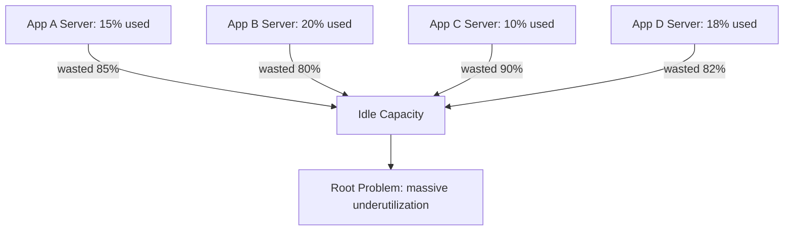

**Real-World Example:** A university data center runs 40 physical servers at ~12 percent average load, one application per box. After virtualizing with VMware ESXi, the same 40 workloads run as VMs across just 6 physical hosts — cutting hardware footprint by over 80 percent while raising average utilization to 60-70 percent.

**Exam Strategy:**
- Open with the utilization statistic (10-15 percent typical pre-virtualization CPU usage) — examiners look for this quantified justification.
- Link directly to the three consequences: cost, space, power/cooling.
- Close with the one-line root cause: virtualization decouples the logical workload from the physical machine.

---

### 2. Traditional IT Infrastructure and Shortcomings of Physical Infrastructure

**In plain words:** Before virtualization, IT infrastructure was rigid — every app was bolted directly to its own physical box, so if that box failed, broke, or ran out of capacity, you had a real, physical problem with no quick software fix.

**Formal definition:** Traditional IT infrastructure follows a "one application, one physical server" model, where hardware, OS, and application are tightly coupled. Its shortcomings include low resource utilization, high capital and operational expenditure, poor scalability, single points of failure with no workload portability, complex disaster recovery, and large physical footprint/power draw.

**How it actually works:**
- Tight coupling means the application's configuration, drivers, and sometimes licensing are tied to that exact physical hardware — moving it elsewhere is a manual reinstall, not a copy-paste.
- Scaling up means literally ordering new hardware and waiting weeks; scaling down means hardware sits wasted since it can't be repurposed instantly.
- No portability means a hardware failure equals application downtime until identical replacement hardware is sourced and rebuilt.
- Disaster recovery requires a second, matching physical site kept on standby — expensive and slow to fail over.

**Diagram:**
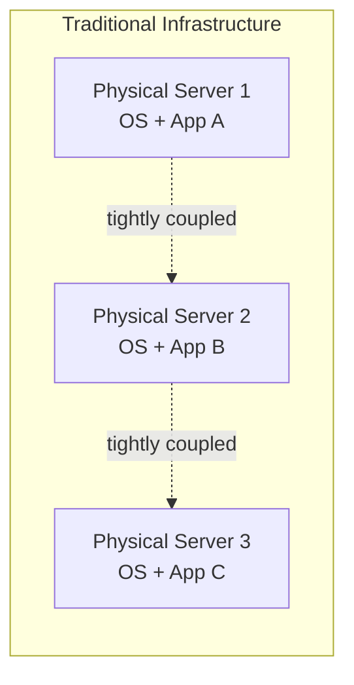

**Real-World Example:** A bank's legacy core-banking server suffers a motherboard failure. Because the application is tightly bound to that specific physical hardware (custom drivers, no abstraction layer), recovery requires sourcing an identical replacement and re-imaging it from scratch, causing hours of downtime — the exact scenario virtualization eliminates via VM portability and live migration.

**Exam Strategy:**
- List shortcomings as a clear enumerated set (utilization, cost, scalability, portability, DR complexity, footprint) — marks are awarded per correctly named shortcoming.
- Use the exact phrase "tight coupling of hardware and software" as the root architectural cause.
- Close with one sentence contrasting this with virtualization's decoupling, to set up topic 4.

---

### 3. Benefits of Virtualization

**In plain words:** Once you can run many virtual machines on one physical box, good things cascade: you need fewer machines (cheaper), you can spin up new environments in minutes instead of weeks (faster), and if a physical host has a problem, VMs can move to a healthy one without anyone noticing (more resilient).

**Formal definition:** Virtualization delivers measurable benefits across four dimensions: Consolidation (higher server utilization, fewer physical machines), Cost Reduction (lower CapEx/OpEx, reduced power and cooling), Agility (rapid provisioning, snapshots, cloning), and Resilience (live migration, high availability, simplified disaster recovery).

**How it actually works:**
- Consolidation is the direct fix to topic 1's problem — many VMs safely share one host's spare capacity.
- Cost reduction follows automatically from consolidation — fewer physical machines means less capital spend and lower power/cooling bills.
- Agility comes from VMs being pure software: cloning a "golden template" VM takes minutes versus weeks of hardware procurement.
- Resilience comes from decoupling the VM from any single physical host — if Host A fails, the VM (or its latest snapshot) can be started on Host B.

**Diagram:**
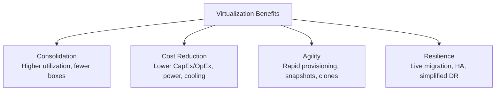

**Real-World Example:** An enterprise IT team clones a golden VM template to provision a new test environment in 5 minutes, instead of the 3-week hardware procurement cycle previously required — while consolidating 200 legacy servers onto 15 physical hosts and cutting the annual power bill by 60 percent.

**Exam Strategy:**
- Structure the answer strictly under the four named categories — this is the most-used official benefit taxonomy in university virtualization syllabi.
- Give one quantified or concrete example per category, not just abstract adjectives.
- Note this section directly feeds into topic 11 (Cost and Manageability Impact) — cross-reference it if asked together.

---

### 4. Comparison of Traditional IT Infrastructure with Virtualized Infrastructure

**In plain words:** This topic just asks you to put topics 2 and 3 side by side. Traditional infrastructure is rigid and 1:1; virtualized infrastructure is flexible and many:1, with a hypervisor doing the work of splitting one machine into many.

**Formal definition:** The comparison is best expressed across resource mapping, utilization, provisioning speed, scalability, and failure isolation, where virtualization introduces a hypervisor abstraction layer that decouples logical compute resources from underlying physical hardware.

**How it actually works — the exact contrast to reproduce:**

| Parameter | Traditional | Virtualized |
|---|---|---|
| Resource Mapping | 1:1 (OS/App to hardware) | Many:1 (many VMs to hardware) |
| Utilization | Low (10-15%) | High (60-80%) |
| Provisioning Speed | Days to weeks | Minutes |
| Scalability | Requires new hardware | Software-defined, elastic |
| Failure Isolation | Hardware failure = app down | VM migrates to healthy host |
| Portability | None — tied to physical box | High — snapshot/live migrate |

**Diagram:**
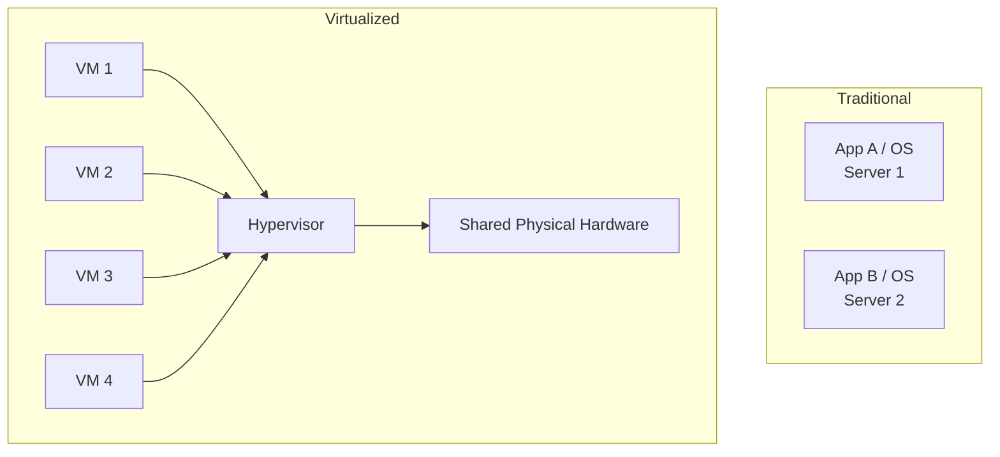

**Real-World Example:** During a disaster recovery drill, traditional infrastructure requires re-provisioning identical hardware and reinstalling the OS/app stack (hours to days) to recover a failed server. Virtualized infrastructure live-migrates or restores the same VM from a snapshot onto any compatible host in under 10 minutes using VMware vMotion or Hyper-V Live Migration.

**Exam Strategy:**
- Always answer with the side-by-side comparison table — tabular answers score higher than prose for "compare and contrast" questions.
- Explicitly name the hypervisor as the abstraction layer enabling the "many:1" resource mapping shift.
- Close with the business-impact line: "This shift converts IT infrastructure from a fixed capital cost model to a flexible, elastic operating model."

---

### 5. Implementing Virtualization — Server Stack and Logical Equivalence

**In plain words:** To virtualize a server, you slide a hypervisor between the hardware and the operating system. The OS running inside a VM still thinks it has its own dedicated CPU, RAM, disk, and network card — it just doesn't know those are actually "virtual" slices of a shared physical machine. That illusion is called logical equivalence.

**Formal definition:** Implementing virtualization involves inserting a hypervisor between the physical hardware and the operating system layer, creating a logical equivalence where each VM perceives dedicated virtual hardware (vCPU, vRAM, vNIC, virtual disk) that is, in reality, a software-abstracted slice of shared physical resources.

**How it actually works:**
- The physical stack is: Application → OS → Physical CPU/RAM/NIC/Disk → Physical Hardware.
- The virtualized stack becomes: Application → Guest OS → Virtual CPU/RAM/NIC/Disk → Hypervisor → Physical Hardware.
- Every physical resource (CPU cores, RAM, network bandwidth, disk blocks) gets a virtual counterpart that the hypervisor schedules and maps transparently.
- Transparency is the defining property: the guest OS runs unmodified and has no built-in awareness that it isn't on dedicated hardware.

**Diagram:**
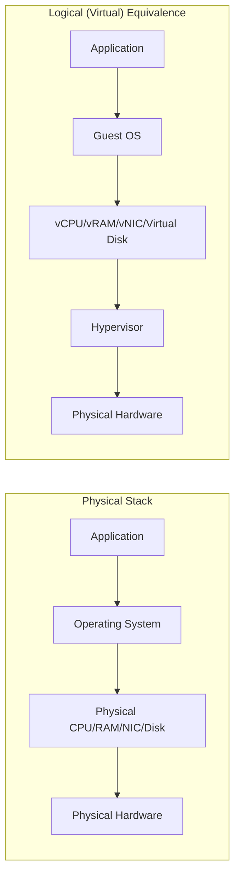

**Real-World Example:** A VM configured with 4 vCPUs and 16 GB vRAM on VMware ESXi is scheduled by the hypervisor across the physical host's actual 32-core CPU and 256 GB RAM pool, alongside dozens of other VMs — the guest OS has no awareness it is not running on dedicated physical hardware.

**Exam Strategy:**
- Draw the stack diagram showing physical-to-virtual mapping at each layer — this is the standard diagram expected for "implementing virtualization" questions.
- Use the precise term "logical equivalence" — it is the textbook keyword this topic is named after.
- Mention transparency (guest OS unaware of the abstraction) as the defining property of a correct implementation.

---

### 6. Pre-Virtualization and Post-Virtualization Server Stack

**In plain words:** This is the "before and after" picture. Before: one OS, one app, one server — no sharing possible. After: a hypervisor sits directly on the hardware, and multiple independent OS+app stacks run on top of it simultaneously, each unaware of the others.

**Formal definition:** The pre-virtualization server stack has the OS installed directly on physical hardware, with a single application per OS instance. The post-virtualization server stack inserts a hypervisor directly on the hardware (or on a host OS), allowing multiple independent guest OS/application stacks to run concurrently on the same physical server.

**How it actually works:**
- Pre-virtualization stack (bottom to top): Physical Hardware → Operating System → Application. Exactly one of each.
- Post-virtualization stack (bottom to top): Physical Hardware → Hypervisor → (Guest OS 1 + App 1), (Guest OS 2 + App 2), (Guest OS 3 + App 3) ... running in parallel.
- The architectural transition is specifically the insertion of the hypervisor layer, which converts a "1 App : 1 OS : 1 Server" ratio into an "N Apps : N OS : 1 Server" ratio.
- Each guest OS instance keeps its own independent patch cycle, reboot schedule, and lifecycle, isolated from its neighbors, despite sharing the same physical hardware underneath.

**Diagram:**
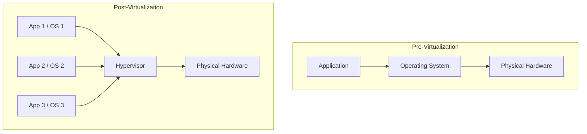

**Real-World Example:** A retail company's pre-virtualization stack ran Windows Server plus an inventory app directly on dedicated hardware. Post-virtualization, the same hardware runs Hyper-V hosting the inventory app VM alongside a separate finance-app VM and a reporting VM — each with independent OS instances and patch cycles, isolated from one another despite sharing hardware.

**Exam Strategy:**
- Answer this as an explicit "before/after" diagram — "architectural transition" means the examiner wants the shift illustrated, not just each state described in isolation.
- State clearly where the hypervisor is inserted in the stack — directly on hardware for Type 1, or on a host OS for Type 2 — this connects forward to topic 17.
- Emphasize independent lifecycle management (patch/reboot per VM) as the key operational payoff of the post-virtualization stack.

---

### 7. Types and Classification of Virtualization (Area-Based and Technology-Based)

**In plain words:** There are two completely different ways to slice up "types of virtualization." One asks "what part of IT is being virtualized?" (servers, storage, network, desktops, apps). The other asks "how is the virtualization technically achieved?" (full emulation, cooperative para-virtualization, shared-kernel containers, or CPU-hardware-assisted). You need both axes for a complete answer.

**Formal definition:** Virtualization is classified along two axes: Area-based classification — Server, Storage, Network, Desktop, and Application Virtualization — categorizing by which IT resource is being abstracted; and Technology-based classification — Full Virtualization, Para-Virtualization, OS-Level Virtualization (Containers), and Hardware-Assisted Virtualization — categorizing by the abstraction mechanism used.

**How it actually works — technology-based types, one line each:**
- **Full Virtualization** — hypervisor completely emulates hardware via binary translation; guest OS runs unmodified (e.g., VMware ESX classic mode).
- **Para-Virtualization** — guest OS is modified to issue "hypercalls" directly to the hypervisor instead of privileged instructions, trading compatibility for performance (e.g., Xen PV).
- **OS-Level Virtualization (Containers)** — a single kernel is shared and partitioned into isolated user-space instances using namespaces/cgroups; no separate guest OS (e.g., Docker, LXC).
- **Hardware-Assisted Virtualization** — CPU extensions (Intel VT-x/AMD-V) trap sensitive instructions directly in hardware, enabling unmodified guests at near-native speed (e.g., KVM).

**Diagram:**
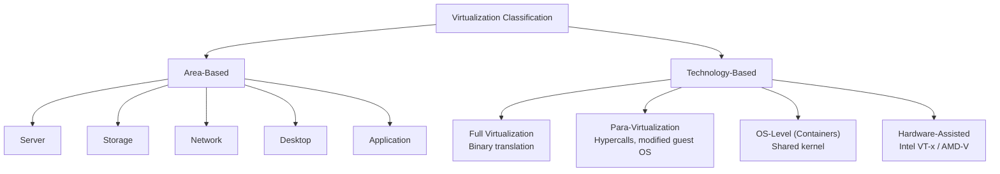

**Real-World Example:** An enterprise uses Server Virtualization (area-based) implemented via Hardware-Assisted Virtualization (technology-based, Intel VT-x) for its database tier, while its microservices platform uses OS-Level Virtualization via Docker containers for lightweight, fast-starting workloads — both classification axes applied side by side in one organization.

**Exam Strategy:**
- Always answer using BOTH axes; answering only one axis is the single most common mark loss on this question.
- Give one distinguishing technical detail per technology type (emulation vs cooperation vs shared kernel vs CPU extensions).
- Close by naming one product example per technology-based type — VMware ESX (full), Xen PV (para), Docker (OS-level), KVM (hardware-assisted).

---

### 8. History of Virtualization: Time-Sharing Systems

**In plain words:** Virtualization isn't a new cloud-era invention — it's over 60 years old. In the 1960s, mainframes were so expensive that IBM built time-sharing systems so multiple users could each believe they had their own dedicated machine while actually sharing one physical mainframe. That is literally the same idea as a modern EC2 instance, just decades earlier.

**Formal definition:** Virtualization traces its origin to 1960s IBM mainframe time-sharing systems, where a single expensive mainframe was partitioned to allow multiple users to run isolated batch jobs concurrently, giving each user the illusion of a dedicated machine — a concept (IBM CP-40/CP-67, leading to VM/370 in 1972) that is the direct historical ancestor of the modern hypervisor.

**How it actually works — the arc, explained:**
- 1960s: Mainframes cost millions; multiplexing one machine across many users was the only economical way to serve many researchers/departments.
- IBM CP-40/CP-67 (mid-to-late 1960s) pioneered running multiple isolated "virtual machines" on one physical mainframe — this is literally where the term "virtual machine" comes from.
- 1972: IBM formalized this into VM/370, the first fully mature commercial hypervisor product.
- 1980s-90s: cheap x86 hardware made "one app, one cheap server" affordable again, and virtualization interest declined.
- Late 1990s-2000s: server sprawl from too many cheap, underused x86 boxes revived the need, leading to VMware's founding (1998) and the modern virtualization renaissance.

**Diagram:**
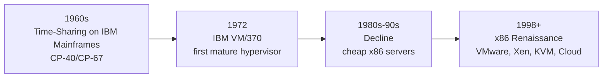

**Real-World Example:** IBM's CP-67/CMS system in the late 1960s let multiple researchers each believe they had their own dedicated System/360 mainframe, running isolated jobs simultaneously — the direct conceptual and terminological ("Virtual Machine") predecessor of today's cloud VM instances; an AWS EC2 instance is the modern-day equivalent of a CP-67 time-shared partition.

**Exam Strategy:**
- Always cite IBM CP-40/CP-67 and VM/370 by name with approximate dates (1960s origin, 1972 for VM/370) — named systems and dates are directly graded.
- Explain WHY time-sharing needed virtualization (expensive mainframes, maximize ROI) — this is the same root motivation as topic 1, a valuable cross-link.
- Mention the "decline and resurgence" arc through to VMware's 1998 founding to show the full historical picture, not just the origin point.

---

### 9. IBM Mainframe and PowerVM Virtualization

**In plain words:** IBM still runs virtualization at the very top end of enterprise computing today — not with generic x86 hypervisors, but with its own proprietary technology built for its own hardware. Mainframes use "LPARs" to split one machine into hardware-isolated partitions; POWER servers use "PowerVM," a hypervisor that can slice CPU allocation down to a tiny fraction of a single core.

**Formal definition:** IBM Mainframe virtualization (System z / z/VM) provides logical partitioning (LPAR), enabling a single physical mainframe to run multiple independent OS instances with hardware-enforced isolation. PowerVM is IBM's enterprise hypervisor for POWER architecture servers, providing micro-partitioning (sub-CPU-core allocation), Logical Partitions (LPARs), and a Virtual I/O Server (VIOS) for shared virtualized network/storage access across partitions.

**How it actually works:**
- LPAR (Logical Partition) — a hardware-enforced division of a mainframe/Power server into independent, isolated system instances, each capable of running its own OS.
- Micro-partitioning — PowerVM can allocate CPU in increments as small as 1/100th of a physical core, far finer-grained than typical x86 hypervisor scheduling.
- Dynamic LPAR (DLPAR) — CPU/memory can be reassigned between running partitions live, with zero downtime, to meet shifting workload demand.
- VIOS (Virtual I/O Server) — a special partition that owns the physical network/storage adapters and shares virtualized access to them across all other partitions, avoiding the need to dedicate physical adapters per partition.

**Diagram:**
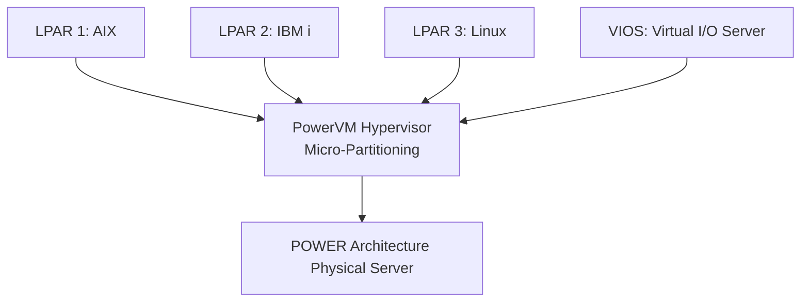

**Real-World Example:** A bank running mission-critical core-banking workloads on IBM Power servers uses PowerVM micro-partitioning to allocate as little as 0.1 of a physical CPU core to a low-demand LPAR, while Dynamic LPAR shifts additional capacity live into a high-demand AIX partition during month-end batch processing — and VIOS centralizes shared access to physical HBAs/NICs across all partitions.

**Exam Strategy:**
- Name LPAR, micro-partitioning, and VIOS explicitly — these three terms are PowerVM's signature vocabulary and are directly graded.
- Distinguish PowerVM (POWER architecture, IBM's proprietary enterprise hypervisor) from generic x86 hypervisors — examiners test whether students conflate the two.
- Mention that mainframe/Power LPAR isolation is hardware-enforced, historically stronger than typical x86 hypervisor software isolation — a nuance worth stating for higher marks.

---

### 10. Extending Virtualization to x86 and Its Hardware Support

**In plain words:** x86 chips (the kind in normal PCs and servers) were not originally designed to be virtualized safely — some privileged instructions misbehaved instead of politely notifying the hypervisor. Engineers first patched around this in software (clever but slow tricks), and eventually Intel and AMD redesigned the chips themselves to make virtualization a first-class, hardware-supported operation.

**Formal definition:** Extending virtualization to the x86 architecture was historically difficult because x86 was not classically virtualizable — certain privileged instructions failed silently instead of trapping to the hypervisor, per the Popek-Goldberg virtualization requirements. This was solved first via software techniques (binary translation, para-virtualization) and later via hardware-assisted virtualization extensions — Intel VT-x and AMD-V — which added a new CPU privilege level (root mode) to trap sensitive instructions natively.

**How it actually works — the three solution paths, in order of history:**
1. **Binary Translation (Full Virtualization)** — the hypervisor rewrites sensitive instructions on the fly before they execute, so an unmodified guest OS never actually issues the problematic instruction directly. Works with any guest OS, but adds translation overhead.
2. **Para-Virtualization** — the guest OS's source code is modified to issue "hypercalls" (direct, cooperative requests to the hypervisor) instead of the problematic privileged instructions. Faster than binary translation, but requires access to and modification of the guest OS source (Xen's original approach).
3. **Hardware-Assisted Virtualization (Intel VT-x / AMD-V)** — the CPU itself gains a new, more-privileged execution mode (often called "root mode" or "Ring -1"). Sensitive guest instructions are automatically trapped by the hardware and handed to the hypervisor — no binary translation and no guest OS modification needed.

**Diagram:**
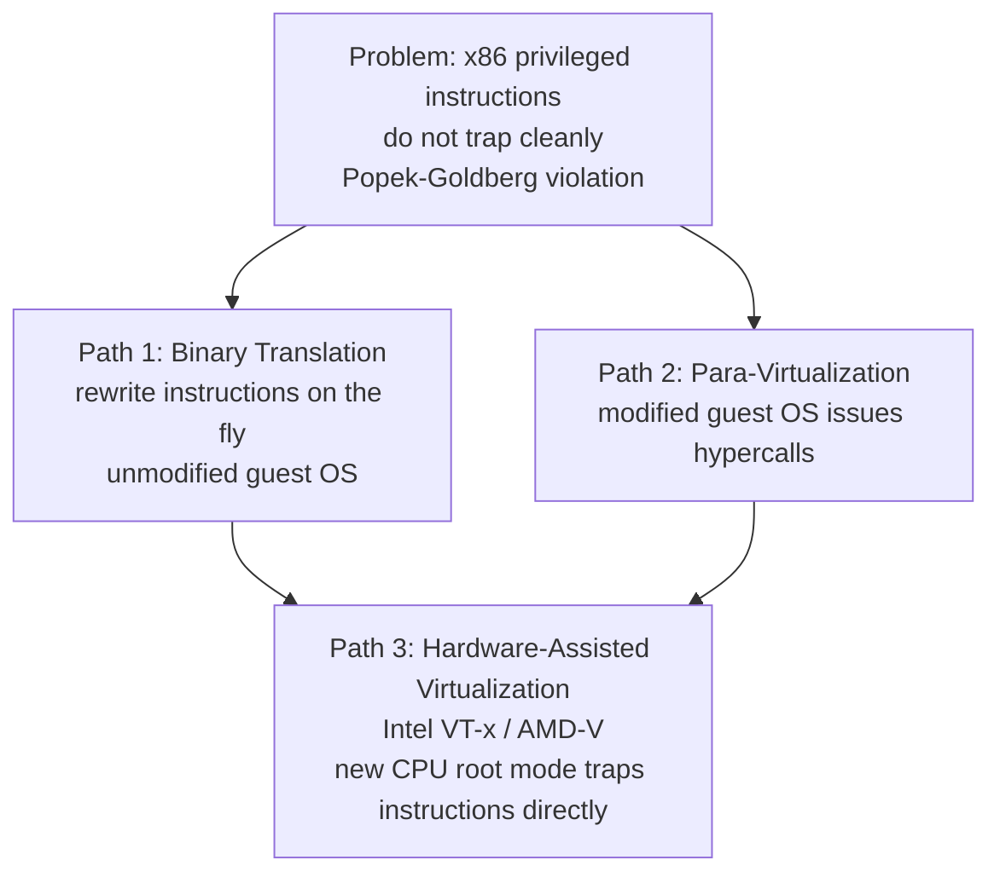

**Real-World Example:** Modern KVM on Linux relies entirely on Intel VT-x/AMD-V hardware extensions to run unmodified guest operating systems (Windows, any Linux distro) at near-native performance, whereas early VMware Workstation (pre-2006) had to use binary translation software tricks because consumer x86 CPUs lacked these hardware extensions at the time.

**Exam Strategy:**
- Always mention the Popek-Goldberg virtualization requirements (why x86 was historically "not virtualizable") as the theoretical foundation — a high-value, frequently-missed keyword.
- Name Intel VT-x and AMD-V explicitly, and describe the added CPU privilege level ("root mode"/"Ring -1").
- Present all three solution paths with one distinguishing sentence each — full marks require covering the historical progression, not just the final hardware solution.

---

### 11. Impact of Virtualization: Cost and Manageability

**In plain words:** Once you've virtualized, two big-picture changes show up on the balance sheet and in the IT team's day-to-day workload: you spend less money, and you spend less time managing things one-by-one, because you now manage templates and pools instead of individual physical machines.

**Formal definition:** Virtualization's impact is measured across two dimensions: Cost impact — reduced CapEx (fewer physical servers), reduced OpEx (power, cooling, floor space, licensing consolidation), and improved ROI through higher utilization; and Manageability impact — centralized management consoles, templated provisioning, simplified patching, and improved disaster recovery via snapshots and replication.

**How it actually works:**
- **Cost impact, split further:** CapEx savings come from avoiding new hardware purchases (fewer physical boxes for the same workload count). OpEx savings come from lower ongoing power, cooling, floor space, and often consolidated software licensing.
- **Manageability impact, split further:** A centralized console (vCenter, SCVMM) lets one admin view and control an entire virtual estate. Template-based provisioning means new environments are cloned, not manually built. Patch management shifts from patching hundreds of individual physical machines to patching a small set of golden templates that get redeployed. Snapshots and replication make backup/DR dramatically faster and simpler than physical-server-based DR.

**Diagram:**
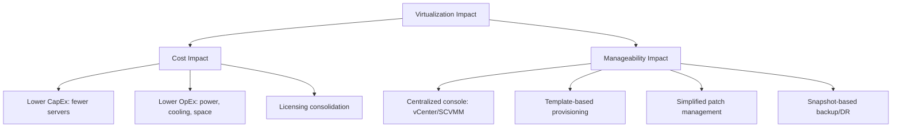

**Real-World Example:** An enterprise IT department reduces its data center footprint from 300 physical servers to 40 hosts running 300+ VMs, cutting annual power/cooling costs by an estimated 65 percent (cost impact), while reducing patch-management effort from touching 300 individual machines to updating a small set of golden VM templates redeployed via vCenter (manageability impact).

**Exam Strategy:**
- Always split the answer explicitly into "Cost Impact" and "Manageability Impact" as two labeled sub-sections — unlabeled/blended answers lose structure marks.
- Under cost, distinguish CapEx (hardware purchase avoidance) from OpEx (ongoing power/cooling/licensing) — this distinction is specifically tested.
- Under manageability, name at least one concrete mechanism (centralized console, templating, snapshotting) rather than the vague phrase "easier to manage."

---

## PART B — SERVER AND STORAGE VIRTUALIZATION

---

### 12. Types of Server Virtualization

**In plain words:** This is the server-focused restatement of topic 7's technology axis: how exactly does a hypervisor pull off the trick of running multiple guest OSes on one box? There are three main approaches, each with a different trade-off between compatibility and speed.

**Formal definition:** Server virtualization types are classified by how the hypervisor abstracts hardware from the guest: Full Virtualization (hypervisor completely emulates hardware; unmodified guest OS), Para-Virtualization (guest OS modified to cooperate with the hypervisor via hypercalls), and OS-Level Virtualization (a single kernel is shared and partitioned into isolated user-space instances/containers, with no separate guest OS or hypervisor).

**How it actually works:**
- Full virtualization gives the best compatibility (any unmodified guest OS works) at the cost of translation/emulation overhead.
- Para-virtualization gives better performance than full virtualization because the guest cooperates directly with the hypervisor, but it requires access to modify the guest OS source code.
- OS-level virtualization (containers) has the lowest overhead of all three because there is no separate guest kernel at all — every container shares the host's single kernel, isolated only by namespaces and cgroups — but this means isolation is weaker than a true VM, since a host kernel bug can affect every container on that host.

**Diagram:**
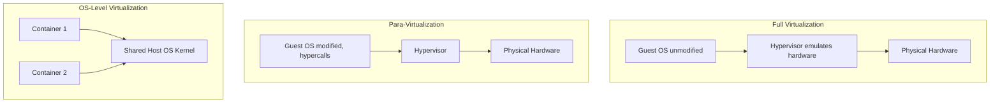

**Real-World Example:** A cloud provider runs customer-facing tenant VMs using full virtualization (VMware ESXi, guests unaware they are virtualized) for maximum compatibility, while its internal microservices platform uses OS-level virtualization (Docker on a shared Linux kernel) for faster startup and higher density.

**Exam Strategy:**
- Name all three types with the emulation vs cooperation vs shared-kernel distinction spelled out — this is the core tested contrast.
- State the primary trade-off for each: full = best compatibility/most overhead; para = better performance/requires source modification; OS-level = lowest overhead/weakest isolation.
- Name one product per type — VMware ESXi (full), Xen PV (para), Docker/LXC (OS-level).

---

### 13. Simulation

**In plain words:** Simulation is the "brute force" way to run software from a different world — every single instruction is translated in software, one at a time, no shortcuts. It's slow, but it means you can run software built for a completely different chip architecture on hardware that has nothing to do with it.

**Formal definition:** Simulation, in the virtualization context, refers to software that mimics the behavior of hardware or a system without directly executing native instructions on the underlying processor — every instruction is interpreted in software, providing complete flexibility (e.g., emulating a different CPU architecture entirely) at the cost of significant performance overhead compared to virtualization.

**How it actually works:**
- A simulator/emulator reads each guest instruction and interprets what it "means," then performs an equivalent operation on the host, rather than letting the host CPU execute it natively.
- Because nothing is executed natively, the guest architecture does not need to match the host architecture at all — this is why simulation can run ARM code on an x86 laptop.
- The cost is speed: interpreting every instruction in software is dramatically slower than virtualization's near-native execution.

**Diagram:**
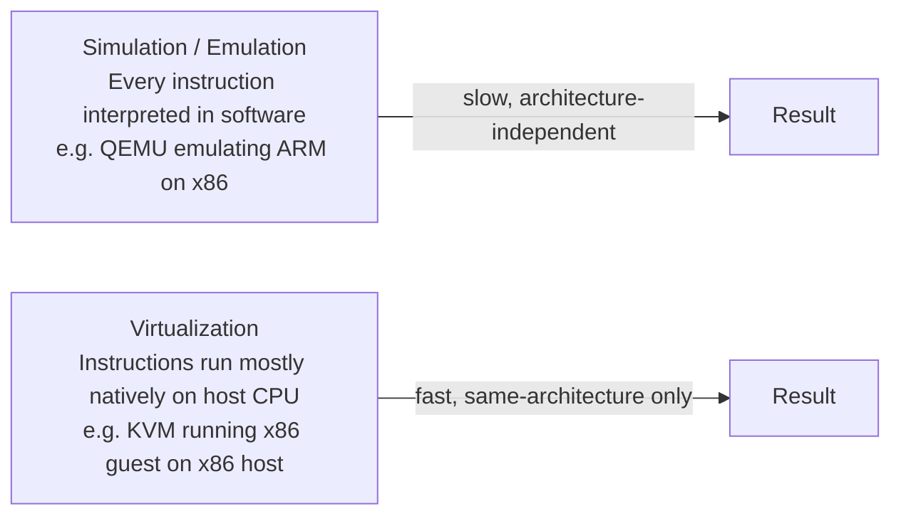

**Real-World Example:** QEMU in pure emulation mode allows a developer to run an ARM-based embedded Linux image on an x86 development laptop for software testing, interpreting every ARM instruction in software — useful for cross-architecture development but far slower than QEMU/KVM's hardware-accelerated virtualization mode on matching architectures.

**Exam Strategy:**
- Clearly separate simulation (software instruction interpretation, cross-architecture capable) from virtualization (near-native execution, same-architecture) — a common short-answer trap.
- Cite QEMU as the standard example, since it can operate in both pure-emulation and KVM-accelerated modes.
- State the performance trade-off explicitly (simulation is markedly slower) as the key differentiator examiners expect.

---

### 14. Hardware-Assisted Virtualization

**In plain words:** This is topic 10's solution, revisited as its own standalone topic: modern CPUs from Intel and AMD have built-in features specifically designed to make virtualization fast and safe, removing the need for the software workarounds virtualization used to require.

**Formal definition:** Hardware-assisted virtualization uses CPU-level extensions — Intel VT-x and AMD-V — that add a new, more-privileged CPU execution mode allowing the hypervisor to trap and handle sensitive/privileged guest instructions directly in hardware, eliminating the need for binary translation or guest OS modification, and enabling near-native performance for unmodified guest operating systems.

**How it actually works:**
- The CPU gains a distinct "root mode" (sometimes informally called Ring -1) that sits above the guest OS's normal Ring 0.
- When the guest OS (believing it is in full control, in its own Ring 0) executes a sensitive instruction, the CPU hardware automatically traps that instruction and hands control to the hypervisor in root mode.
- Because this trapping happens in hardware, no software binary translation is needed, and the guest OS does not need to be modified — any standard OS can be a guest.

**Diagram:**
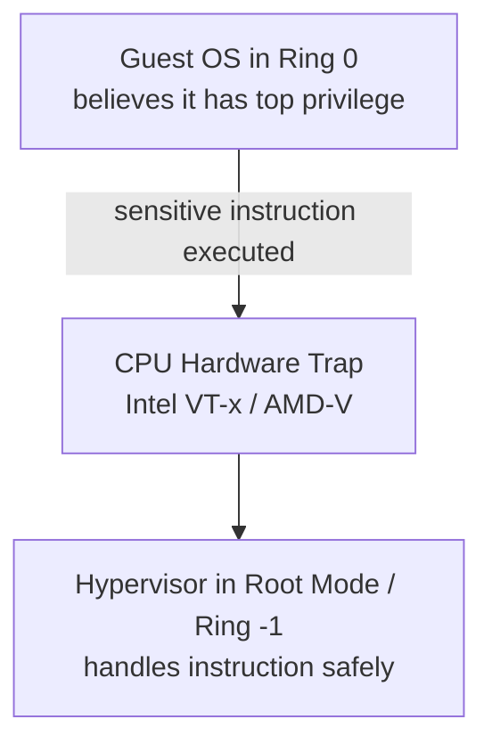

**Real-World Example:** KVM on a Linux host leverages Intel VT-x's VMX root/non-root mode distinction to run an unmodified Windows guest OS at near-native CPU speed, with the CPU hardware itself intercepting privileged instructions rather than relying on software binary translation.

**Exam Strategy:**
- Cross-reference topic 10 for full historical context, but in a standalone question, define VT-x/AMD-V directly and name the added privilege level.
- State the concrete benefit: near-native performance with unmodified guest OSes.
- Name KVM as the canonical example of a hypervisor built to rely on hardware-assisted virtualization.

---

### 15. Hypervisors

**In plain words:** The hypervisor is the traffic controller of virtualization — the piece of software that actually creates VMs, hands out slices of CPU/RAM/disk/network to each one, and makes sure none of them can see or touch each other.

**Formal definition:** A hypervisor (Virtual Machine Monitor, VMM) is the software layer that creates, runs, and manages virtual machines by abstracting and allocating physical hardware resources (CPU, memory, storage, network) among multiple isolated guest operating system instances.

**How it actually works — its three core functions:**
- **Resource allocation** — deciding how much CPU, RAM, storage, and network bandwidth each VM gets.
- **Scheduling** — deciding, moment to moment, which VM's instructions actually run on the physical CPU cores right now (conceptually similar to how an OS schedules processes, but one level up).
- **Isolation enforcement** — making sure VM A's memory, CPU state, and storage are never directly readable or writable by VM B.

**Diagram:**
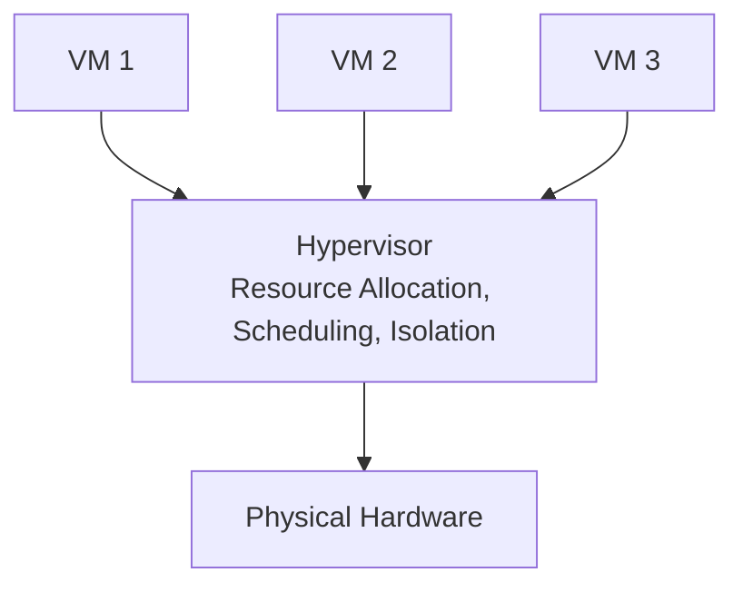

**Real-World Example:** VMware ESXi acts as the hypervisor for a private cloud, scheduling CPU time-slices across 60 running VMs, enforcing memory isolation so no VM can read another's memory space, and presenting each VM with a consistent virtual hardware abstraction regardless of the underlying physical server model.

**Exam Strategy:**
- Give the formal name "Virtual Machine Monitor (VMM)" alongside "hypervisor" — both terms appear interchangeably in question papers.
- State its three core functions explicitly: resource allocation, scheduling, isolation enforcement.
- Use this definition as the anchor point before answering topic 17 (Types of Hypervisors) if asked together.

---

### 16. Ring Levels on x86 Processors

**In plain words:** x86 CPUs have four "trust levels," from Ring 0 (the OS kernel, fully trusted) down to Ring 3 (your normal apps, least trusted). The problem for virtualization: the guest OS still wants to sit in Ring 0 like it normally would, but the hypervisor also needs that top level of control — they can't both actually be there at once, which is exactly the conflict hardware-assisted virtualization was built to resolve.

**Formal definition:** x86 processors implement a protection-ring model with four privilege levels (Ring 0 to Ring 3), where Ring 0 is the most privileged (kernel/OS mode, direct hardware access) and Ring 3 is the least privileged (user applications). Virtualization complicates this model because the guest OS expects to run in Ring 0, but the hypervisor must actually control Ring 0 — solved via hardware-assisted virtualization's additional "Ring -1" (root mode) for the hypervisor itself.

**How it actually works:**
- Ring 0: kernel/OS — direct hardware access, highest classical privilege.
- Ring 1 and Ring 2: rarely used in modern OS design.
- Ring 3: user-space applications — least privileged, must ask the OS (via system calls) to do anything privileged.
- Before hardware-assisted virtualization existed, hypervisors had to use tricks (like binary translation, or "ring compression" where the guest OS is demoted to a lower ring than it expects) to safely let a guest believe it had Ring 0 while the hypervisor kept real control.
- Intel VT-x/AMD-V solved this cleanly by adding true Ring -1/root mode purely for the hypervisor, above the guest's Ring 0.

**Diagram:**
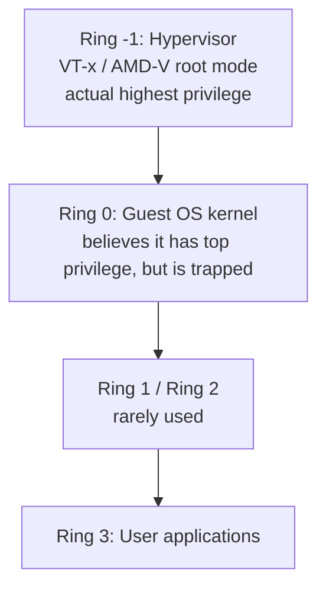

**Real-World Example:** Before hardware-assisted virtualization existed, VMware had to use binary translation or ring-compression tricks to safely let a guest OS kernel believe it was running in Ring 0 while the hypervisor retained real control — a workaround made unnecessary once Intel VT-x introduced true Ring -1 hardware support.

**Exam Strategy:**
- Draw the ring diagram from Ring -1/Ring 0 down to Ring 3 with labels — visual ring diagrams are explicitly rewarded in mark schemes.
- Explain the core conflict: both the guest OS and the hypervisor "want" Ring 0, and virtualization technology exists to resolve that conflict safely.
- Connect directly to hardware-assisted virtualization (topics 10/14) as the modern solution via Ring -1.

---

### 17. Types of Hypervisors

**In plain words:** Hypervisors come in two flavors: ones that install directly on bare hardware (used in real data centers, because they're fast and have a small attack surface), and ones that install on top of a normal operating system like a regular app (used on personal laptops for quick testing, but never in production clouds).

**Formal definition:** Hypervisors are classified as Type 1 (Bare-Metal/Native) — installed directly on physical hardware with no underlying host OS, offering higher performance and security (e.g., VMware ESXi, Microsoft Hyper-V, Xen) — and Type 2 (Hosted) — installed as an application atop a conventional host operating system, offering easier setup at the cost of an extra abstraction layer (e.g., VMware Workstation, Oracle VirtualBox).

**How it actually works:**
- Type 1 talks to hardware directly, so there is no general-purpose host OS to patch, compromise, or add latency — this is why every real production cloud data center uses Type 1.
- Type 2 sits on top of a full host OS (Windows, macOS, Linux), meaning every VM's I/O passes through an extra software layer, adding overhead and a larger attack surface (the host OS itself can be compromised).
- Type 2 is much easier to install (just run an installer like any other app) which is why it's the default choice for developers on personal machines.

**Diagram:**
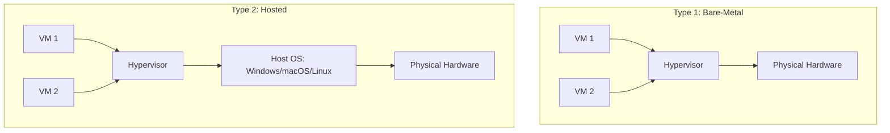

**Real-World Example:** A production data center runs VMware ESXi (Type 1) directly on server hardware for maximum performance and minimal attack surface, whereas a developer runs Oracle VirtualBox (Type 2) on their personal Windows laptop to spin up disposable test VMs alongside normal desktop applications.

**Exam Strategy:**
- Always give at least two named product examples per type — bare product-name recall is directly graded here.
- State the performance/security trade-off: Type 1 has a smaller attack surface and better performance; Type 2 is easier to install and better suited to desktop/development use.
- Note that data centers and enterprise clouds exclusively use Type 1 — a common "which would you choose for production" application question.

---

### 18. IBM PowerVM Hypervisor

**In plain words:** (Direct continuation of topic 9.) PowerVM itself is specifically a Type 1 hypervisor — it's worth remembering that classification if this appears as a standalone question separate from the general IBM/mainframe topic.

**Formal definition:** PowerVM is IBM's Type 1 hypervisor for POWER-architecture servers, providing micro-partitioning (allocating CPU in increments as small as 1/100th of a core), Logical Partitions (LPARs) for OS isolation, Dynamic LPAR (DLPAR) for live resource reallocation without downtime, and the Virtual I/O Server (VIOS) for centralized, shared virtual networking and storage across partitions.

**How it actually works:** See topic 9's full breakdown of LPAR, micro-partitioning, DLPAR, and VIOS — they apply identically here since PowerVM is the specific hypervisor product implementing all of them.

**Diagram:** (Same architecture as topic 9 — PowerVM is the hypervisor referenced there.)
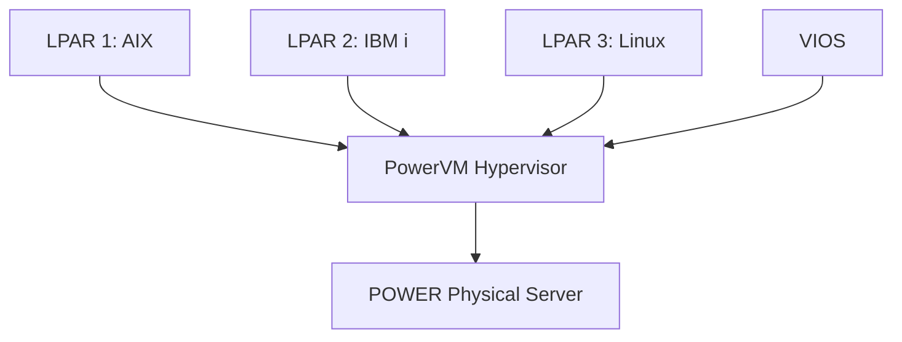

**Real-World Example:** An enterprise running SAP on IBM Power servers uses Dynamic LPAR to shift additional CPU and memory capacity live, without downtime, from a lower-priority development LPAR into the production SAP LPAR during peak month-end financial close processing.

**Exam Strategy:**
- If asked as a standalone question, lead with "PowerVM is a Type 1 hypervisor" to anchor it within the topic 17 classification before adding IBM-specific detail.
- Name micro-partitioning, LPAR, DLPAR, and VIOS explicitly — these four terms constitute the full expected keyword set.
- Emphasize DLPAR's live, no-downtime reallocation as PowerVM's standout enterprise differentiator versus typical x86 hypervisors.

---

### 19. Common Considerations in Server Virtualization

**In plain words:** Virtualizing your servers isn't a free lunch — you trade one set of problems (physical sprawl) for a new set of problems you now need to actively manage: overhead, licensing headaches, new security risks, resource contention, and the sheer need for good centralized tooling once you have hundreds of VMs instead of dozens of physical boxes.

**Formal definition:** Common considerations when implementing server virtualization include performance overhead (virtualization tax on CPU/memory/I/O), licensing (per-core/per-VM software licensing complexity), security/isolation (VM escape risk, hypervisor attack surface), capacity planning (avoiding over-provisioning/resource contention, the "noisy neighbor" problem), compatibility (hardware/driver support for virtualized devices), and management overhead (need for centralized tooling at scale).

**How it actually works — each consideration, one line:**
- **Performance overhead** — even a well-optimized hypervisor adds some CPU/memory/I/O tax compared to bare metal.
- **Licensing** — many enterprise software vendors license per physical core, so consolidating VMs onto fewer, denser hosts can unexpectedly spike license costs.
- **Security/isolation** — a hypervisor vulnerability could compromise every VM on that host (VM escape).
- **Capacity planning / noisy neighbor** — a VM with no CPU/IO limits can starve its neighbors sharing the same host.
- **Compatibility** — some specialized hardware (GPUs, custom peripherals) needs special drivers/passthrough support to work correctly inside a VM.
- **Management overhead** — hundreds of VMs need centralized tooling (vCenter, SCVMM); manual, per-machine management does not scale.

**Diagram:**
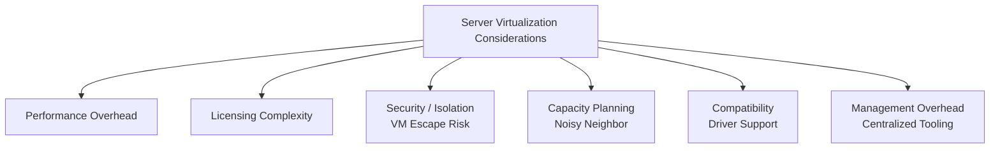

**Real-World Example:** An IT team over-provisions VMs on a single host without CPU reservation limits; during month-end batch processing, one VM consumes disproportionate CPU cycles and starves neighboring VMs (the "noisy neighbor" problem), which the team resolves by implementing resource pools with reservation and limit settings in vCenter.

**Exam Strategy:**
- List all six considerations by category with a one-line explanation each — completeness across categories is directly graded.
- Name the "noisy neighbor" problem explicitly under capacity planning — a favorite specific-term recall question.
- Mention licensing complexity as an often-underestimated real-world consideration to show applied insight.

---

### 20. Desktop Virtualization: Benefits, Constraints, and Types

**In plain words:** Instead of installing Windows and apps on every employee's individual laptop, you run the actual desktop centrally in the data center as a VM, and employees just stream the screen to whatever device they're using. Their local device becomes almost irrelevant — the real desktop lives centrally.

**Formal definition:** Desktop virtualization decouples a user's desktop OS and applications from the physical endpoint device, most commonly implemented as VDI (Virtual Desktop Infrastructure) — desktop OS instances run centrally as VMs in a data center and are streamed to thin clients — with benefits of centralized management, security, and BYOD support; constraints of network dependency, storage/graphics overhead, and licensing cost; and types including Host-Based VDI, Session-Based (RDSH/Terminal Services), and Local/Client-Hosted Desktop Virtualization.

**How it actually works, split into the three labeled parts:**
- **Benefits:** all data stays centrally in the data center rather than on the endpoint (security); one central place to patch, back up, and manage desktops (management); any device (including personal, BYOD devices) can connect to a company-managed desktop image.
- **Constraints:** the experience heavily depends on network quality and latency — a poor connection makes VDI feel sluggish or unusable; running many full desktop OS instances centrally requires significant storage and graphics/GPU overhead; VDI licensing (hypervisor + broker + client access licenses) can be costly.
- **Types:** Host-Based VDI (each user gets their own full desktop VM); Session-Based/RDSH (many users share one server OS instance, each in their own session — cheaper but less isolated); Local/Client-Hosted (the VM actually runs on the local device but is still centrally managed/provisioned).

**Diagram:**
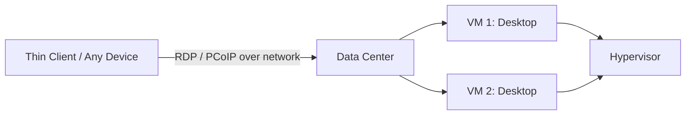

**Real-World Example:** A hospital deploys VDI (Citrix/VMware Horizon) so clinicians can access an identical, centrally-managed, compliant desktop from any workstation across the building, with all patient data remaining in the data center rather than on the local endpoint — improving both security and device flexibility, at the cost of requiring reliable, low-latency internal network connectivity.

**Exam Strategy:**
- Structure explicitly as three labeled sub-answers — Benefits, Constraints, Types — matching the exact phrasing of the topic name for structure marks.
- Name VDI explicitly and describe the client-server streaming model.
- Under constraints, mention network dependency as the most commonly tested limitation.

---

### 21. Three Major Layers in Xen Server

**In plain words:** Xen has a very specific three-part design worth memorizing exactly: a thin hypervisor at the bottom, a special "boss" VM called Dom0 that has all the real hardware drivers and manages everything, and ordinary "worker" VMs called DomU that just run user workloads and never touch hardware directly.

**Formal definition:** The Xen hypervisor architecture consists of three major layers: the Xen Hypervisor itself (the thin, privileged layer running directly on hardware, handling CPU/memory scheduling), Domain 0 (Dom0) — a privileged, specially-modified guest OS with direct hardware driver access that manages all other VMs, and Domain U (DomU) — the unprivileged guest VMs running actual user workloads.

**How it actually works:**
- The Xen Hypervisor is deliberately kept thin — it handles core scheduling and isolation, but deliberately does not include device drivers itself.
- Dom0 is a specially privileged VM (a modified Linux kernel, historically) that holds all the actual hardware drivers and brokers I/O on behalf of every other VM.
- DomU guests are unprivileged — they never touch physical hardware directly; every disk read, every network packet passes through Dom0 first.
- This privileged/unprivileged split is Xen's defining architectural choice, distinguishing it from hypervisors like ESXi where the hypervisor itself contains the drivers.

**Diagram:**
```mermaid
graph TB
    D0["Dom0: Privileged<br/>hardware drivers, management"] --> XH["Xen Hypervisor<br/>thin layer, scheduling"]
    DU1["DomU VM 1: unprivileged"] --> XH
    DU2["DomU VM 2: unprivileged"] --> XH
    XH --> PH["Physical Hardware"]
    D0 -.->|"brokers I/O for"| DU1
    D0 -.->|"brokers I/O for"| DU2
```

**Real-World Example:** On a Xen-based cloud host (historically used by early AWS EC2 infrastructure), Dom0 runs a modified Linux kernel with direct access to physical NICs and disks, brokering I/O requests on behalf of unprivileged DomU guest VMs, which never touch physical hardware directly.

**Exam Strategy:**
- Name all three layers explicitly — Xen Hypervisor, Dom0, DomU — using exact terminology; this topic is almost always graded on precise vocabulary recall.
- Emphasize that Dom0 is privileged and holds the actual hardware drivers, while DomU guests are unprivileged and depend on Dom0 for I/O.
- Mention that early AWS EC2 was famously built on Xen as a concrete, exam-relevant real-world anchor.

---

### 22. RAID Levels

**In plain words:** RAID combines several physical disks so they act like one logical disk, either to go faster, to survive a disk dying without losing data, or both. Different RAID levels make different trade-offs between speed, safety, and how much usable storage you actually get.

**Formal definition:** RAID (Redundant Array of Independent Disks) combines multiple physical disks into a logical unit for performance and/or redundancy. Key levels: RAID 0 (striping, no redundancy, max performance), RAID 1 (mirroring, full redundancy, 50% capacity efficiency), RAID 5 (striping with distributed parity, tolerates 1 disk failure), RAID 6 (striping with double distributed parity, tolerates 2 disk failures), and RAID 10 (striped mirrors, combines performance and redundancy).

**How it actually works — one line per level:**
- **RAID 0** — data is striped (split) across all disks with zero redundancy; fastest, but one disk failure loses everything.
- **RAID 1** — every disk is a full mirror of another; survives a disk failure, but you only get 50 percent of your total raw capacity as usable space.
- **RAID 5** — data plus a "parity" checksum is striped across all disks; can rebuild from any single disk failure, with better capacity efficiency than RAID 1.
- **RAID 6** — like RAID 5 but with a second, independent parity block; survives two simultaneous disk failures.
- **RAID 10** — disks are first mirrored in pairs, then those mirrored pairs are striped together, combining RAID 1's redundancy with RAID 0's speed.

**Diagram:**
```mermaid
graph TD
    R0["RAID 0: Striping<br/>No redundancy, fastest"]
    R1["RAID 1: Mirroring<br/>Full redundancy, 50% usable"]
    R5["RAID 5: Striping + 1 Parity<br/>Tolerates 1 disk failure"]
    R6["RAID 6: Striping + 2 Parity<br/>Tolerates 2 disk failures"]
    R10["RAID 10: Striped Mirrors<br/>Speed + redundancy"]
```

**Real-World Example:** A storage administrator configures RAID 10 for a high-transaction database (best balance of speed and redundancy), RAID 5 for a general file server (cost-efficient single-fault tolerance), and RAID 1 for boot/OS volumes (simple full mirroring) — selecting the RAID level based on the specific workload's performance versus redundancy requirements.

**Exam Strategy:**
- Name each RAID level with its exact mechanism (striping/mirroring/parity) and fault tolerance — this is a direct-recall table question; draw the table.
- State the capacity-efficiency trade-off per level if the question asks for comparison.
- Give one "which RAID for which workload" recommendation to demonstrate applied understanding.

---

### 23. DAS, NAS, SAN

**In plain words:** These are three different ways to attach storage to a server. DAS is a disk plugged directly into one machine, like a USB drive. NAS is a shared network drive anyone can open files from, like a shared folder. SAN is a dedicated high-speed private network that makes remote storage look and behave exactly like a local disk to every server connected to it.

**Formal definition:** DAS (Direct-Attached Storage) is storage directly connected to a single server via a local interface (SATA/SAS/USB), with no network involved. NAS (Network-Attached Storage) is a dedicated file-level storage device connected to the network, accessed by multiple clients via file-sharing protocols (NFS, SMB/CIFS). SAN (Storage Area Network) is a dedicated high-speed network providing block-level storage access to multiple servers, typically over Fibre Channel or iSCSI, appearing to each server as locally-attached disks.

**How it actually works — the single line to remember for each:**
- DAS = no network at all; simplest, but not shareable between servers.
- NAS = file-level access over a normal network (you request "give me this file"); simple to share, moderate performance.
- SAN = block-level access over a dedicated storage network (you request "give me this exact disk block"); appears to the server as if it were a local disk, enabling advanced features like VM live migration between hosts that all share the same SAN storage.

**Diagram:**
```mermaid
graph TB
    subgraph DAS
    DS["Server"] --> DD["Local Disk"]
    end
    subgraph NAS
    C1["Client 1"] --> NN["NAS Device<br/>file-level, NFS/SMB"]
    C2["Client 2"] --> NN
    end
    subgraph SAN
    S1["Server 1"] --> SF["Fibre Channel / iSCSI"]
    S2["Server 2"] --> SF
    SF --> SA["SAN Storage Array<br/>block-level"]
    end
```

**Real-World Example:** A small office uses a NAS device (Synology) for shared file storage across employee laptops via SMB, while a data center running VMware ESXi hosts connects to a SAN over Fibre Channel to provide block-level shared storage (VMFS datastores), enabling VM live migration (vMotion) between physical hosts.

**Exam Strategy:**
- Present the three-way comparison explicitly (connection type, file vs block access level, typical protocol, typical use case) — the most commonly asked exact-recall table in storage topics.
- State clearly: DAS = no network, NAS = file-level over network, SAN = block-level over dedicated network.
- Connect SAN to virtualization directly: shared block storage is what makes VM live migration between hosts possible.

---

### 24. Storage Virtualization Overview: Benefits and Types

**In plain words:** Just like server virtualization hides physical servers behind VMs, storage virtualization hides physical disks/arrays (possibly from different vendors) behind one simple, unified logical storage pool that applications just see as "storage," without caring where it physically lives.

**Formal definition:** Storage virtualization abstracts physical storage devices (disks, arrays, SANs) into a logical storage pool, presenting a unified, simplified view to servers/applications regardless of the underlying physical hardware, heterogeneity, or location. Benefits include simplified management, improved utilization, non-disruptive data migration, and thin provisioning. Types are classified by where the abstraction occurs: Host-based, Storage (array)-based, and Network-based.

**How it actually works:**
- A logical storage pool sits between servers and the actual physical arrays; servers only ever talk to the logical pool.
- Because the abstraction hides which physical array actually holds the data, an admin can migrate data between physical arrays live, with zero application downtime — a major benefit called non-disruptive data migration.
- The three location-based types differ only in where this abstraction logically "lives": inside the host's own software (host-based), inside the storage array's own controller (storage-based), or inside a dedicated appliance sitting in the network between them (network-based) — each detailed individually in topics 26-29.

**Diagram:**
```mermaid
graph TD
    App["Servers / Applications"] --> Pool["Logical Storage Pool<br/>Virtualized"]
    Pool --> A1["Physical Array 1<br/>Vendor A"]
    Pool --> A2["Physical Array 2<br/>Vendor B"]
    Pool --> A3["Physical Array 3<br/>Vendor C"]
```

**Real-World Example:** An enterprise storage team virtualizes storage from three different vendor SAN arrays into a single logical pool using a storage virtualization appliance (e.g., IBM SAN Volume Controller), enabling non-disruptive migration of a running application's data from an aging Vendor A array to a new Vendor C array with zero application downtime.

**Exam Strategy:**
- Define the abstraction clearly: physical storage heterogeneity hidden behind a uniform logical layer — the core definitional sentence expected.
- Name the three location-based types (host, storage/array, network-based) as a preview, since topics 26-29 detail each individually — mentioning all three here shows structural awareness.
- List benefits with the keyword "non-disruptive data migration," the most distinctive, high-value benefit examiners look for.

---

### 25. Features of Logical Layers

**In plain words:** The "logical layer" is the invisible translation table that makes storage virtualization work — it remembers which logical block maps to which actual physical block, and it can quietly change that mapping any time without the application noticing.

**Formal definition:** The logical layer in storage virtualization is the abstraction tier that maps logical storage units (as seen by servers/applications) to physical storage blocks (as they actually exist on disk arrays), providing features such as location transparency (physical location hidden from consumers), dynamic mapping/remapping (data can move physically without disrupting logical addresses), pooling (aggregating heterogeneous physical capacity), and thin provisioning (allocating logical capacity larger than physically reserved, consumed on demand).

**How it actually works:**
- Location transparency: the server sees a clean, contiguous logical volume; it has no idea (and doesn't need to know) which physical disks or arrays actually hold that data.
- Dynamic mapping: because the mapping table is just software, the underlying physical location of data can change (for migration, rebalancing, tiering) without the logical address the application uses ever changing.
- Pooling: physical capacity from multiple, possibly different-vendor devices is aggregated into one usable pool.
- Thin provisioning: a server can be handed a logical volume far larger than what is physically reserved right now; physical capacity is only actually consumed as data is really written.

**Diagram:**
```mermaid
graph TD
    Logic["Logical View: server sees<br/>'DB_Volume' = 500 GB contiguous"] --> Map["Mapping Table<br/>Logical Layer"]
    Map --> Phys["Physical Reality:<br/>scattered across Array1-Disk3,<br/>Array2-Disk7, Array2-Disk9"]
```

**Real-World Example:** A storage administrator uses thin provisioning to present a database server with a 2 TB logical volume, while only 400 GB of physical capacity is actually allocated at creation time; the logical layer's mapping table dynamically grows physical allocation as the database writes more data, without the application ever needing reconfiguration.

**Exam Strategy:**
- List all four features by name — location transparency, dynamic mapping, pooling, thin provisioning — this is the expected direct-recall set.
- Explain thin provisioning with a numeric example since it is the most frequently tested individual feature.
- Emphasize that the mapping table is the technical mechanism making all these features possible — naming the mechanism, not just the outcome, earns higher marks.

---

### 26. Host-Level Storage Virtualization

**In plain words:** Sometimes the "smart layer" that does storage virtualization actually lives on the server itself, in software, rather than in a fancy storage array. On Linux, this software is called LVM — it combines several disks (even from different vendors) into flexible logical volumes the admin can resize on the fly.

**Formal definition:** Host-level storage virtualization implements the abstraction layer in software running on the server (host) itself — typically via a Logical Volume Manager (LVM) — combining multiple physical/logical disks into virtual volumes that can be resized, mirrored, or snapshotted independently of the underlying physical storage hardware.

**How it actually works:**
- Physical Volumes (PVs) — the raw physical/logical disks LVM is given to work with, from any vendor.
- Volume Group (VG) — PVs are pooled together into one combined capacity pool.
- Logical Volume (LV) — the actual usable, resizable volume carved out of the VG, which is what the file system and application actually see.
- Because the abstraction lives entirely in host software, this approach is hardware-vendor-agnostic — it works the same regardless of which brand of physical disk is underneath.

**Diagram:**
```mermaid
graph TD
    FS["Application / File System"] --> LV["Logical Volume LV<br/>resizable, snapshot-capable"]
    LV --> VG["Volume Group VG<br/>pooled capacity"]
    VG --> PV["Physical Volumes PV<br/>/dev/sda, /dev/sdb, /dev/sdc"]
```

**Real-World Example:** A Linux server administrator uses LVM to create a logical volume spanning three separate physical disks from different vendors, then non-disruptively extends the volume's size by adding a fourth disk to the volume group — all without unmounting the file system or interrupting the running application.

**Exam Strategy:**
- Name LVM (Logical Volume Manager) explicitly as the canonical host-level implementation — the highest-yield keyword for this topic.
- State the key advantage: the host, not the storage array, performs the abstraction, making it hardware-vendor-agnostic.
- Mention resizing and snapshotting as the most commonly tested practical LVM capabilities.

---

### 27. Host-Based Mirroring

**In plain words:** This is RAID 1's logic, but done by the server's own operating system in software instead of by dedicated RAID hardware — the OS itself writes every piece of data to two disks at once, so if one disk dies, nothing is lost.

**Formal definition:** Host-based mirroring is a host-level storage virtualization technique (typically implemented via LVM or software RAID) where the server's operating system writes identical data simultaneously to two or more physical disks (equivalent to software RAID 1), providing redundancy without requiring a hardware RAID controller or intelligent storage array.

**How it actually works:**
- Every write from the application passes through the host OS's mirroring driver, which duplicates the write to two (or more) physical disks before confirming it as complete.
- If one disk fails, the OS transparently continues serving reads/writes from the surviving disk, with no dependency on a hardware RAID controller.
- The trade-off versus hardware/array-based mirroring: host-based mirroring consumes host CPU cycles to perform the duplication, since the work is done in software rather than offloaded to a dedicated controller.

**Diagram:**
```mermaid
graph TD
    W["Application Write"] --> M["Host OS / LVM Mirror Driver"]
    M --> D1["Physical Disk A<br/>identical copy"]
    M --> D2["Physical Disk B<br/>identical copy"]
```

**Real-World Example:** A Linux server uses `mdadm` (Linux software RAID) to mirror its root file system across two physical disks purely at the OS level; if Disk A fails, the OS continues operating transparently from Disk B, with no dependency on a hardware RAID controller.

**Exam Strategy:**
- Explicitly connect this to RAID 1 (topic 22) — this topic is essentially "RAID 1 implemented in host software rather than hardware," and stating that link earns cross-topic synthesis marks.
- Name a concrete tool (Linux `mdadm`, Windows Storage Spaces, LVM mirroring) as the implementation mechanism.
- Note the trade-off versus array-based mirroring: host-based mirroring consumes host CPU cycles that array-based mirroring would offload.

---

### 28. Storage-Level Virtualization

**In plain words:** Here, the "smart layer" doesn't live on the server at all — it lives inside the storage array's own controller. The array itself handles RAID, snapshots, and replication internally, and simply hands servers clean, ready-made logical volumes (LUNs), with zero involvement needed from the connecting host.

**Formal definition:** Storage-level (array-based) virtualization implements the abstraction layer within the intelligent storage array/controller itself, pooling the array's own physical disks into logical volumes (LUNs) presented to servers, with the array handling RAID, snapshots, replication, and thin provisioning internally — transparent to and independent of the connecting hosts.

**How it actually works:**
- The array's own controller owns and manages all its internal physical disks — RAID, snapshotting, replication, deduplication, and thin provisioning all happen inside the array itself.
- Servers simply connect to the array (via SAN) and see clean logical block devices (LUNs) — they have no visibility into or responsibility for the array's internal management.
- Because the intelligence lives in the array, not the host, this approach is host-OS-agnostic — any type of connecting server works identically.

**Diagram:**
```mermaid
graph TD
    S1["Server 1"] --> Ctrl["Storage Array Controller<br/>RAID, LUN mapping, snapshots,<br/>thin provisioning"]
    S2["Server 2"] --> Ctrl
    S3["Server 3"] --> Ctrl
    Ctrl --> Disks["Physical Disks: internal to array"]
```

**Real-World Example:** A NetApp storage array presents multiple LUNs to different application servers, internally managing RAID-DP (double parity), automated hourly snapshots, and deduplication — all handled by the array's own controller, completely transparent to the connected servers, which simply see standard block devices.

**Exam Strategy:**
- Distinguish clearly from topic 26 (host-level): here, the intelligence and abstraction live in the storage array's controller, not in host software — the single sentence examiners check for.
- List array-native features enabled at this level: RAID, snapshots, replication, deduplication, thin provisioning.
- Mention that this approach is host-OS-agnostic, since the abstraction never depends on host software.

---

### 29. Network-Based Storage Virtualization

**In plain words:** Here, the "smart layer" lives in neither the server nor the array — it lives in a dedicated appliance sitting in the storage network between them, meaning it can unify storage from multiple, completely different vendor arrays into one pool, which neither host-level nor array-level virtualization alone can do.

**Formal definition:** Network-based storage virtualization implements the abstraction layer in a dedicated appliance or switch sitting within the storage network (between hosts and storage arrays) — either in-band (appliance sits directly in the data path, handling both control and data traffic) or out-of-band (appliance handles only control/metadata, while data flows directly between host and storage) — enabling virtualization across multiple, heterogeneous storage arrays from different vendors.

**How it actually works:**
- In-band mode: every byte of actual data traffic flows through the virtualization appliance itself, alongside the control/metadata information. Simpler to deploy, but the appliance is in the direct performance/failure path.
- Out-of-band mode: the appliance only handles control/metadata (deciding "where is this data really located"); actual data traffic flows directly between host and storage array, bypassing the appliance — better performance, but requires special host-side software to be aware of the metadata.
- The primary advantage over host-level and array-level virtualization: it can unify heterogeneous, multi-vendor storage across the entire network, not just within one host or one array.

**Diagram:**
```mermaid
graph TD
    Sv["Servers"] --> App["Virtualization Appliance/Switch<br/>e.g. IBM SAN Volume Controller<br/>sits IN the SAN fabric"]
    App --> A1["Array A: Vendor 1"]
    App --> A2["Array B: Vendor 2"]
    App --> A3["Array C: Vendor 3"]
```

**Real-World Example:** An IBM SAN Volume Controller (SVC) deployed in-band within a SAN fabric virtualizes storage from three different vendor arrays into a single logical pool presented to all connected servers, enabling the storage team to migrate data transparently between physical arrays for hardware refresh without any server-side reconfiguration.

**Exam Strategy:**
- Name both deployment modes (in-band and out-of-band) with the key distinction: in-band = data and control through the appliance; out-of-band = only control/metadata through the appliance.
- Give a named product example (IBM SVC) as the standard textbook reference for this topic.
- State the primary advantage over host-level and array-level virtualization: it can unify heterogeneous, multi-vendor storage across the entire network.

---

## PART C — ROLE OF VIRTUALIZATION IN CLOUD COMPUTING

**In plain words:** Cloud computing's whole promise — rent exactly the compute you need, get it instantly, pay only for what you use — is not actually a cloud-specific invention. It's virtualization, wearing a self-service web portal and a billing meter. Without a hypervisor able to slice one physical machine into many independent, isolated, metered virtual machines, none of the cloud's defining properties would be technically possible.

**Formal definition:** Virtualization is the foundational enabling technology of cloud computing, directly providing the NIST essential characteristics: resource pooling (hypervisor multiplexes physical hardware across tenants), rapid elasticity (VMs provisioned/de-provisioned in minutes via templates), on-demand self-service (users request virtual resources without provider intervention), and measured service (hypervisor-level metering of vCPU/vRAM/storage usage per tenant).

**How it actually works — mapping virtualization to each NIST characteristic:**
- **Resource pooling / multi-tenancy** — many customers share the same physical hardware pool; this is what makes cloud economically viable, since the provider does not need one physical machine per customer.
- **Rapid elasticity** — because VMs are pure software definitions, they can be created, resized, or destroyed in minutes, enabling the scale-up/scale-down cloud computing is famous for.
- **On-demand self-service** — a customer requests a VM through an API/portal, and the hypervisor fulfills it without a human at the provider approving each request.
- **Measured service** — the hypervisor itself can meter exactly how much vCPU, vRAM, and storage each VM consumes, which is what makes precise, per-second billing possible.
- Beyond the four NIST characteristics, virtualization also provides **isolation** (the technical basis of secure multi-tenancy) and **hardware abstraction/portability** (the same VM image can run on any compatible physical host, enabling standardized "golden images").

**Diagram:**
```mermaid
graph TD
    Svc["Cloud Service Models<br/>IaaS / PaaS / SaaS"] --> Mgmt["Cloud Management Platform<br/>Self-Service, Metering, Orchestration"]
    Mgmt --> Virt["Virtualization Layer<br/>Hypervisor: Resource Pooling,<br/>Multi-Tenant Isolation, VM Migration"]
    Virt --> HW["Physical Data Center Hardware"]
```

**Real-World Example:** When a customer requests an AWS EC2 instance, the request hits AWS's cloud control plane, which instructs the underlying Nitro hypervisor to instantiate a new VM on a physical host from the shared resource pool within seconds, isolates it from co-resident tenant VMs, meters its vCPU/memory/storage usage for per-second billing, and reclaims the resources to the pool the moment the customer terminates it — the entire IaaS experience is virtualization operating beneath a self-service API.

**Exam Strategy:**
- Structure the answer explicitly around the four NIST characteristics (resource pooling, rapid elasticity, on-demand self-service, measured service) and state that virtualization is what technically implements each one.
- Draw the layered diagram showing virtualization directly beneath the cloud service models — this visually proves the "foundational enabling technology" argument, the central thesis expected.
- Close with the explicit causal claim: "Cloud computing's defining properties — multi-tenancy, elasticity, self-service — would not be achievable without virtualization's hardware abstraction."

---

## PART D — IST-1 DIRECT ANSWER BANK (Dhruv Sir's Priority Topics)

These are the exact topics your teacher flagged as important for IST-1. Every answer below is a ready-to-reproduce version, pulling together the relevant syllabus topics above into one clean, exam-structured answer — the same way each syllabus topic already stands on its own above, nothing here replaces or overrides that full coverage.

### Q1. Traditional vs. Virtualized IT Infrastructure

Traditional IT infrastructure follows a rigid "one application, one physical server" model — hardware, OS, and application are tightly coupled, resulting in low utilization (10-15 percent), high CapEx/OpEx, slow scaling (weeks), no portability, and complex disaster recovery. Virtualized infrastructure inserts a hypervisor between hardware and OS, converting the resource mapping from 1:1 to many:1 — many VMs now share one physical host's pooled resources, achieving high utilization (60-80 percent), provisioning in minutes, software-defined scalability, and VM portability via snapshot/live migration.

**Answer structure for full marks:** State the traditional model's tight-coupling definition → draw the comparison table (topic 4) → explicitly name the hypervisor as the abstraction layer enabling the shift → close with the business-impact line about converting fixed CapEx into flexible OpEx.

### Q2. Server Stacks & Architectural Transitions

The pre-virtualization server stack is Physical Hardware → Operating System → Application, with exactly one of each per physical machine. The post-virtualization stack inserts a hypervisor directly on the hardware, allowing multiple independent Guest OS + Application stacks to run concurrently — converting a "1 App : 1 OS : 1 Server" ratio into "N Apps : N OS : 1 Server." Implementing this transition relies on logical equivalence (topic 5): each VM's virtual CPU/RAM/NIC/disk is a software-mapped slice of the real physical resources, and the guest OS is entirely unaware it isn't on dedicated hardware.

**Answer structure for full marks:** Draw the pre/post stack diagram (topic 6) as a before/after transition, not two separate descriptions → mention logical equivalence and the hardware/software stack mapping (topic 5) → state where the hypervisor is inserted (directly on hardware for Type 1, or on host OS for Type 2) to bridge into hypervisor-type questions.

### Q3. Types & Classifications of Virtualization

Virtualization is classified along two independent axes, and a complete answer must cover both. Area-based classification asks what is being virtualized: Server, Storage, Network, Desktop, and Application Virtualization. Technology-based classification asks how the virtualization is technically achieved: Full Virtualization (binary translation, unmodified guest OS), Para-Virtualization (modified guest OS using hypercalls), OS-Level Virtualization/Containers (shared kernel, namespaces/cgroups), and Hardware-Assisted Virtualization (Intel VT-x/AMD-V CPU extensions).

**Answer structure for full marks:** Draw both axes explicitly (topic 7) — answering only one axis is the single most common mark loss on this exact question → give one distinguishing technical detail per technology type → name one product example per technology type (VMware ESX, Xen PV, Docker, KVM).

### Q4. x86 Architecture & Hardware-Assisted Virtualization

x86 was historically not classically virtualizable — certain privileged instructions failed silently instead of trapping to the hypervisor, violating the Popek-Goldberg virtualization requirements. This was first solved in software via binary translation (full virtualization) and para-virtualization (modified guest OS, hypercalls), and later solved properly in hardware via Intel VT-x and AMD-V, which add a new CPU privilege level (root mode, informally "Ring -1") that automatically traps sensitive guest instructions without needing binary translation or guest OS modification.

**Answer structure for full marks:** Name the Popek-Goldberg requirements explicitly as the theoretical foundation (topic 10) → present all three solution paths in historical order with one line each → name Intel VT-x/AMD-V and the added privilege level explicitly, and draw the ring diagram (topic 16) if the question allows a diagram.

### Q5. Core Benefits & Impact on IT Cost & Manageability

Virtualization's core benefits fall into four categories: Consolidation (higher utilization, fewer physical machines), Cost Reduction (lower CapEx/OpEx, less power/cooling), Agility (rapid provisioning via templates/snapshots/clones), and Resilience (live migration, HA, simplified DR). Its impact should be answered as two explicitly labeled sections: Cost Impact (lower CapEx from fewer server purchases, lower OpEx from power/cooling/floor-space/licensing consolidation, better ROI from higher utilization) and Manageability Impact (centralized management consoles like vCenter, templated provisioning, simplified patch management via golden templates instead of per-machine patching, and snapshot-based backup/DR).

**Answer structure for full marks:** Present the four-category benefit taxonomy (topic 3) first → then explicitly split Cost Impact vs Manageability Impact into two labeled sub-sections (topic 11) — unlabeled, blended answers lose structure marks → give one quantified example for each (e.g., 300 servers to 40 hosts, 65 percent power cost reduction).

### Q6. Enterprise Virtualization Systems (IBM Mainframes & PowerVM)

IBM Mainframe virtualization (System z/z-VM) uses LPAR (Logical Partitioning) to hardware-enforce isolation between multiple independent OS instances on one physical mainframe. PowerVM is IBM's Type 1 hypervisor for POWER-architecture servers, adding micro-partitioning (CPU allocation as fine as 1/100th of a core), Dynamic LPAR (live, zero-downtime resource reallocation between running partitions), and VIOS (Virtual I/O Server, which centralizes and shares physical network/storage adapters across all partitions instead of dedicating hardware per partition).

**Answer structure for full marks:** Name LPAR, micro-partitioning, DLPAR, and VIOS explicitly (topics 9 and 18) — this exact four-term keyword set is what's graded → draw the PowerVM architecture diagram → distinguish PowerVM (POWER architecture, IBM proprietary) from generic x86 hypervisors → mention mainframe LPAR isolation is hardware-enforced, historically stronger than typical x86 software isolation.

### Q7. Evolution & History of Virtualization (Time-Sharing Systems)

Virtualization originated in 1960s IBM mainframe time-sharing systems, where a single, extremely expensive mainframe was partitioned to let multiple users each run isolated jobs while believing they had a dedicated machine. IBM's CP-40/CP-67 pioneered this and directly gave us the term "virtual machine"; this matured into VM/370 in 1972, the first fully commercial hypervisor. Interest declined in the 1980s-90s as cheap x86 hardware made "one app, one cheap server" affordable again — but server sprawl from too many underused cheap boxes revived the need, leading to VMware's 1998 founding and the modern x86 virtualization era that underpins cloud computing today.

**Answer structure for full marks:** Cite IBM CP-40/CP-67 and VM/370 by name with approximate dates (topic 8) — named systems and dates are directly graded → draw the timeline diagram → explain the economic motivation (expensive mainframes needing multiplexing) as the same root cause as "Need for Virtualization" (topic 1), and state the full decline-and-resurgence arc through to VMware's founding.

### Q8. Role of Virtualization in Cloud Computing

Virtualization is the foundational enabling technology of cloud computing — it directly implements all four NIST essential characteristics. Resource pooling and multi-tenancy come from the hypervisor multiplexing physical hardware across many customers, which is what makes cloud economically viable. Rapid elasticity comes from VMs being pure software, creatable/destroyable in minutes. On-demand self-service comes from customers requesting VMs via API without provider approval. Measured service comes from the hypervisor's own ability to meter exact vCPU/vRAM/storage consumption per VM, enabling precise billing. Beyond these four, virtualization also provides isolation (secure multi-tenancy) and hardware abstraction (VM portability across hosts, enabling golden images).

**Answer structure for full marks:** Structure explicitly around the four NIST characteristics, mapping each to the specific hypervisor mechanism that implements it (Part C) → draw the layered diagram showing virtualization directly beneath the cloud service models → close with the causal claim that cloud's defining properties would not be achievable without virtualization's hardware abstraction — write this sentence close to verbatim, it is close to the expected model-answer conclusion.

---

## FINAL EXAM CHECKLIST

```
[ ] Need for virtualization: 10-15% utilization stat, cost/space/power triad
[ ] Traditional vs Virtualized: full comparison table drawable from memory
[ ] Pre/post virtualization server stack: before/after transition diagram
[ ] Logical equivalence: physical-to-virtual stack mapping (CPU/RAM/NIC/disk)
[ ] Two-axis classification: area-based AND technology-based, both listed
[ ] Popek-Goldberg problem + binary translation + para-virt + VT-x/AMD-V + Ring -1
[ ] Cost Impact vs Manageability Impact answered as two labeled sections
[ ] IBM Mainframe LPAR + PowerVM: micro-partitioning, LPAR, DLPAR, VIOS named
[ ] History: IBM CP-40/CP-67, VM/370 (1972), time-sharing motivation, VMware 1998
[ ] Types of server virtualization: full / para / OS-level, one product example each
[ ] Simulation vs virtualization: interpreted instructions vs near-native execution
[ ] Ring levels 0-3 plus Ring -1, drawable with hypervisor conflict explained
[ ] Type 1 vs Type 2 hypervisor: two named products each, production vs desktop use
[ ] Xen's three layers: Hypervisor, Dom0 (privileged), DomU (unprivileged)
[ ] RAID 0/1/5/6/10: mechanism + fault tolerance for each, drawable table
[ ] DAS vs NAS vs SAN: no-network / file-level / block-level, one-line distinction
[ ] Storage virtualization: benefits (esp. non-disruptive migration) + 3 location types
[ ] Logical layer features: location transparency, dynamic mapping, pooling, thin provisioning
[ ] Host-level (LVM: PV/VG/LV) vs Storage-level (array controller) vs Network-level (in-band/out-of-band, IBM SVC)
[ ] Host-based mirroring: software RAID 1 equivalent, mdadm example
[ ] Role of virtualization in cloud: all 4 NIST characteristics mapped to hypervisor mechanisms
[ ] PART D: all 8 of Dhruv Sir's IST-1 topics rehearsed out loud at least once
```
