# DevOps Process Automation — Unit 1 (Deep-Dive Notes)
### Introduction to DevOps Testing & DevSecOps, Version Control with Git, Build Automation with Jenkins — MCA Exam Prep

**How to use this document:** Every topic has five parts — **1. In plain words** — explained like a senior explaining it to a junior, no jargon-dump. **2. Formal definition** — the "textbook line" you write first in the exam so the examiner sees the keyword. **3. How it actually works** — the depth layer, so you understand it instead of memorizing it. **4. Diagram** — a Mermaid diagram you can redraw on paper in the exam. **5. Real-world/DevOps example + Exam strategy** — a concrete scenario, plus how to structure the answer for marks.

This document follows your Unit-1 table in order: **Introduction to DevOps (Testing & DevSecOps)**, **Version Control in DevOps (Git)**, and **Tools Used for Build Process (Jenkins)**.

---

## PART A — INTRODUCTION TO DEVOPS: TESTING & DEVSECOPS

---

### 1. Basics of Testing in DevOps

**In plain words:** In old-school software teams, testing was a separate phase done at the very end, by a separate team, right before release — which meant bugs were found late, when they're expensive and slow to fix. DevOps testing means testing happens constantly, throughout development, by everyone, so bugs are caught the same day they're written, not weeks later.

**Formal definition:** Testing in DevOps is the practice of embedding automated, continuous testing throughout the entire software delivery pipeline — from code commit through build, integration, and deployment — rather than treating testing as an isolated final phase, in order to detect defects early (shift-left testing) and enable fast, reliable, frequent releases.

**How it actually works:**
- Traditional testing model: Develop everything → hand off to QA → QA tests everything → bugs found late → slow fix-retest cycle.
- DevOps testing model: every code commit automatically triggers a battery of tests (unit, integration, security, performance) before the code is even merged, catching problems within minutes of being introduced.
- "Shift-left" is the core philosophy — moving testing activities as early ("left" on a project timeline) as possible, ideally to the moment a developer writes the code.
- Testing is no longer solely QA's job — developers write and own unit tests, and automated pipelines enforce quality gates that nobody can bypass manually.

**Diagram:**
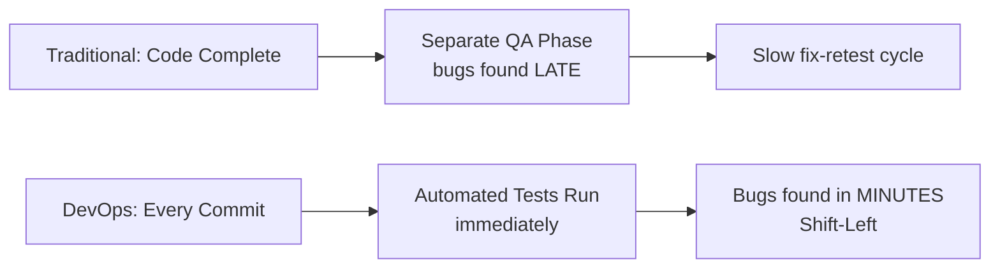

**Real-World Example:** A developer pushes a code change; within 3 minutes, an automated pipeline runs unit tests, a static code analysis scan, and an integration test suite — if any fail, the developer is notified immediately and the change is blocked from merging, rather than a QA engineer discovering the bug two weeks later during a manual test cycle.

**Exam Strategy:**
- Always contrast traditional (late, manual, siloed) testing against DevOps (continuous, automated, embedded) testing — the comparison itself is the expected answer structure.
- Use the exact term "shift-left testing" — this is the single highest-yield keyword for this topic.
- Mention that testing ownership shifts from "QA alone" to "everyone, enforced by automation" as the cultural change underpinning the technical change.

---

### 2. Integration of Testing in DevOps

**In plain words:** This is about exactly where in the DevOps pipeline different types of tests get plugged in — you don't run every test at every stage; you run fast, cheap tests first and slow, expensive tests later, so failures are caught as early and as cheaply as possible.

**Formal definition:** Integration of testing in DevOps refers to embedding distinct test types at appropriate stages of the CI/CD pipeline — unit tests at commit/build time, integration tests after build, security/performance tests before deployment, and acceptance/UI tests before release — so that each pipeline stage acts as an automated quality gate.

**How it actually works:**
- **Commit stage:** fast unit tests and static code analysis run automatically on every push (seconds to a couple of minutes).
- **Build stage:** integration tests verify that different modules/services work together correctly once assembled.
- **Pre-deployment stage:** security scanning (SAST/DAST), performance/load testing, and API contract testing run against a near-production-like environment.
- **Pre-release stage:** acceptance testing, UI/end-to-end testing, and smoke tests confirm the full user-facing experience before the release is promoted to production.
- If any stage's tests fail, the pipeline stops there — later, more expensive stages never run against known-broken code, saving time and compute.

**Diagram:**
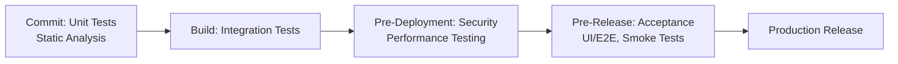

**Real-World Example:** A CI/CD pipeline for an e-commerce app runs unit tests on every commit (10 seconds), integration tests after every successful build (2 minutes), an OWASP ZAP security scan and load test before deployment to staging (10 minutes), and a final smoke test suite immediately after production deployment to confirm the live site is healthy — each gate catching a different class of problem at the cheapest possible point.

**Exam Strategy:**
- Present this as a staged pipeline diagram — the "right test at the right stage" idea is what's specifically being tested here, not just a list of test types.
- Name at least four distinct test types (unit, integration, security, performance/acceptance) mapped to specific stages.
- State the efficiency argument explicitly: failing fast at a cheap early stage avoids wasting time/compute on later, more expensive stages.

---

### 3. Importance of Continuous Testing in DevOps

**In plain words:** Continuous testing is what makes it safe to release software constantly instead of once every few months. If you're going to deploy multiple times a day, you cannot possibly have humans manually test everything each time — automation and constant testing is the only way frequent releases stay safe.

**Formal definition:** Continuous testing is the practice of executing automated tests at every stage of the software delivery pipeline as an integral, ongoing part of the process, providing immediate feedback on business risk and code quality associated with a release candidate, enabling faster releases without sacrificing quality or stability.

**How it actually works:**
- Continuous testing provides **immediate feedback** — a developer knows within minutes whether their change broke something, not days later.
- It **de-risks frequent deployment** — since every change is automatically validated, teams can deploy many times a day with confidence instead of batching risky, infrequent releases.
- It **reduces the cost of fixing bugs** — a bug caught at commit time costs far less time and money to fix than the same bug caught in production.
- It builds **institutional confidence** — teams trust their pipeline's test results enough to automate deployment decisions on top of them (e.g., auto-promote to production if all tests pass).

**Diagram:**
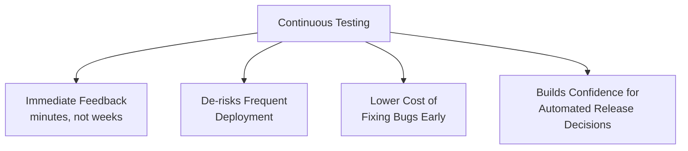

**Real-World Example:** A SaaS company deploys to production over 50 times a day; this is only possible because their continuous testing pipeline automatically validates every single change within minutes, giving the team enough confidence to let a passing pipeline automatically trigger production deployment with no manual sign-off required.

**Exam Strategy:**
- Frame the answer around "why is this necessary," not just "what is it" — the importance/necessity angle is specifically what the topic name asks for.
- Explicitly connect continuous testing to enabling frequent releases — this causal link (testing enables speed, not just quality) is the key insight examiners look for.
- Mention the cost-of-bugs argument (cheaper to fix early) as a quantifiable, commonly cited justification.

---

### 4. Tips for Developing a DevOps Testing Strategy

**In plain words:** Building a good DevOps testing strategy isn't just "add more tests" — it's a set of deliberate decisions about what to automate, in what order, and how to keep the whole pipeline fast enough that developers don't start ignoring or bypassing it.

**Formal definition:** A DevOps testing strategy is a deliberate plan defining test scope, automation priorities, environment parity, and feedback speed across the pipeline; effective strategies follow key principles: prioritize test automation, follow the shift-left approach, maintain a balanced test pyramid, ensure environment/data parity with production, monitor and continuously improve test coverage, and keep feedback loops fast.

**How it actually works — key tips, one line each:**
- **Automate aggressively, but prioritize** — automate the tests that run most often and catch the most bugs first (usually unit tests), rather than trying to automate everything at once.
- **Follow the test pyramid** — have many fast, cheap unit tests at the base, fewer integration tests in the middle, and very few slow, expensive end-to-end/UI tests at the top; inverting this pyramid (too many slow UI tests) makes pipelines painfully slow.
- **Keep environments production-like** — tests run against environments that don't match production configuration give false confidence; strive for environment parity.
- **Keep feedback loops fast** — if the pipeline takes too long, developers will start ignoring or working around it; fast tests must run first so failures are caught within minutes.
- **Continuously monitor test coverage and flaky tests** — a test suite riddled with unreliable ("flaky") tests erodes trust in the whole pipeline just as much as having no tests at all.

**Diagram:**
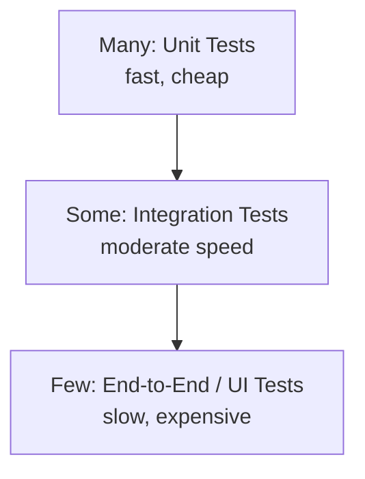

**Real-World Example:** An engineering team notices their pipeline takes 45 minutes per run because 200 slow UI tests dominate the suite; following the test pyramid principle, they rewrite most of those checks as fast unit and API-level integration tests, keeping only a handful of critical UI smoke tests — cutting pipeline time to 8 minutes without losing meaningful coverage.

**Exam Strategy:**
- Draw the test pyramid diagram — it is the single most iconic and most-tested visual for this topic.
- List the tips as a clear enumerated set (automation priority, shift-left, environment parity, fast feedback, flaky test monitoring) rather than a vague paragraph.
- Explicitly warn about the "inverted pyramid" anti-pattern (too many slow UI tests) as a concrete, specific failure mode worth naming.

---

### 5. DevOps Testing Tools

**In plain words:** Different stages and types of testing need different specialized tools — there's no single tool that does unit testing, security scanning, performance testing, and UI testing all at once, so a DevOps pipeline typically stitches several tools together.

**Formal definition:** DevOps testing tools are specialized software used to automate different categories of testing within a CI/CD pipeline, commonly grouped as: unit testing frameworks (JUnit, NUnit, pytest), integration/API testing tools (Postman, RestAssured), UI/end-to-end testing tools (Selenium, Cypress), performance testing tools (JMeter, Gatling), security testing tools (OWASP ZAP, SonarQube), and CI/CD orchestration tools that tie testing into the pipeline (Jenkins, GitLab CI).

**How it actually works — tools mapped by category:**

| Category | Purpose | Example Tools |
|---|---|---|
| Unit Testing | Test individual functions/classes | JUnit, NUnit, pytest |
| Integration/API Testing | Test services working together | Postman, RestAssured |
| UI/End-to-End Testing | Test the full user-facing flow | Selenium, Cypress |
| Performance Testing | Test speed/load-handling | JMeter, Gatling |
| Security Testing | Find vulnerabilities | OWASP ZAP, SonarQube |
| CI/CD Orchestration | Wire tests into the pipeline | Jenkins, GitLab CI |

**Diagram:**
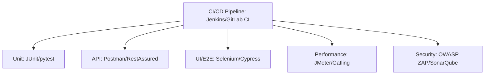

**Real-World Example:** A Jenkins pipeline runs pytest for unit tests immediately after every commit, then RestAssured API tests after the build step, then triggers a SonarQube static analysis scan and an OWASP ZAP dynamic security scan before deployment to staging, and finally a Selenium end-to-end suite to verify the checkout flow before promoting the release to production.

**Exam Strategy:**
- Draw or reproduce the category-to-tool mapping table — this is the expected direct-recall format for "name DevOps testing tools" questions.
- Name at least one tool per category (six categories) — completeness across categories is directly graded.
- Mention that a CI/CD orchestrator (Jenkins) is what actually wires all these separate tools into one automated pipeline — this connects directly into Part C of this document.

---

### 6. DevSecOps Fundamentals

**In plain words:** Traditionally, security was checked right at the end, by a separate security team, often right before (or even after) release — by which point fixing a found vulnerability meant reworking code that was already "done." DevSecOps means baking security checks into the pipeline from the very start, the same way DevOps baked testing in, so vulnerabilities are caught and fixed while the code is still fresh.

**Formal definition:** DevSecOps is the practice of integrating security practices and automated security testing throughout the entire DevOps pipeline — from code commit through build, test, and deployment — making security a shared responsibility of developers, operations, and security teams rather than a separate, siloed, end-of-cycle gate; it is commonly summarized as "shifting security left."

**How it actually works:**
- **SAST (Static Application Security Testing)** — scans source code for known vulnerability patterns without running the application, typically at commit/build time (e.g., SonarQube, Checkmarx).
- **DAST (Dynamic Application Security Testing)** — tests a running application from the outside for exploitable vulnerabilities, typically pre-deployment (e.g., OWASP ZAP).
- **Dependency/SCA scanning (Software Composition Analysis)** — checks third-party libraries and dependencies for known CVEs (e.g., Snyk, OWASP Dependency-Check).
- **Infrastructure as Code (IaC) scanning** — checks Terraform/CloudFormation templates for misconfigurations before they're ever deployed (e.g., tfsec, Checkov).
- **Secrets scanning** — prevents credentials/API keys from being accidentally committed into source control.
- All of these run automatically as pipeline gates, the same way functional tests do, so a vulnerable build simply cannot progress to production without either being fixed or explicitly, visibly overridden.

**Diagram:**
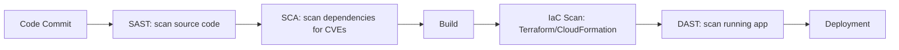

**Real-World Example:** A DevSecOps pipeline runs Snyk to scan dependencies for known CVEs on every commit, runs SonarQube SAST analysis at build time, scans Terraform infrastructure code with Checkov before any cloud resource is provisioned, and runs an OWASP ZAP DAST scan against the staging environment before allowing promotion to production — blocking the pipeline automatically if a critical vulnerability is found at any stage.

**Exam Strategy:**
- Use the exact phrase "shifting security left" — the direct DevSecOps analog of "shift-left testing" from topic 1, and a very high-value keyword.
- Name all the scanning categories explicitly (SAST, DAST, SCA/dependency scanning, IaC scanning, secrets scanning) with one tool example each.
- Emphasize the cultural point: security becomes everyone's shared responsibility (developers included), not solely a separate security team's job at the end — this framing mirrors topic 1's testing-ownership shift and is worth stating explicitly for cross-topic consistency.

---

## PART B — VERSION CONTROL IN DEVOPS

---

### 7. Distributed Version Control System: Git

**In plain words:** Git tracks every change ever made to your code, letting you go back in time, see who changed what, and work on different features in parallel without stepping on each other's toes. Unlike older systems where only one central server held the full history, Git gives every single developer a complete copy of the entire project history on their own machine.

**Formal definition:** Git is a distributed version control system (DVCS) that tracks changes to source code over time, where every developer's local repository contains a full copy of the project's history (not just the latest snapshot), enabling offline work, fast local operations, and flexible collaboration workflows without requiring constant connectivity to a central server.

**How it actually works:**
- In a **centralized** VCS (like old SVN), there is one central server holding the full history; developers check out only the current snapshot, and every meaningful operation (commit, log, diff against history) requires network access to that central server.
- In a **distributed** VCS like Git, every clone of the repository is a full, independent copy of the entire history — committing, branching, viewing history, and diffing are all local operations that work instantly, even offline.
- A **remote** (like GitHub/GitLab/a shared server) still typically exists as a convention for synchronizing work between developers via `push`/`pull`/`fetch`, but it's not structurally required the way a centralized VCS's server is.
- Because every developer has the full history, there's no single point of failure — if the remote server is lost, any developer's local clone can fully restore it.

**Diagram:**
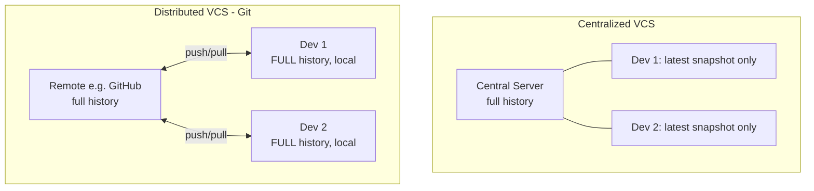

**Real-World Example:** A developer working on a flight with no internet connection can still commit code, view the entire project's history, create branches, and diff against any past commit — all fully functional offline — because their local Git repository already contains the complete project history, and they only need connectivity again when they're ready to `push` their work to the shared remote.

**Exam Strategy:**
- Always contrast "distributed" against "centralized" VCS explicitly — this comparison is the core of what's being tested, not just a definition of Git in isolation.
- State clearly that every clone has the FULL history, not just the latest files — this is the single most important distinguishing fact.
- Mention "no single point of failure" as the practical consequence of full distributed history — a frequently rewarded insight.

---

### 8. Installing Git on Ubuntu

**In plain words:** On Ubuntu, installing Git is a one-line command using the built-in package manager, since Git is available directly from Ubuntu's official software repositories.

**Formal definition:** Git is installed on Ubuntu using the APT package manager, which downloads and installs Git along with its dependencies from Ubuntu's official repositories, followed by a one-time global configuration of the user's identity (name and email) required for making commits.

**How it actually works:**
```
sudo apt update                            # Refresh the package index
sudo apt install git -y                    # Install Git
git --version                              # Verify installation

# One-time global identity configuration (required before committing)
git config --global user.name "Your Name"
git config --global user.email "you@example.com"

# View current configuration
git config --list
```
- `apt update` refreshes the local list of available package versions before installing, ensuring you get the latest available version.
- `git config --global` sets configuration that applies to every repository for that user on that machine (as opposed to `--local`, which applies only to one specific repository).
- The `user.name` and `user.email` configuration is mandatory — Git embeds this identity into every commit you make, and Git will refuse to commit without it configured.

**Diagram:**
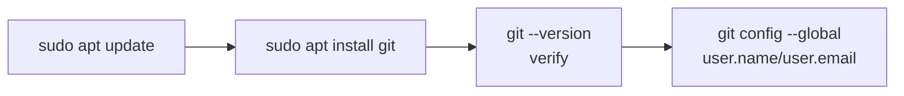

**Real-World Example:** A new developer joining a team sets up their Ubuntu development VM by running `sudo apt update && sudo apt install git -y`, then immediately configures `git config --global user.name "Priya Shah"` and `git config --global user.email "priya@company.com"` so that every future commit is correctly attributed to them across all their repositories on that machine.

**Exam Strategy:**
- Give the exact command sequence — `apt update`, `apt install git`, `git --version` — command-recall questions expect exact syntax.
- Always include the mandatory `git config --global user.name/user.email` step — many students forget this step even though it's required before Git will accept any commit.
- Mention `--global` vs `--local` scope briefly, since it's a natural, easy follow-up point that shows deeper configuration understanding.

---

### 9. Installing Git on Windows

**In plain words:** On Windows, Git isn't a built-in package like on Ubuntu — you download and run a standard installer from the official Git website, which also bundles "Git Bash," a Unix-like terminal that lets you use the same Git commands you'd use on Linux/Mac.

**Formal definition:** Git is installed on Windows by downloading and running the official Git for Windows installer (from git-scm.com), which installs the Git command-line tools along with Git Bash (a Bash emulation terminal) and optionally a graphical interface (Git GUI), followed by the same one-time global identity configuration required on any platform.

**How it actually works:**
1. Download the installer from the official source: `git-scm.com/download/win`.
2. Run the installer, accepting the license and choosing installation options (default options are safe for most users — including adding Git to the system PATH so it's usable from any terminal).
3. Open **Git Bash** (installed alongside Git) — this provides a Unix-like command-line environment on Windows, so the same `git` commands used on Linux/Mac work identically.
4. Verify installation and configure identity, exactly as on any other platform:
```
git --version
git config --global user.name "Your Name"
git config --global user.email "you@example.com"
```
- Choosing to add Git to PATH during installation means `git` commands also work from the regular Windows Command Prompt or PowerShell, not just Git Bash.

**Diagram:**
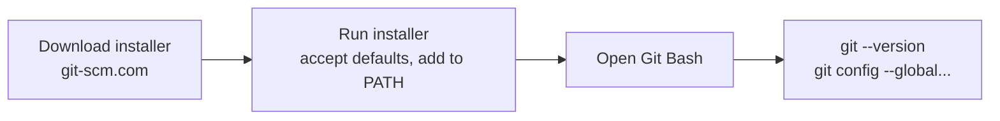

**Real-World Example:** A student installs Git for Windows from the official site, keeps the default option to add Git to PATH, and afterward can run `git status` both from Git Bash and from a regular Windows PowerShell window, since the installer made the `git` executable available system-wide.

**Exam Strategy:**
- Mention the official download source (git-scm.com) explicitly — using an unofficial source is a security-relevant point worth a quick mention.
- Name "Git Bash" specifically as the Windows-specific component that provides Unix-like command compatibility — a distinctive Windows-only detail examiners look for versus the Ubuntu installation.
- Note that the same `git config --global` identity setup step applies identically across platforms — a good closing line tying topics 8 and 9 together.

---

### 10. Building the Code / Need for Building the Code

**In plain words:** Writing source code isn't the same as having a working, runnable application — most languages need a "build" step that compiles, links, packages, or bundles that source code into something that can actually execute. Skipping this step (or doing it inconsistently) is exactly how "works on my machine" problems happen.

**Formal definition:** Building the code is the automated process of transforming source code into a runnable software artifact — including steps such as compiling source files, resolving and downloading dependencies, running static checks, linking libraries, and packaging the result into a deployable format (e.g., a JAR, WAR, executable, or Docker image). The need for building arises because raw source code, dependency versions, and environment configuration must be consistently and repeatably assembled into a single verified artifact before it can be tested or deployed.

**How it actually works — why building matters:**
- **Consistency:** an automated build process produces the exact same output every time, given the same source code and dependency versions — eliminating "it compiled fine on my laptop" surprises.
- **Dependency resolution:** modern applications depend on many external libraries; the build process resolves the exact correct versions and fetches them automatically (e.g., via Maven, npm, pip).
- **Early error detection:** compilation errors, missing dependencies, and some static analysis issues are caught at build time, before the code is ever run — much cheaper than catching them later.
- **Producing a single deployable artifact:** the build step's output (a compiled binary, a packaged JAR, a Docker image) is the one exact thing that gets tested and later deployed — this is the "final artifact" concept, covered in more depth under Jenkins (Part C).

**Diagram:**
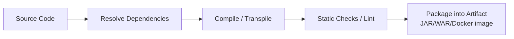

**Real-World Example:** A Java project's build process (via Maven) automatically downloads all required libraries at their pinned versions, compiles every `.java` source file, runs unit tests, and packages everything into a single `.jar` file — that single, verified `.jar` is what gets deployed to every environment (dev, staging, production), guaranteeing every environment runs the exact same tested artifact.

**Exam Strategy:**
- Explicitly answer both halves of the topic name — what "building the code" means, AND why it's needed (consistency, dependency resolution, early error detection) — a very common two-part question.
- Name the "final artifact" concept explicitly as the tangible output of a build — this connects directly forward into Part C's Jenkins topics.
- Give one concrete build tool example (Maven, npm, Gradle) to ground the answer in a real technology.

---

### 11. Introduction to Git Branching Strategy

**In plain words:** A branch is an independent line of development — you can work on a new feature or fix a bug on your own branch without touching the main, stable codebase, then merge your changes back in once they're ready. A "branching strategy" is your team's agreed-upon rules for how branches get created, named, and merged, so multiple people can work in parallel without chaos.

**Formal definition:** A Git branching strategy is a set of conventions defining how a team creates, names, and merges branches to manage parallel development, releases, and hotfixes; common strategies include Git Flow (long-lived `develop` and `main` branches with supporting `feature`, `release`, and `hotfix` branches), GitHub Flow (a single `main` branch with short-lived feature branches merged via pull requests), and Trunk-Based Development (very short-lived branches merged into a single trunk multiple times a day).

**How it actually works — the common strategies, one line each:**
- **Git Flow:** a structured model with a long-lived `main` (production-ready) branch, a long-lived `develop` (integration) branch, short-lived `feature/*` branches off `develop`, `release/*` branches for release preparation, and `hotfix/*` branches for urgent production fixes off `main`. Best suited for projects with scheduled, versioned releases.
- **GitHub Flow:** simpler — just `main` plus short-lived feature branches; every feature branch is merged into `main` via a pull request after review and passing CI, and `main` is always deployable. Best suited for continuous deployment / web applications.
- **Trunk-Based Development:** developers commit directly to (or merge very frequently, multiple times a day, into) a single shared branch ("trunk"/`main`), using feature flags to hide incomplete work rather than long-lived branches. Best suited for teams practicing true continuous integration/deployment at high velocity.
- Core Git branching commands:
```
git branch feature/login          # Create a new branch
git checkout feature/login        # Switch to it
git checkout -b feature/login     # Create AND switch in one command
git merge feature/login           # Merge a branch into the current branch
git branch -d feature/login       # Delete a branch after merging
```

**Diagram:**
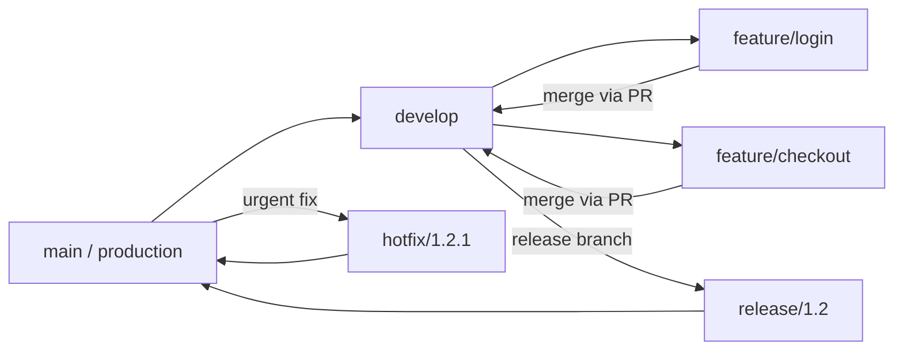

**Real-World Example:** A SaaS company practicing continuous deployment uses GitHub Flow: a developer creates `feature/dark-mode` off `main`, commits changes, opens a pull request, waits for CI checks and a teammate's review to pass, then merges directly into `main`, which auto-deploys to production within minutes — no long-lived `develop` branch or scheduled release train involved.

**Exam Strategy:**
- Name all three common strategies (Git Flow, GitHub Flow, Trunk-Based Development) with a one-line description each, and state which type of project/release cadence each suits best — this "which strategy fits which scenario" framing is what's usually being tested.
- Draw the Git Flow branch diagram, since it's the most detailed and most commonly asked to be reproduced.
- Give the core branch commands (`git branch`, `git checkout -b`, `git merge`) exactly — command-recall matters here too.

---

## PART C — TOOLS USED FOR BUILD PROCESS: JENKINS

---

### 12. Jenkins Overview

**In plain words:** Jenkins is the "robot" that watches your Git repository and automatically does the boring, repetitive work every time code changes — pulling the latest code, building it, running tests, and deploying it — all without a human manually triggering each step.

**Formal definition:** Jenkins is an open-source, self-hosted automation server used to build, test, and deploy software continuously, implementing Continuous Integration (CI) and Continuous Delivery/Deployment (CD) by automatically triggering configurable jobs (pipelines) in response to events such as source code changes.

**How it actually works:**
- Jenkins runs as a persistent server process (the Jenkins controller), typically accessed via a web UI, and executes defined "jobs" or "pipelines" — sequences of automated steps (checkout code, build, test, package, deploy).
- Jobs are triggered by events: a Git push (via webhook), a scheduled time (cron-like syntax), or manual triggering.
- Jenkins is highly extensible via a large plugin ecosystem — plugins add support for specific version control systems, build tools, cloud platforms, notification systems, and more.
- Jenkins can distribute build work across multiple machines using a controller-agent architecture, where the central controller delegates actual build execution to one or more agent nodes.

**Diagram:**
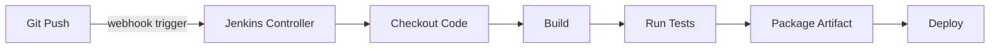

**Real-World Example:** Every time a developer pushes to the `main` branch of a GitHub repository, a configured webhook instantly notifies Jenkins, which automatically checks out the latest code, runs the full build and test suite, and — if everything passes — deploys the new version to a staging environment, entirely without human intervention.

**Exam Strategy:**
- Define Jenkins explicitly as an automation server implementing CI/CD — this exact phrase ("CI/CD automation server") is the expected keyword opener.
- Mention event-based triggering (webhook, schedule, manual) as the mechanism connecting Jenkins to source control.
- Note the controller-agent architecture and plugin ecosystem as two distinguishing, frequently tested Jenkins characteristics.

---

### 13. Jenkins Build Server

**In plain words:** The "Jenkins build server" is the actual machine (or set of machines) where Jenkins runs and where the real work of compiling, testing, and packaging code happens — it's the engine room behind the Jenkins web dashboard you interact with.

**Formal definition:** The Jenkins Build Server refers to the Jenkins controller (master) instance — the central server that hosts job configurations, the web UI, and orchestration logic — optionally paired with one or more Jenkins agent (slave) nodes, which are separate machines/containers that the controller delegates actual build execution to, enabling parallel and distributed builds.

**How it actually works:**
- The **controller (master)** stores all job/pipeline configurations, schedules builds, and serves the web UI — but does not necessarily execute build work itself, especially in larger setups.
- **Agents (slaves)** are worker machines (physical, virtual, or containerized) that connect to the controller and actually execute the build steps (compiling, running tests) assigned to them.
- This controller-agent split allows Jenkins to scale horizontally — adding more agents lets more builds run in parallel, and different agents can be configured with different OS/toolchains for cross-platform builds.
- Each agent typically has "executors" — a configurable number of concurrent build slots per agent machine.

**Diagram:**
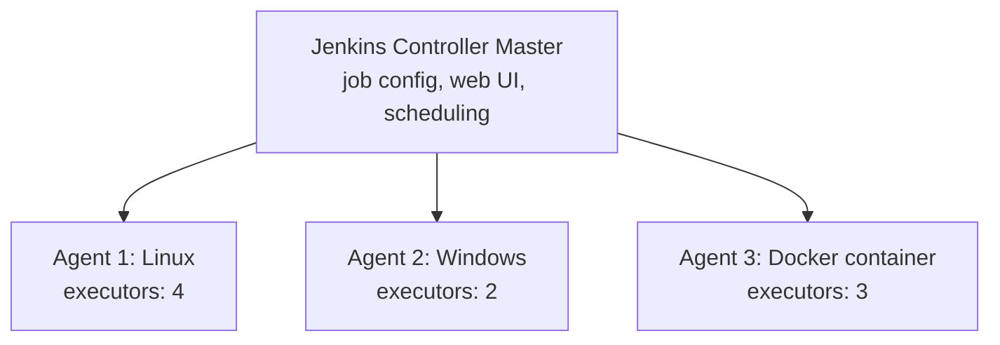

**Real-World Example:** A company's Jenkins setup has one controller managing job definitions, but delegates actual build execution to three agent VMs — one running Linux for backend service builds, one running Windows for a legacy .NET application, and one spinning up disposable Docker containers for isolated, clean builds — allowing multiple builds to run simultaneously without contending for the same resources.

**Exam Strategy:**
- Explicitly name the controller (master) and agent (slave) terms and their distinct responsibilities — this exact vocabulary pair is what's graded.
- State the scaling/parallelism benefit of the controller-agent split as the practical motivation for this architecture.
- Mention "executors" as the specific mechanism controlling how many builds an agent can run concurrently, for extra depth.

---

### 14. Managing Build Dependencies

**In plain words:** Almost no project is built from scratch — it depends on other libraries, tools, and sometimes other internal projects. Managing build dependencies means making sure Jenkins always uses the exact right versions of everything the build needs, consistently, every single time.

**Formal definition:** Managing build dependencies in Jenkins involves ensuring that all external libraries, tools, plugins, and upstream project artifacts required by a build are correctly resolved, versioned, and made available to the build environment — typically handled via build-tool-level dependency management (Maven/Gradle/npm dependency files) combined with Jenkins-level plugin and tool configuration, and job-to-job dependency chaining for internal projects.

**How it actually works:**
- **Build-tool-level dependencies:** the actual application's third-party libraries are declared in a manifest file (e.g., `pom.xml` for Maven, `package.json` for npm) and resolved automatically during the build step by that tool, pulling exact pinned versions from a repository (e.g., Maven Central, npm registry, or an internal artifact repository like Nexus/Artifactory).
- **Jenkins-level tool configuration:** Jenkins itself can be configured with specific tool versions (a specific JDK version, a specific Maven version) via "Global Tool Configuration," ensuring every job uses a consistent, known toolchain rather than whatever happens to be installed on an agent.
- **Inter-job dependencies:** when one project depends on another internal project's build output, Jenkins jobs can be chained (see topic 18) so that a downstream job automatically triggers after its upstream dependency successfully builds a new artifact.
- Using a private artifact repository (Nexus, Artifactory, Docker registry) as the source of truth for both internal and cached external dependencies is standard practice, avoiding direct, repeated dependence on public internet repositories during every build.

**Diagram:**
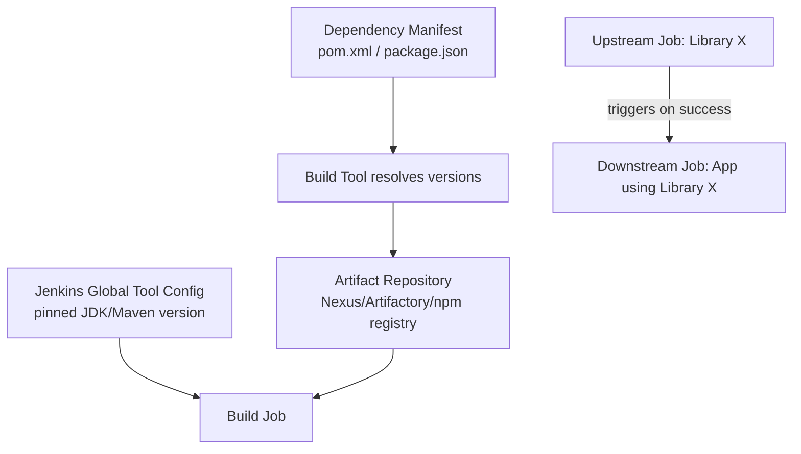

**Real-World Example:** A Jenkins pipeline for a Java microservice pulls its third-party dependencies (pinned exact versions in `pom.xml`) from an internal Nexus repository rather than the public internet, uses a Jenkins-configured JDK 17 toolchain so every build is compiled identically regardless of which agent runs it, and is automatically triggered whenever an upstream "shared-utils" library project successfully publishes a new version.

**Exam Strategy:**
- Distinguish the two layers explicitly: build-tool-level dependency management (the application's own libraries) versus Jenkins-level tool/environment configuration (JDK/Maven version consistency) — conflating these two loses precision marks.
- Mention a private artifact repository (Nexus/Artifactory) by name as standard practice for reliable, fast dependency resolution.
- Connect inter-job dependency chaining forward to topic 18 (Chaining Jobs) for cross-topic consistency.

---

### 15. The Final Artifact

**In plain words:** After all the compiling, testing, and packaging is done, a build produces one specific output file (or set of files) — this is the "final artifact," the actual thing that gets deployed to servers or shipped to users. Everything before this point was just steps to produce it; everything after uses it as-is.

**Formal definition:** The final artifact is the packaged, deployable output produced at the end of a successful build process — such as a JAR/WAR file (Java), a compiled executable, an npm package, or a Docker image — which Jenkins archives (via "Archive the artifacts") and/or publishes to an artifact repository, so that the exact same tested artifact can be promoted and deployed identically across every subsequent environment (staging, production) without being rebuilt.

**How it actually works:**
- Once the build and test stages succeed, Jenkins can archive the resulting artifact (using the "Archive the Artifacts" post-build action), storing it attached to that specific build number in Jenkins for later retrieval.
- More commonly in mature pipelines, the artifact is instead pushed to a dedicated artifact repository (Nexus/Artifactory for JARs, Docker Hub/ECR for container images, npm registry for packages) as the authoritative, versioned storage location.
- The critical principle is **"build once, deploy many times"** — the exact same artifact that passed all tests in the pipeline is what gets deployed to staging and later promoted (not rebuilt) to production, eliminating any possibility of environment-specific build inconsistencies.

**Diagram:**
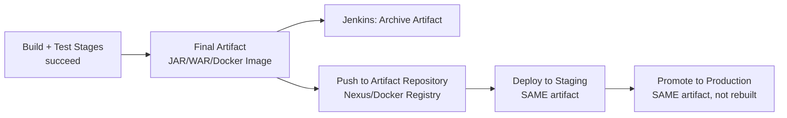

**Real-World Example:** A Jenkins pipeline builds a Docker image tagged `myapp:build-482`, pushes it to a private Docker registry, deploys that exact image to staging for testing, and — once staging tests pass — simply re-tags and promotes that same `myapp:build-482` image to production, rather than triggering a fresh build for the production deployment, guaranteeing staging and production ran the literal identical code.

**Exam Strategy:**
- Use the exact phrase "build once, deploy many times" — this is the single highest-value keyword phrase for this topic.
- Name at least two concrete artifact types (JAR/WAR, Docker image) and where they typically get stored (Nexus/Artifactory, Docker registry).
- Explain why rebuilding for each environment is a bad practice (risk of inconsistency between what was tested and what's deployed) as the reasoning behind the final-artifact principle.

---

### 16. Managing the Build Process Using Jenkins

**In plain words:** This is about how you actually tell Jenkins what to do — either by clicking through a web form to configure a traditional "Freestyle" job, or (the modern, preferred way) by writing the entire build process as code in a file called a Jenkinsfile that lives right alongside your source code.

**Formal definition:** Managing the build process in Jenkins is done by defining Jobs, which specify the sequence of steps (source checkout, build, test, package, deploy) to execute, configured either as a **Freestyle project** (steps configured through the Jenkins web UI) or, preferably, as a **Pipeline** defined in a `Jenkinsfile` using Pipeline-as-Code syntax (Declarative or Scripted), which is version-controlled alongside the application source code.

**How it actually works:**
- A **Freestyle project** is configured entirely through Jenkins's web UI — simple to set up for basic use cases, but the configuration lives only inside Jenkins itself, is not version-controlled, and is harder to review, replicate, or audit.
- A **Pipeline (Jenkinsfile)** is written as code, checked into the same Git repository as the application, and defines every stage explicitly. This is strongly preferred in modern DevOps practice because the pipeline definition is versioned, reviewable, and reproducible.
- Example Declarative Jenkinsfile:
```groovy
pipeline {
    agent any
    stages {
        stage('Checkout') {
            steps { git 'https://github.com/example/myapp.git' }
        }
        stage('Build') {
            steps { sh 'mvn clean package' }
        }
        stage('Test') {
            steps { sh 'mvn test' }
        }
        stage('Deploy') {
            steps { sh './deploy.sh' }
        }
    }
}
```
- Each `stage` groups related `steps`; Jenkins displays pipeline progress visually stage-by-stage, making it easy to see exactly where a build failed.

**Diagram:**
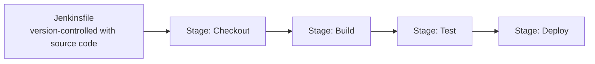

**Real-World Example:** A team migrates from a Freestyle job (configured manually through clicks, undocumented, and only understood by one senior engineer) to a Declarative Jenkinsfile checked into their repository; now every change to the build process goes through the same pull-request review as any code change, and any team member can understand or reproduce the exact build steps just by reading the file.

**Exam Strategy:**
- Explicitly compare Freestyle projects against Pipeline/Jenkinsfile — stating clearly why Pipeline-as-Code is the modern, preferred approach (version control, reviewability, reproducibility) is the core of what's being tested.
- Reproduce a basic Declarative Jenkinsfile structure (`pipeline { agent ... stages { stage(...) { steps {...} } } }`) — syntax recall is commonly graded here.
- Name the standard stage sequence (Checkout → Build → Test → Deploy) as the canonical example pipeline structure.

---

### 17. Triggering a Build from External Links

**In plain words:** Instead of only starting builds automatically (on a Git push) or manually (clicking a button in Jenkins), Jenkins can also expose a special URL that lets any external system or script kick off a build just by sending an HTTP request to it.

**Formal definition:** Jenkins supports triggering a build remotely via an HTTP request to a specially constructed URL (the "Remote Access API" / remote trigger URL), typically of the form `JENKINS_URL/job/JOB_NAME/build?token=TOKEN`, authenticated using a per-job security token, allowing external systems (webhooks, scripts, other CI tools, chatops integrations) to programmatically initiate builds without using the Jenkins web UI.

**How it actually works:**
- In a job's configuration, enabling "Trigger builds remotely" generates an authentication token and the exact URL pattern to use.
- Any system capable of sending an HTTP request — a GitHub webhook, another Jenkins job, a custom script, a Slack chatops bot — can call that URL to start the build.
```
curl "https://jenkins.example.com/job/myapp-build/build?token=MY_SECRET_TOKEN"

# With parameters, for a parameterized job:
curl "https://jenkins.example.com/job/myapp-build/buildWithParameters?token=MY_SECRET_TOKEN&BRANCH=release-2.0"
```
- This is the exact underlying mechanism GitHub/GitLab webhooks use to trigger Jenkins automatically on a push — the webhook is simply an automated caller of this same remote trigger URL.
- The security token prevents arbitrary unauthenticated parties from triggering builds on your Jenkins server.

**Diagram:**
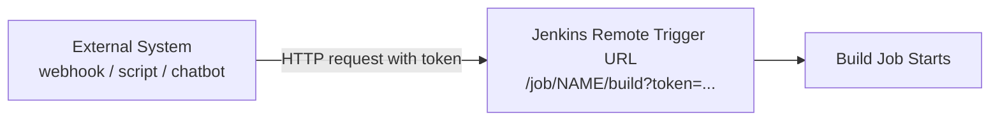

**Real-World Example:** A GitHub repository is configured with a webhook pointing at Jenkins's remote trigger URL, so every push to `main` automatically fires an HTTP request that starts the corresponding Jenkins build within seconds — the same mechanism a developer could also trigger manually from a terminal using `curl` against that same URL during testing.

**Exam Strategy:**
- Give the exact URL pattern (`JOB_URL/build?token=TOKEN`) — command/URL-syntax recall is directly graded for this topic.
- Explain that a webhook (from GitHub/GitLab) is just an automated version of the exact same remote-trigger mechanism — this connects the abstract concept to the concrete CI trigger flow.
- Mention the security token explicitly as the authentication mechanism preventing unauthorized remote triggering.

---

### 18. How to Chain Jobs in Jenkins

**In plain words:** Real software systems are made of multiple projects that depend on each other — chaining jobs means setting things up so that when one project finishes building successfully, it automatically kicks off the build of the next project that depends on it, creating an automated assembly line instead of separate, disconnected builds.

**Formal definition:** Job chaining in Jenkins is the practice of configuring one job to automatically trigger another job upon completion (typically upon success), implemented via the "Build other projects" post-build action (for simple linear chains) or the more flexible/robust Pipeline `build` step (for pipeline-based chaining), enabling multi-project build pipelines that reflect real project dependencies.

**How it actually works:**
- **Freestyle chaining:** in Job A's configuration, under "Post-build Actions," selecting "Build other projects" and specifying Job B causes Job B to automatically start whenever Job A completes successfully.
- **Pipeline chaining:** within a Jenkinsfile, the `build` step explicitly triggers another named pipeline job:
```groovy
stage('Trigger Downstream') {
    steps {
        build job: 'downstream-app-build', wait: true
    }
}
```
- The `wait: true` parameter makes the upstream job wait for the downstream job to finish (and can fail the upstream build if the downstream one fails) — `wait: false` fires it off asynchronously without waiting.
- This is exactly the mechanism referenced in topic 14 (Managing Build Dependencies) for triggering a dependent project's build automatically after a shared library project successfully builds.

**Diagram:**
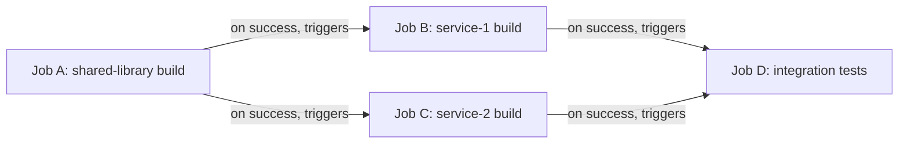

**Real-World Example:** A "shared-utils" library job, once it successfully builds and publishes a new version, automatically triggers both a "service-1" job and a "service-2" job (both of which depend on that library), and once both of those succeed, a final "integration-tests" job automatically runs to validate they all still work together correctly.

**Exam Strategy:**
- Give both chaining methods — the Freestyle "Build other projects" post-build action, and the Pipeline `build` step with exact syntax — since exam questions may ask for either the classic or modern approach.
- Explain `wait: true` vs `wait: false` explicitly, since it's a specific, gradable detail about synchronous vs asynchronous chaining.
- Draw the multi-job dependency diagram (a fan-out/fan-in shape) to show a realistic, non-trivial chaining scenario, not just a simple two-job chain.

---

### 19. How to Use the Command Line Interface for Jenkins

**In plain words:** Besides the web UI, Jenkins has a command-line tool (the Jenkins CLI) that lets you do the same things — trigger builds, check job status, manage configuration — directly from a terminal or script, which is essential for automating Jenkins itself or integrating it into other scripted workflows.

**Formal definition:** The Jenkins Command Line Interface (CLI) is a client tool, distributed as `jenkins-cli.jar`, that allows users to interact with a Jenkins controller from a terminal or script — executing commands such as triggering builds, listing jobs, managing plugins, and reading configuration — by connecting to the controller over SSH or HTTP(S) with appropriate authentication.

**How it actually works:**
```
# Download the CLI jar from your Jenkins server
curl -O https://JENKINS_URL/jnlpJars/jenkins-cli.jar

# Trigger a build
java -jar jenkins-cli.jar -s https://JENKINS_URL -auth USER:API_TOKEN build myapp-build

# List all jobs
java -jar jenkins-cli.jar -s https://JENKINS_URL -auth USER:API_TOKEN list-jobs

# Get the console output of a specific build
java -jar jenkins-cli.jar -s https://JENKINS_URL -auth USER:API_TOKEN console myapp-build 42

# View available commands
java -jar jenkins-cli.jar -s https://JENKINS_URL help
```
- The `-s` flag specifies the Jenkins server URL; `-auth` provides credentials (typically a username plus an API token generated from the user's Jenkins account settings, not their raw password).
- The CLI supports dozens of commands beyond just building — including managing plugins, creating/deleting jobs, and reading configuration — making it a powerful tool for scripting Jenkins administration itself.
- This is functionally similar to the remote trigger URL (topic 17) for starting builds, but the CLI offers a much broader command surface beyond just triggering builds, useful for administrative automation.

**Diagram:**
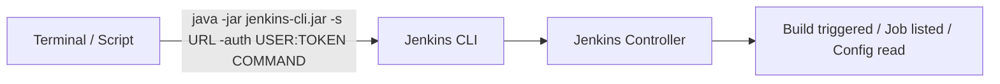

**Real-World Example:** An SRE writes a shell script that uses the Jenkins CLI to trigger a nightly build (`java -jar jenkins-cli.jar ... build nightly-regression`), waits for it to complete, then uses the CLI's `console` command to pull the build log and automatically post a summary to a team Slack channel — all without ever opening the Jenkins web UI.

**Exam Strategy:**
- Give the exact CLI invocation pattern (`java -jar jenkins-cli.jar -s URL -auth USER:TOKEN COMMAND`) — command-syntax recall matters here too.
- Mention that authentication uses an API token (generated per-user), not a raw password, as a security-relevant detail.
- Distinguish the CLI's broader administrative command set from the narrower remote-trigger URL (topic 17), which is limited to just starting builds — this comparison is a natural, frequently expected follow-up point.

---

## FINAL EXAM CHECKLIST

```
[ ] Shift-left testing: definition and why DevOps moves testing earlier
[ ] Test integration by pipeline stage: unit -> integration -> security/performance -> acceptance
[ ] Continuous testing importance: immediate feedback, de-risking frequent deploys, lower bug-fix cost
[ ] Testing strategy tips: test pyramid diagram, environment parity, fast feedback, flaky test monitoring
[ ] DevOps testing tools table: one tool per category (unit/API/UI/performance/security/CI orchestration)
[ ] DevSecOps: "shift security left," SAST/DAST/SCA/IaC scanning/secrets scanning all named
[ ] Git as distributed VCS: full history per clone, no single point of failure, vs centralized VCS
[ ] Git install commands exact: apt install git (Ubuntu) vs Git for Windows installer + Git Bash
[ ] git config --global user.name/user.email: mandatory before first commit
[ ] Building the code: why needed (consistency, dependency resolution, early error detection)
[ ] Git branching strategies: Git Flow vs GitHub Flow vs Trunk-Based, which fits which project type
[ ] Git Flow diagram: main, develop, feature/*, release/*, hotfix/* branches
[ ] Jenkins definition: CI/CD automation server, event-triggered jobs, plugin ecosystem
[ ] Jenkins controller (master) vs agent (slave) architecture, executors
[ ] Build dependency management: build-tool-level vs Jenkins tool config vs job chaining
[ ] Final artifact: "build once, deploy many times" principle, JAR/Docker image examples
[ ] Freestyle project vs Pipeline/Jenkinsfile: why Pipeline-as-Code is preferred
[ ] Declarative Jenkinsfile syntax: pipeline/agent/stages/stage/steps structure
[ ] Remote trigger URL exact pattern: JOB_URL/build?token=TOKEN, webhook connection
[ ] Job chaining: Freestyle "Build other projects" vs Pipeline build step, wait:true/false
[ ] Jenkins CLI: jenkins-cli.jar invocation syntax, -auth with API token, broader than remote-trigger URL
```
