# Docker — Unit 1 (Deep-Dive Notes)
### Containerization, Docker Architecture, Images & Containers, Data & Volumes — MCA Exam Prep

**How to use this document:** Every topic has five parts — **1. In plain words** — explained like a senior explaining it to a junior, no jargon-dump. **2. Formal definition** — the "textbook line" you write first in the exam so the examiner sees the keyword. **3. How it actually works** — the depth layer, so you understand it instead of memorizing it. **4. Diagram** — a Mermaid diagram you can redraw on paper in the exam. **5. Real-world/DevOps example + Exam strategy** — a concrete scenario, plus how to structure the answer for marks.

This document follows your Unit-1 table in order: **Chapter 1.1 (Introduction to Docker & Containerization)**, **Chapter 1.2 (Docker Hub, Images, Containers, Lifecycle Commands)**, and **Chapter 1.3 (Data and Volumes)**, with the two lab experiments folded in as practical command reference at the end.

---

## PART A — CHAPTER 1.1: INTRODUCTION TO DOCKER, CONTAINERIZATION, VIRTUALIZATION

---

### 1. Basics of Docker

**In plain words:** Docker is a tool that packages an application together with everything it needs to run — code, libraries, system tools, and settings — into a single unit called an Image. That image is used to create a container that runs consistently anywhere Docker is installed, whether that's your laptop, a teammate's laptop, a test server, or a production cloud host. The whole point is eliminating the classic excuse, “It works on my machine."

**Formal definition:** Docker is an open-source platform that automates the deployment, scaling, and management of applications using OS-level virtualization (containerization), packaging an application and its dependencies into a standardized, portable unit called a container that runs consistently across any environment.

**How it actually works:**
- Docker packages the application code, runtime, system libraries, and configuration files together into an image — a read-only template.
- A container is a running instance of that image — isolated from other containers using Linux kernel features (namespaces for isolation, cgroups for resource limits).
- Because the container includes everything the app needs except the kernel itself, it behaves identically on any machine running a compatible Docker Engine, regardless of what else is installed on that host.

**Diagram:**
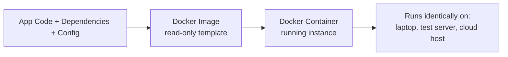

**Real-World Example:** A developer builds a Node.js application locally, packages it into a Docker image with the exact Node version, npm packages, and environment variables it needs, and ships that same image to the QA server and then to production — eliminating the "works on my machine" class of bugs entirely.

**Exam Strategy:**
- Open with the "package once, run anywhere" idea before the formal definition — examiners want to see you understand the motivation, not just recite the definition.
- Use the exact phrase "OS-level virtualization" — this links Docker back to the virtualization classification (containers = OS-level virtualization).
- Mention image (template) vs container (running instance) early — this distinction reappears as its own dedicated topic later and is very frequently tested.

---

### 2. Containerization

**In plain words:** Containerization is the general idea Docker implements — bundling an app with its dependencies so it runs consistently anywhere — using the host machine's own operating system kernel instead of pretending to be a whole separate computer like a VM does. Docker is the most popular tool that does containerization, but containerization as a concept is bigger than just Docker.

**Formal definition:** Containerization is an OS-level virtualization method where multiple isolated user-space instances (containers) share a single host OS kernel, each packaging an application with its own libraries, dependencies, and configuration, while remaining lightweight because no separate guest OS or hypervisor is required.

**How it actually works:**
- All containers on a host share the same kernel — there is no per-container "mini operating system" being booted.
- Isolation between containers is achieved using two Linux kernel features: **namespaces** (each container gets its own isolated view of process IDs, network interfaces, mount points, hostnames) and **cgroups** (control groups, which limit and account for how much CPU, memory, and I/O each container can consume).
- Because there's no separate kernel to boot, containers start in milliseconds to a few seconds, versus the tens of seconds to minutes a full VM takes to boot its own OS.

**Diagram:**
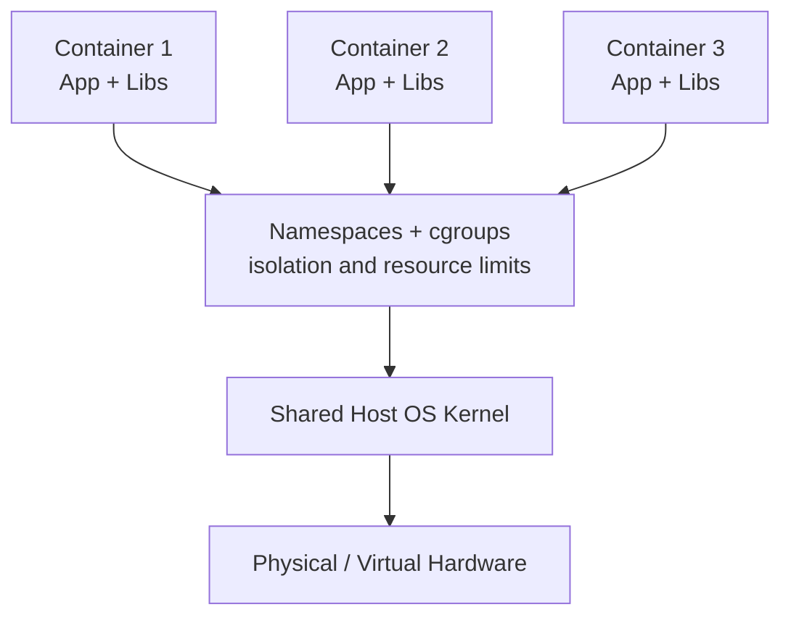

**Real-World Example:** An SRE team runs 40 microservice containers on a single Linux host; each container has cgroup limits capping it at 0.5 CPU cores and 512 MB RAM, and namespace isolation means each container sees only its own processes and network stack, even though they all ultimately share one kernel.

**Exam Strategy:**
- Name namespaces and cgroups explicitly by their exact Linux kernel terms — the single highest-yield technical fact for "how does containerization work" questions.
- State the startup-time contrast (milliseconds for containers vs much longer for VMs) as the direct, memorable consequence of not needing to boot a separate kernel.
- If the question says "containerization" generically, mention Docker as the most common implementation, but keep the concept-level answer OS-agnostic (LXC is another containerization technology worth a one-line mention for breadth).

---

### 3. Virtualization (Context for Comparison)

**In plain words:** A hypervisor lets multiple full virtual machines — each with its own complete guest operating system — run on one physical machine. This topic exists here only to set up a clean, direct comparison against containerization, which is the actual exam focus in this unit.

**Formal definition:** Virtualization (hardware/hypervisor virtualization) is the abstraction of physical hardware into multiple isolated virtual machines, each running its own complete guest operating system, managed by a hypervisor (Type 1 bare-metal or Type 2 hosted).

**How it actually works:** The one fact that matters for this comparison: each VM carries its own full guest OS kernel, completely separate from the host's kernel — this is the structural difference containerization was built to avoid.

**Diagram:**
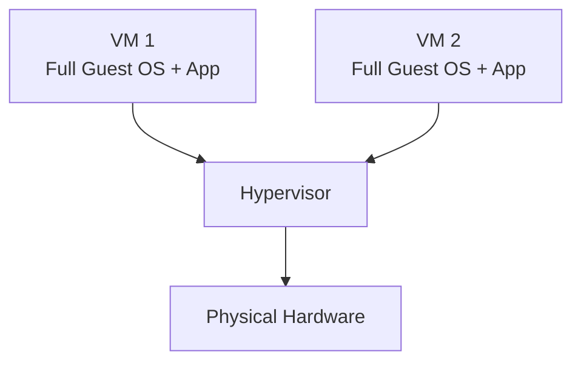

**Real-World Example:** A single physical host running VMware ESXi hosts three VMs, each booting its own independent copy of a full Linux kernel — each VM consumes its own chunk of RAM just to keep its own OS running, before the actual application even starts.

**Exam Strategy:**
- Keep this section brief and comparison-oriented — the exam is testing whether you can use this as a launchpad into topic 4, not testing deep hypervisor mechanics again here.
- The one sentence to always include: "Unlike a container, a VM includes a full guest OS kernel, isolated from the host by a hypervisor rather than by kernel namespaces."

---

### 4. Pros of Containerization over Virtualization - star

**In plain words:** Containers are lighter, faster, and cheaper to run than VMs for most application workloads, because they skip the overhead of booting and maintaining a full separate operating system for every single instance.

**Formal definition:** Containerization offers several advantages over hardware virtualization: significantly lower resource overhead (no duplicate guest OS per instance), faster startup times (seconds vs minutes), higher density (more containers than VMs fit on the same hardware), and simpler, more portable packaging (a single image runs identically across environments) — at the cost of weaker isolation, since all containers share one host kernel.

**How it actually works — the direct comparison to reproduce:**

| Aspect | Virtualization (VMs) | Containerization (Docker) |
|---|---|---|
| OS per instance | Full guest OS each | Shares host kernel |
| Startup time | Minutes | Seconds/milliseconds |
| Resource overhead | High (duplicate OS) | Low (no duplicate OS) |
| Density per host | Lower | Much higher |
| Isolation strength | Strong (hardware-enforced) | Weaker (kernel-shared) |
| Portability | Image tied to hypervisor | Image runs on any Docker host |

**Diagram:**
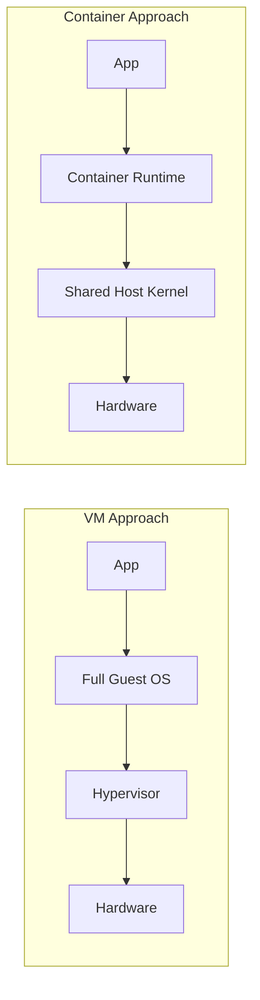

**Real-World Example:** A host that can run 15-20 full VMs (each needing its own guest OS memory footprint) can run several hundred lightweight containers instead, since containers only add the size of the application and its direct dependencies, not an entire duplicate operating system.

**Exam Strategy:**
- Draw the direct comparison table — this exact "VM vs Container" table is one of the most frequently asked questions in any containerization unit.
- Always mention the trade-off honestly: containers are lighter and faster, but isolation is weaker because a kernel-level vulnerability can potentially affect every container on that host.
- Name the resource overhead cause explicitly: no duplicate guest OS per instance is the root reason for every other advantage in the table.

---

### 5. Architecture of Docker

**In plain words:** Docker isn't one single program — it's a client-server system. You type commands into a Docker Client, which talks to a background service called the Docker Daemon, which actually does all the real work of building images and running containers, often by pulling images from a remote registry like Docker Hub.

**Formal definition:** Docker follows a client-server architecture consisting of the Docker Client (CLI/API used to issue commands), the Docker Daemon (dockerd, a persistent background process that builds, runs, and manages Docker objects such as images, containers, networks, and volumes), and a Registry (a storage and distribution system for Docker images, such as Docker Hub), communicating over a REST API.

**How it actually works:**
- The **Docker Client** is what the user directly interacts with (the `docker` command in the terminal); it sends commands to the daemon via the Docker REST API — the client can even talk to a daemon on a remote machine, not just the local one.
- The **Docker Daemon (dockerd)** listens for API requests and manages all Docker objects on that host: building images, running/stopping containers, managing networks and volumes.
- The **Docker Registry** stores and distributes images. Docker Hub is the default public registry; organizations also run private registries for internal images.
- When you run `docker run`, the client asks the daemon to start a container; if the required image isn't already present locally, the daemon automatically pulls it from the configured registry first.

**Diagram:**
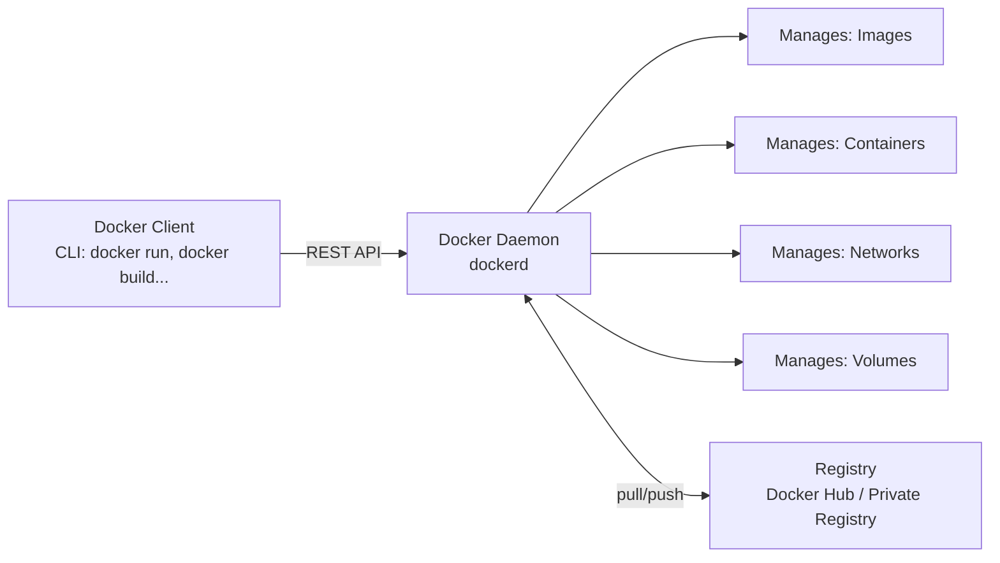

**Real-World Example:** A developer runs `docker run nginx` on their laptop; the Docker Client sends this request to the local Docker Daemon, which checks if the `nginx` image exists locally — since it doesn't, the daemon automatically pulls it from Docker Hub (the registry), then creates and starts a container from that image.

**Exam Strategy:**
- Name all three architectural components explicitly — Client, Daemon, Registry — and state that they communicate via a REST API.
- Draw the architecture diagram showing the client-daemon-registry relationship — the single most commonly asked diagram in any Docker unit.
- Mention that the client can control a remote daemon, not only a local one — a detail that shows deeper understanding beyond the basic picture.

---

### 6. Features of Docker -star

**In plain words:** Docker's popularity comes from a specific bundle of properties: it's lightweight, it's portable, it lets you version and share images easily, and it isolates applications from each other without the overhead of full VMs.

**Formal definition:** Key features of Docker include: Lightweight containerization (shared kernel, minimal overhead), Portability (images run identically across any Docker-compatible environment), Image versioning and layering (images are built in reusable, cacheable layers), Isolation (namespace and cgroup-based process/resource isolation), Scalability (containers can be rapidly created/destroyed to scale applications), and a rich Ecosystem (Docker Hub for image sharing, Docker Compose for multi-container apps, Docker Swarm/Kubernetes for orchestration).

**How it actually works:**
- **Layered images:** each instruction in a Dockerfile creates a new image layer; layers are cached and reused across builds and even across different images, saving build time and storage.
- **Portability:** since a container carries all its dependencies, it behaves the same on a developer's laptop, a CI server, and a production host.
- **Isolation:** achieved via namespaces and cgroups, the same mechanisms covered under Containerization (topic 2).
- **Scalability:** because containers start in seconds, orchestration tools can rapidly add or remove container instances in response to load.

**Diagram:**
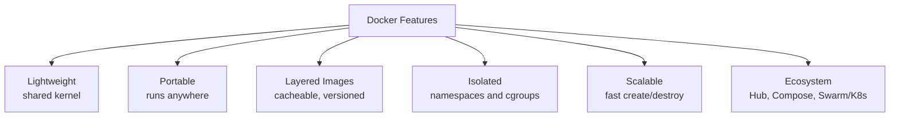

**Real-World Example:** A CI/CD pipeline rebuilds a Docker image on every commit; because only the top layer (the changed application code) needs rebuilding while lower layers (base OS, installed dependencies) are reused from cache, build times drop from minutes to seconds.

**Exam Strategy:**
- List all six features by name — this is a direct-recall question in most papers.
- Explain layered image caching in one extra sentence since it's the feature most students describe vaguely without the caching mechanism.
- Mention the ecosystem tools (Docker Hub, Compose, Swarm/Kubernetes) by name even briefly, to show awareness beyond single-container Docker.

---

### 7. Docker Components

**In plain words:** This is the inventory of "building block" objects Docker works with — the actual nouns you create, manage, and delete when you use Docker, as opposed to the architecture (which is about which process does the work).

**Formal definition:** The core Docker components (objects) are: **Docker Images** (read-only templates used to create containers), **Docker Containers** (running instances of images), **Dockerfile** (a text file containing instructions to build an image), **Docker Hub/Registry** (a repository for storing and sharing images), **Docker Volumes** (persistent storage independent of container lifecycle), and **Docker Networks** (virtual networks connecting containers to each other and the outside world).

**How it actually works:**
- A **Dockerfile** is written by a developer, describing step by step how to build an image (base OS, dependencies to install, files to copy, command to run).
- Running `docker build` on that Dockerfile produces a **Docker Image**.
- Running `docker run` on that image creates and starts a **Docker Container**.
- **Volumes** attach persistent storage to a container so data survives even if the container is deleted (detailed fully in Part C).
- **Networks** let containers communicate with each other by name and control what's exposed to the outside world.
- **Docker Hub/Registry** stores images so they can be shared and pulled onto any other Docker host.

**Diagram:**
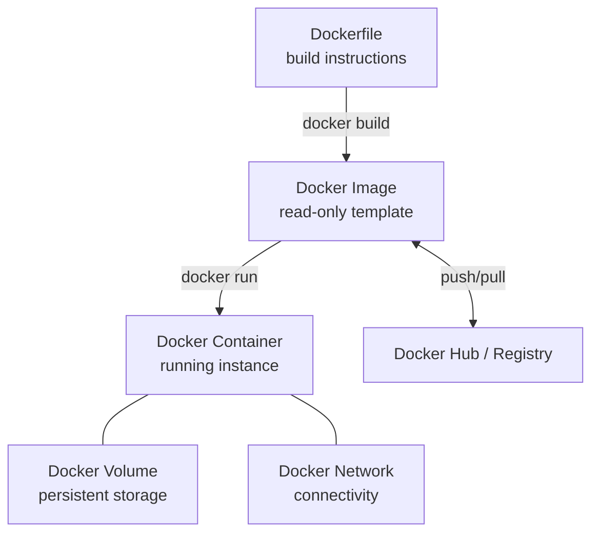

**Real-World Example:** A team writes a Dockerfile that starts from a `python:3.11` base image, copies their application code, and installs dependencies via `pip install`; building this produces an image that is pushed to a private registry, then pulled and run as a container on the production server, with a volume attached for persistent log storage and a network connecting it to a database container.

**Exam Strategy:**
- List all six components by name — Image, Container, Dockerfile, Registry, Volume, Network.
- Draw the flow diagram showing Dockerfile → Image → Container as the central pipeline, with Volume/Network/Registry attached around it.
- Distinguish "components" (the objects) from "architecture" (the processes: client, daemon, registry service) — students commonly conflate the two.

---

### 8. Advantages and Disadvantages of Docker

**In plain words:** Docker solves real, painful problems (environment inconsistency, slow VM startup, wasted resources) but it isn't a free lunch — it introduces its own new set of concerns, mainly around security isolation and the learning curve of a new toolchain.

**Formal definition:** Advantages of Docker include consistency across environments, faster deployment and startup, efficient resource utilization, easy scalability, and simplified CI/CD integration. Disadvantages include weaker isolation than VMs (shared kernel attack surface), persistent data management complexity, networking complexity at scale, and a learning curve for teams new to containerization.

**How it actually works — the balanced list:**

**Advantages:**
- Consistency: "works on my machine" problems are eliminated since the image carries the full runtime environment.
- Speed: containers start in seconds, enabling fast deploys and fast horizontal scaling.
- Efficiency: no duplicate guest OS per instance means more workloads fit on the same hardware.
- CI/CD friendliness: images are easy to build, version, test, and promote through pipeline stages identically.

**Disadvantages:**
- Weaker isolation: since all containers on a host share one kernel, a kernel-level vulnerability can potentially impact every container on that host.
- Persistent data complexity: containers are inherently ephemeral (disposable); managing durable data properly requires deliberate use of volumes (Part C).
- Networking complexity: connecting many containers securely, especially across multiple hosts, requires additional tooling.
- Learning curve: teams need to learn Dockerfiles, image layering, volume/network concepts, and often an orchestrator (Kubernetes/Swarm) to run Docker well in production.

**Diagram:**
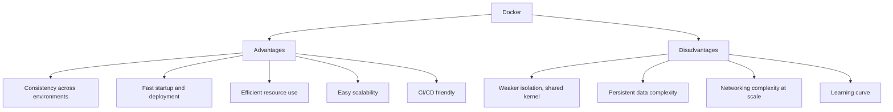

**Real-World Example:** A team migrates a legacy app to Docker and immediately gains fast, consistent deployments across dev/test/prod (advantage). But they initially forget to use volumes for their database container; when that container is redeployed during a routine update, all data inside it is lost (disadvantage), teaching them the hard way why persistent data must be deliberately managed outside the container's own writable layer.

**Exam Strategy:**
- Always answer with both sides explicitly labeled — Advantages and Disadvantages — a one-sided answer loses balance marks.
- Name the weaker-isolation trade-off specifically, tying it back to topic 4's VM-vs-container comparison for cross-topic consistency.
- Use the data-loss scenario as your disadvantage example — it previews and motivates Part C, which examiners often ask as a follow-up question.

---

## PART B — CHAPTER 1.2: DOCKER HUB, IMAGES, CONTAINERS, AND LIFECYCLE COMMANDS

---

### 9. Docker Hub

**In plain words:** Docker Hub is the default, public "app store" for Docker images — a place where you can find ready-made images (like official `nginx`, `mysql`, `python` images) built by others, and where you can upload your own images so your team or the world can pull and run them.

**Formal definition:** Docker Hub is Docker's official cloud-based registry service for finding, storing, and sharing container images, hosting both official/verified images (maintained by software vendors or Docker itself) and public/private user-uploaded repositories, accessed via `docker pull` and `docker push`.

**How it actually works:**
- Images on Docker Hub are organized as repositories, each potentially containing multiple tagged versions (e.g., `python:3.11`, `python:3.9`).
- `docker pull <image>:<tag>` downloads an image from Docker Hub (or another configured registry) to the local machine.
- `docker push <image>:<tag>` uploads a locally built image to a Docker Hub repository (requires `docker login` first, and the image must be tagged with your Docker Hub username/organization).
- Official images are generally preferred over random community images for security and reliability.

**Diagram:**
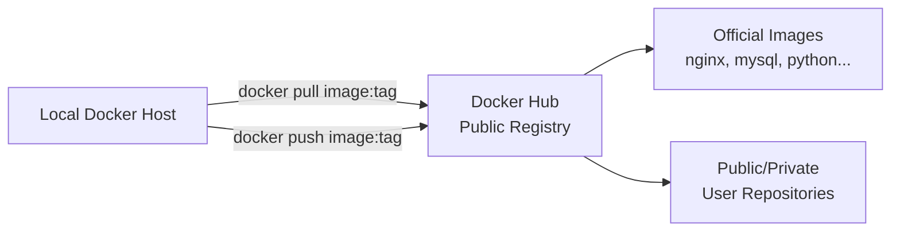

**Real-World Example:** An SRE team pulls the official `postgres:15` image from Docker Hub to spin up a database for local development, and separately pushes their own internally-built application image to a private repository on Docker Hub (or a private registry) so it can be pulled by the production deployment pipeline.

**Exam Strategy:**
- Name both key commands explicitly — `docker pull` and `docker push` — with a one-line description of each direction.
- Distinguish official/verified images from arbitrary public images as a security-relevant point.
- Mention that private registries exist as an alternative to the public Docker Hub, for organizations that can't publish images publicly.

---

### 10. Difference between Docker Image and Container

**In plain words:** This is one of the most fundamental Docker distinctions, and it's exactly like the difference between a class and an object in programming: an image is the blueprint (read-only, doesn't do anything by itself), and a container is a live, running instance created from that blueprint.

**Formal definition:** A Docker Image is a read-only, immutable template containing the application code, dependencies, and configuration needed to run an application, built in layers. A Docker Container is a running (or stopped) instance of an image, with its own writable layer on top of the image's read-only layers, an isolated process space, and its own network/filesystem view.

**How it actually works — the direct comparison:**

| Aspect | Docker Image | Docker Container |
|---|---|---|
| Nature | Read-only template | Running/stopped instance |
| Mutability | Immutable | Has a writable layer |
| Lifecycle | Built once, reused many times | Created, started, stopped, deleted |
| Analogy | Class / blueprint / recipe | Object / house / cooked dish |
| Storage | Stored in registry/local cache | Exists on the host until deleted |
| Multiplicity | One image | Can spawn many containers |

**Diagram:**
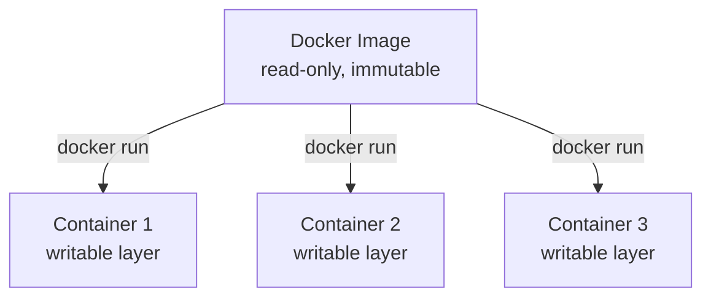

**Real-World Example:** A single `nginx:latest` image sitting on a Docker host can be used to start three separate running containers — each is an independent process with its own writable layer and container ID, and can be individually stopped or deleted, all while sharing the exact same underlying read-only image layers.

**Exam Strategy:**
- Always use the class-vs-object analogy explicitly — examiners specifically reward this because it proves conceptual, not memorized, understanding.
- Draw the "one image, many containers" diagram — this single diagram answers most exam variants of this question.
- Mention the writable layer explicitly as the technical reason a container can change state while the underlying image never changes.

---

### 11. Containers and Shell

**In plain words:** You can get an interactive command-line session inside a running container, exactly as if you had SSH'd into a separate machine — useful for debugging, inspecting files, or running one-off commands inside that isolated environment.

**Formal definition:** A container shell session is an interactive terminal opened inside a running container's isolated process/filesystem namespace, typically obtained via `docker exec -it <container> /bin/bash` (or `/bin/sh` for minimal images), allowing direct inspection and manipulation of the container's internal state.

**How it actually works:**
- `docker exec -it <container_name_or_id> /bin/bash` starts a new interactive process (`bash`) inside the already-running container's namespace, attaching your terminal to it.
- The `-i` flag keeps STDIN open (interactive), and `-t` allocates a pseudo-terminal.
- Minimal images (like `alpine`) often don't include `bash` at all, so `/bin/sh` must be used instead.
- This differs from `docker run -it <image> /bin/bash`, which creates and starts a brand-new container running bash as its main process, rather than attaching to an already-running one.

**Diagram:**
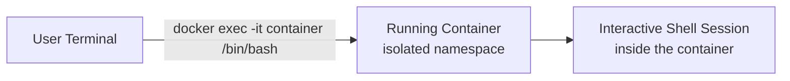

**Real-World Example:** An engineer debugging a misbehaving web application container runs `docker exec -it webapp_container /bin/bash` to get a shell inside the live container, inspects log files and configuration, and confirms an environment variable is missing — all without stopping or restarting the container.

**Exam Strategy:**
- Give the exact command syntax (`docker exec -it <container> /bin/bash`) — command-recall questions expect exact syntax.
- Explain the `-i` and `-t` flags individually — a very common short-answer sub-question.
- Distinguish `docker exec` (attach to an already-running container) from `docker run` (create and start a brand-new container) — a frequent trap question.

---

### 12. Creating Docker Images

**In plain words:** You create an image either by writing a Dockerfile (a recipe Docker follows step by step to build the image automatically — the standard, repeatable way) or by taking a running container's current state and freezing it into a new image using `docker commit` (a quick, manual, less repeatable way).

**Formal definition:** Docker images are created primarily by writing a Dockerfile — a text file of sequential build instructions (`FROM`, `RUN`, `COPY`, `CMD`, etc.) — and running `docker build -t <name>:<tag> .`, which executes each instruction as a new cached, reusable layer. Images can also be created by committing the current state of a running or stopped container using `docker commit <container> <new_image_name>`.

**How it actually works — the Dockerfile method (preferred):**
```
FROM ubuntu:22.04
RUN apt-get update && apt-get install -y python3
COPY app.py /app/app.py
WORKDIR /app
CMD ["python3", "app.py"]
```
- `FROM` sets the base image to build on top of.
- `RUN` executes a command during the build and commits the result as a new layer.
- `COPY` copies files from the build context into the image.
- `WORKDIR` sets the working directory for subsequent instructions and for the container at runtime.
- `CMD` defines the default command run when a container starts from this image.
- Running `docker build -t myapp:1.0 .` reads this Dockerfile and produces a new image named `myapp:1.0`.

**Diagram:**
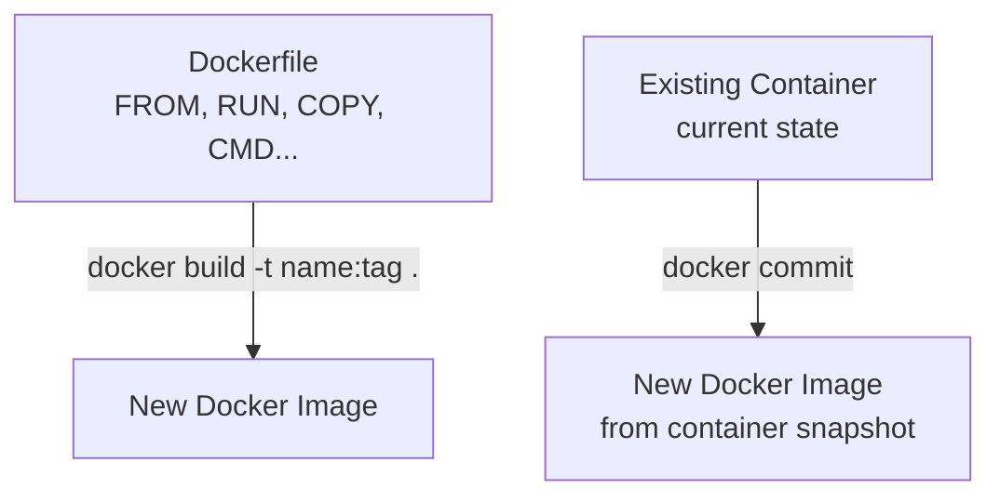

**Real-World Example:** A team writes a Dockerfile starting `FROM node:20-alpine`, copying their application source, running `npm install`, and setting `CMD ["node", "server.js"]`; running `docker build -t myapp:2.1 .` produces a versioned, reproducible image that any teammate can build identically from the same Dockerfile.

**Exam Strategy:**
- Present the Dockerfile method as the primary, recommended approach and `docker commit` as a secondary, quick-but-less-reliable method.
- Name at least four Dockerfile instructions (`FROM`, `RUN`, `COPY`, `CMD`) with a one-line purpose each.
- Give the exact `docker build -t <name>:<tag> .` command syntax, including the trailing dot (build context) — a commonly forgotten detail.

---

### 13. Backing Up a Docker Container

**In plain words:** "Backing up a container" really means saving either its current filesystem state (as a new image) or its attached persistent data (its volumes) somewhere safe, since the running container itself is not the durable copy — it can be deleted at any time.

**Formal definition:** Backing up a Docker container involves preserving its current state and/or data for later restoration, typically achieved by committing the container to a new image (`docker commit`), exporting its filesystem as a tarball (`docker export`), or backing up its attached volumes' data separately.

**How it actually works:**
- `docker commit <container> backup_image:tag` — freezes the container's current filesystem state into a new image.
- `docker export <container> > backup.tar` — exports the container's entire filesystem as a flat tarball (loses image layer history and metadata, unlike `commit`).
- For data specifically stored in a volume, a common pattern is running a temporary container that mounts the same volume and archives its contents to a tar file on the host, since the volume's data is what actually needs preserving long-term.

**Diagram:**
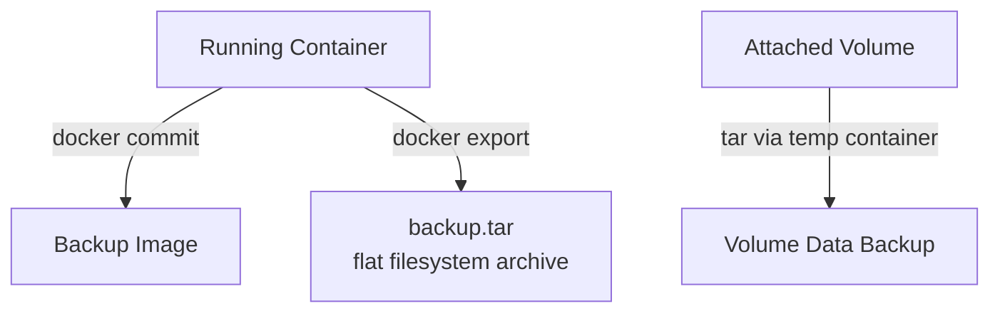

**Real-World Example:** Before applying a risky configuration change to a production container, an SRE runs `docker commit webapp_container webapp_backup:pre-change`, creating a restorable snapshot image; separately, the container's database volume is archived to an S3 bucket using a scheduled backup container so the actual data is durable independent of the container's own lifecycle.

**Exam Strategy:**
- Give both key commands (`docker commit` and `docker export`) with the one-line distinction: commit preserves image layer history and can be run directly; export flattens everything into a single filesystem tarball.
- Emphasize that volume data must be backed up separately from the container itself — this links directly into Part C.
- Mention this is typically done before risky changes/updates, giving the answer a practical framing.

---

### 14. Restoring a Docker Container

**In plain words:** Restoring is the reverse operation — turning a saved backup (an image or a tarball) back into a running container again, either on the same machine or a completely different one.

**Formal definition:** Restoring a Docker container involves recreating a running container from previously backed-up state, using `docker run` against a committed backup image, or `docker import` to convert a filesystem tarball back into a new image, which is then run as a container.

**How it actually works:**
- From a backup image: `docker run -d --name restored_app backup_image:tag` — starts a new container directly from the previously committed backup image.
- From an exported tarball: `docker import backup.tar restored_image:tag` first converts the tarball back into an image, which can then be run with `docker run` as usual.
- If the original data lived in a volume, that volume's backed-up data must be restored into a (new or existing) volume and re-attached to the new container — restoring the image alone does not automatically restore volume data.

**Diagram:**
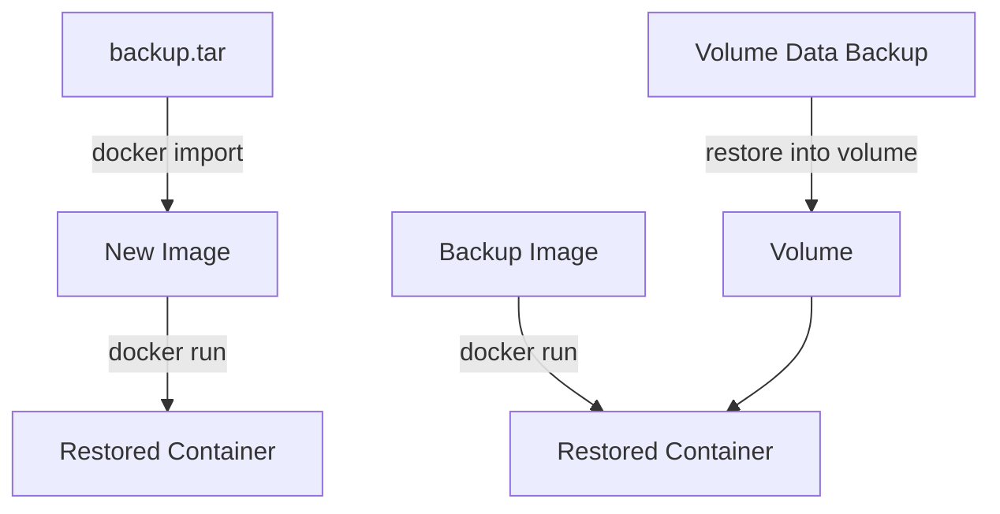

**Real-World Example:** After a faulty deployment corrupts the production `webapp_container`, the SRE team runs `docker run -d --name webapp_container webapp_backup:pre-change` to instantly restore the last known-good state from the pre-change backup image, restoring service in seconds rather than rebuilding from scratch.

**Exam Strategy:**
- Give both restore paths explicitly — from a backup image (`docker run`) and from an exported tarball (`docker import` then `docker run`).
- Explicitly state that restoring the container's image does not restore volume data automatically — a commonly missed but frequently tested nuance.
- Frame the answer around speed/recovery: restoring from a pre-made backup image is dramatically faster than rebuilding from scratch.

---

### 15. Deploy, Login, Exit Container

**In plain words:** These are three basic, everyday operations: getting a container up and running (deploy/run), getting an interactive session inside it (login), and getting back out of that session without stopping the container (exit).

**Formal definition:** **Deploying** a container means starting a new container instance from an image via `docker run [options] <image>`. **Logging into** a container means attaching an interactive terminal session to it via `docker exec -it <container> /bin/bash` (or `docker attach` to the container's main process). **Exiting** a container session means detaching from that interactive shell — using `exit` (which, if attached via `docker attach`, may stop the container) or the detach sequence `Ctrl+P, Ctrl+Q` (which leaves the container running).

**How it actually works — the essential commands:**
```
docker run -d --name mycontainer nginx        # Deploy (detached mode)
docker exec -it mycontainer /bin/bash          # Login (interactive shell)
exit                                            # Exit the shell (container keeps running,
                                                 # since it was started via exec, not attach)
```
- The `-d` flag runs the container in detached (background) mode.
- `docker exec -it` opens an additional shell process inside an already-running container; typing `exit` there only ends that shell session, not the container itself.
- `docker attach` instead connects directly to the container's main (PID 1) process; typing `exit` there can actually stop the container — this is why `Ctrl+P, Ctrl+Q` (detach without stopping) exists specifically for `attach` sessions.

**Diagram:**
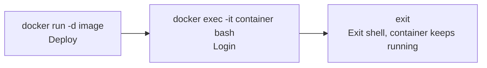

**Real-World Example:** An engineer deploys a database container with `docker run -d --name db postgres:15`, logs in later to check its state with `docker exec -it db /bin/bash`, inspects the data directory, then types `exit` to leave the shell — the `db` container itself continues running uninterrupted in the background the whole time.

**Exam Strategy:**
- Give the exact commands for each of the three actions — this topic is almost purely command-recall.
- Explicitly distinguish `docker exec` (safe to exit, container keeps running) from `docker attach` (exiting the main process can stop the container) — the key trap most students miss.
- Mention the detached mode flag `-d` as the standard way containers are deployed in real production use.

---

### 16. List, Start, Stop, and Restart Containers

**In plain words:** These are the everyday container lifecycle management commands — checking what's running, turning things on, turning things off, and turning them off-then-on-again.

**Formal definition:** Container lifecycle management commands include: `docker ps` (list running containers; `docker ps -a` lists all containers including stopped ones), `docker start <container>` (start a stopped container), `docker stop <container>` (gracefully stop a running container by sending SIGTERM, then SIGKILL after a timeout), and `docker restart <container>` (stop then start a container in one command).

**How it actually works:**
```
docker ps                    # List running containers
docker ps -a                 # List ALL containers (running + stopped)
docker start mycontainer     # Start a stopped container
docker stop mycontainer      # Gracefully stop a running container
docker restart mycontainer   # Stop, then start again
```
- `docker stop` sends a SIGTERM signal first, giving the application inside a chance to shut down gracefully, and only sends a forceful SIGKILL if the container hasn't stopped after a grace period (10 seconds by default).
- `docker ps` alone only shows currently running containers — stopped/exited containers are hidden unless `-a` is added.
- `docker restart` is functionally equivalent to `docker stop` followed by `docker start`, but as one atomic command.

**Diagram:**
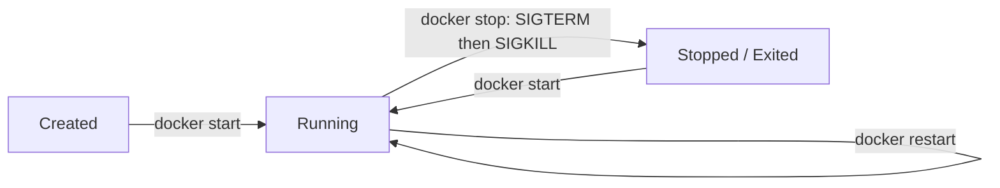

**Real-World Example:** An SRE runs `docker ps -a` to audit all containers on a host (including old, stopped ones consuming disk space), identifies a stopped container that should still be running, and brings it back with `docker start`, while later using `docker restart` on a misbehaving container to clear a stuck in-memory state without deleting and recreating it entirely.

**Exam Strategy:**
- Give exact command syntax for all four operations — a pure command-recall topic.
- Explain SIGTERM-then-SIGKILL behind `docker stop` explicitly — a frequently tested "how does it actually work" detail.
- Point out the `docker ps` vs `docker ps -a` distinction explicitly, a very common practical trap in lab exams.

---

### 17. Deleting Containers

**In plain words:** Once a container is no longer needed, you remove it to free up disk space and keep your system clean — but you generally need to stop it first, since Docker won't let you delete a container that's still running (unless you force it).

**Formal definition:** Deleting (removing) a container permanently destroys it and its writable layer, performed via `docker rm <container>` (requires the container to be stopped first, unless `-f` is used to force removal of a running container), with `docker container prune` available to bulk-remove all stopped containers at once.

**How it actually works:**
```
docker rm mycontainer          # Remove a stopped container
docker rm -f mycontainer       # Force-remove a running container (stops it first)
docker container prune         # Remove ALL stopped containers on the host
```
- Deleting a container destroys its writable layer permanently — any data written inside the container's own filesystem (not in a volume) is lost forever.
- Data stored in an attached volume survives container deletion by design, since volumes exist independently of any single container's lifecycle.
- `docker container prune` is a convenient bulk-cleanup command, useful for reclaiming disk space from many old, stopped containers at once.

**Diagram:**
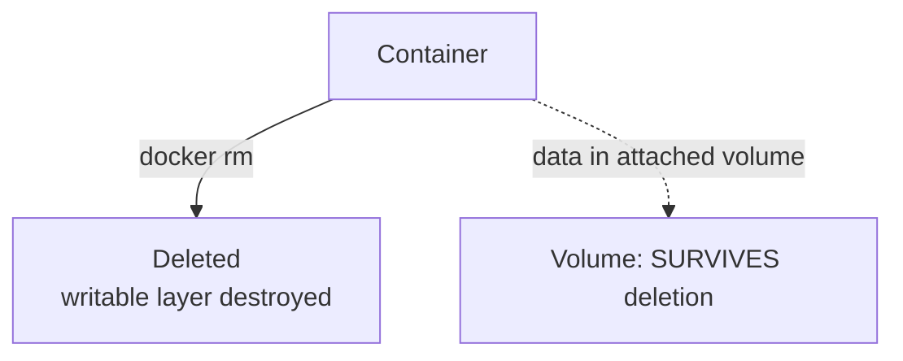

**Real-World Example:** A CI pipeline runs `docker container prune -f` after every test run to automatically clean up dozens of short-lived test containers, preventing disk space from filling up on the build server over time — while the actual test result artifacts, stored in a mounted volume, are safely preserved for the pipeline to collect afterward.

**Exam Strategy:**
- Give the exact removal commands, including the force flag (`-f`) and the bulk cleanup command (`docker container prune`).
- State explicitly that a container must normally be stopped before removal, and explain what the force flag does differently.
- Emphasize the volume-survives-deletion point as the direct bridge into Part C — examiners frequently pair this exact fact with a follow-up question on volumes.

---

## PART C — CHAPTER 1.3: DATA AND VOLUMES

---

### 18. Creating and Mounting Data Volumes

**In plain words:** By default, anything a container writes to its own filesystem disappears the moment that container is deleted — a disaster for databases or any app that needs to remember things. A volume is Docker's answer: a piece of storage that lives outside the container's own disposable filesystem, so it survives container deletion, restarts, and even lets multiple containers share the same data.

**Formal definition:** A Docker Volume is a persistent storage mechanism managed by Docker, existing independently of any container's lifecycle, created via `docker volume create <name>` and attached (mounted) to a container's filesystem at a specified path using `docker run -v <volume_name>:<container_path>` or the more explicit `--mount` syntax, allowing data to persist across container restarts and deletions.

**How it actually works:**
```
docker volume create mydata                          # Create a named volume
docker run -d -v mydata:/var/lib/mysql mysql:8        # Mount it into a container
docker run -d --mount source=mydata,target=/var/lib/mysql mysql:8   # Equivalent, explicit syntax
```
- `docker volume create` provisions a new volume, managed entirely by Docker (stored on the host under `/var/lib/docker/volumes/`, though that internal location shouldn't be relied on directly — always interact with volumes via Docker commands).
- The `-v <volume_name>:<container_path>` flag mounts that volume at the given path inside the container's filesystem — any data the application writes to that path is actually being written into the volume, not the container's disposable writable layer.
- Because the volume exists independently of the container, deleting the container (`docker rm`) leaves the volume and its data completely intact; a brand-new container can mount the same volume and immediately see the same data.
- Multiple containers can mount the same volume simultaneously, enabling data sharing between containers.

**Diagram:**
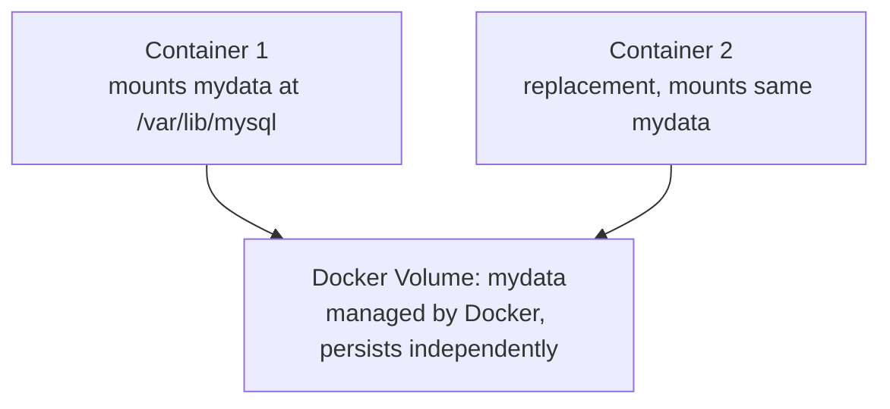

**Real-World Example:** A MySQL container is run with `docker run -d -v mysql_data:/var/lib/mysql mysql:8`; when the container is later deleted and a fresh MySQL container is started with the same `-v mysql_data:/var/lib/mysql` mount, all the original databases and tables are immediately present again, because the actual data lived in the `mysql_data` volume the whole time.

**Exam Strategy:**
- Give both the `docker volume create` and `docker run -v` command syntax exactly — command precision is directly graded here.
- State the core motivation clearly first: containers are ephemeral by design, so anything that must survive restarts/deletion needs to live in a volume.
- Mention that multiple containers can share one volume — a distinctive, frequently tested capability beyond simple single-container persistence.

---

### 19. Defining Volumes in Images

**In plain words:** Instead of only attaching a volume at `docker run` time, you can bake the intention to use a volume directly into the image itself, using the `VOLUME` instruction in a Dockerfile — this tells Docker "this path should always be treated as external, persistent storage," even if whoever runs the container forgets to specify `-v` manually.

**Formal definition:** The `VOLUME` instruction in a Dockerfile declares a mount point within the image as intended for external, persistent storage; when a container is started from that image, Docker automatically creates an anonymous volume and mounts it at the declared path if no explicit volume/bind-mount is specified at runtime, ensuring that path's data is never silently stored in the container's disposable writable layer.

**How it actually works:**
```
FROM mysql:8
VOLUME /var/lib/mysql
```
- When a container is started from an image containing `VOLUME /var/lib/mysql`, Docker automatically provisions an anonymous volume (an unnamed, auto-generated volume) and mounts it at that path, even if the person running the container never typed `-v`.
- This guarantees that critical data paths (like a database's data directory) are never accidentally left inside the ephemeral container layer.
- Best practice is to still explicitly name and mount a volume at `docker run` time (as in topic 18) for easier management, backup, and reuse — the Dockerfile's `VOLUME` instruction is a safety net, not a substitute for deliberate volume naming.

**Diagram:**
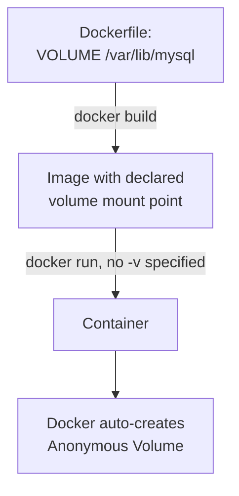

**Real-World Example:** The official MySQL Docker image declares `VOLUME /var/lib/mysql` in its own Dockerfile; even a developer who runs `docker run mysql:8` without specifying any `-v` flag still gets their database files safely stored in an auto-created anonymous volume, rather than losing all data the moment the container is removed.

**Exam Strategy:**
- Give the exact Dockerfile syntax: `VOLUME <path>`.
- Explain the safety-net behavior explicitly: Docker auto-creates an anonymous volume if the runtime user doesn't specify one.
- Recommend explicit named volumes at `docker run` time as best practice regardless, since anonymous volumes are harder to identify, back up, and manage later.

---

### 20. Pruning Unused Resources

**In plain words:** Over time, a Docker host accumulates junk — stopped containers, unused images, dangling volumes, and unused networks nobody's using anymore, all quietly eating disk space. Pruning is Docker's built-in spring cleaning.

**Formal definition:** Pruning is the process of removing unused Docker resources (stopped containers, dangling/unused images, unused volumes, and unused networks) to reclaim disk space, performed via targeted commands (`docker container prune`, `docker image prune`, `docker volume prune`, `docker network prune`) or the combined `docker system prune`, which cleans up multiple resource types at once.

**How it actually works:**
```
docker container prune       # Remove all stopped containers
docker image prune           # Remove dangling (untagged) images
docker image prune -a        # Remove ALL unused images, not just dangling ones
docker volume prune          # Remove all volumes not used by at least one container

docker network prune         # Remove all unused networks
docker system prune          # Remove stopped containers, dangling images, unused
                              # networks, and build cache all at once
docker system prune -a --volumes   # Aggressive cleanup: also removes all unused
                                    # images and unused volumes
```
- A "dangling" image is one with no tag, usually left behind after rebuilding an image with the same tag.
- `docker volume prune` will only remove volumes not currently attached to any container — a safety behavior, but it means orphaned volumes from already-deleted containers are exactly what typically gets cleaned here.
- Pruning is destructive and irreversible — especially `docker system prune -a --volumes`, which can delete data if a container that was supposed to be using a volume has already been removed.

**Diagram:**
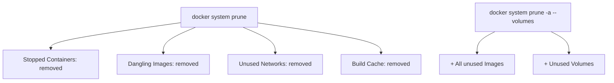

**Real-World Example:** A CI/CD build server accumulates hundreds of stopped test containers and dangling images from repeated builds over a few weeks, filling up disk space; an SRE schedules a nightly `docker system prune -f` job to automatically reclaim that space, while deliberately excluding `--volumes` from the automated job to avoid accidentally deleting any production data volume that might briefly appear unattached.

**Exam Strategy:**
- Name each individual prune command (container, image, volume, network) plus the combined `docker system prune`.
- Explain what a "dangling" image specifically means — a frequently tested precise-definition sub-question.
- Always mention the destructive/irreversible nature of pruning, especially with `--volumes`, as a caution point.

---

## LAB EXPERIMENT QUICK REFERENCE

### Experiment 1 — Install Docker and Use the Docker CLI

```
# Ubuntu/Debian install (summary)
sudo apt-get update
sudo apt-get install docker-ce docker-ce-cli containerd.io
sudo systemctl start docker
sudo systemctl enable docker
docker --version
docker info

# Core CLI check
docker run hello-world      # Verifies installation end-to-end
```
**Exam Strategy:** If asked to describe the install process, mention that Docker requires a Linux kernel with namespace/cgroup support (on Windows/macOS, Docker Desktop runs a lightweight Linux VM underneath to provide this) — ties directly back to Containerization (topic 2) being fundamentally a Linux-kernel-level technology.

### Experiment 2 — Pulling Docker Images from Docker Hub

```
docker search nginx           # Search Docker Hub for an image
docker pull nginx:latest      # Pull a specific image and tag
docker images                 # List locally pulled images
```
**Exam Strategy:** Connect this directly to topic 9 (Docker Hub) — `docker search` and `docker pull` are the practical commands implementing everything described conceptually there.

---

## FINAL EXAM CHECKLIST

```
[ ] Docker definition: "package once, run anywhere," OS-level virtualization keyword
[ ] Containerization mechanism: namespaces (isolation) + cgroups (resource limits) named exactly
[ ] Containerization vs Virtualization: full comparison table drawable from memory
[ ] Docker architecture: Client -> Daemon (dockerd) -> Registry, REST API named
[ ] Docker features: all 6 named (lightweight, portable, layered, isolated, scalable, ecosystem)
[ ] Docker components: Image, Container, Dockerfile, Registry, Volume, Network -- all 6 named
[ ] Advantages vs Disadvantages: both sides answered explicitly, weaker isolation trade-off stated
[ ] Docker Hub: pull vs push commands, official vs public images distinction
[ ] Image vs Container: class-vs-object analogy, writable layer explained
[ ] docker exec vs docker attach: exiting behavior difference (container survives vs may stop)
[ ] Dockerfile instructions: FROM, RUN, COPY, WORKDIR, CMD with one-line purpose each
[ ] docker commit vs docker export: image-with-history vs flat tarball
[ ] Backup/restore commands exact syntax, and that volume data must be restored separately
[ ] docker ps vs docker ps -a; docker stop SIGTERM-then-SIGKILL behavior
[ ] docker rm vs docker rm -f vs docker container prune; volumes survive container deletion
[ ] Volume creation and mounting: docker volume create + docker run -v syntax exact
[ ] VOLUME instruction in Dockerfile: auto-creates anonymous volume as a safety net
[ ] All prune commands named (container/image/volume/network/system), dangling image defined
[ ] Pruning is destructive/irreversible -- mention this caution explicitly
```
