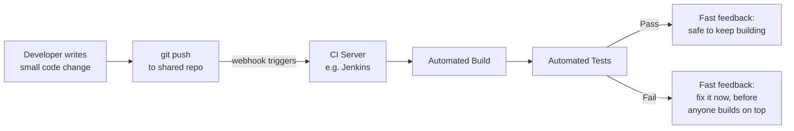
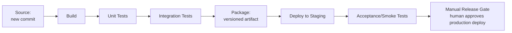
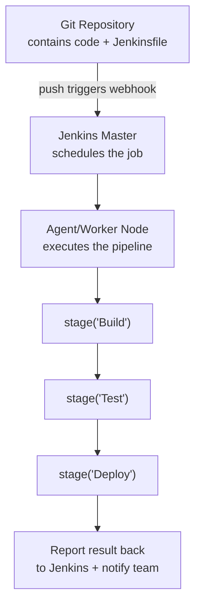
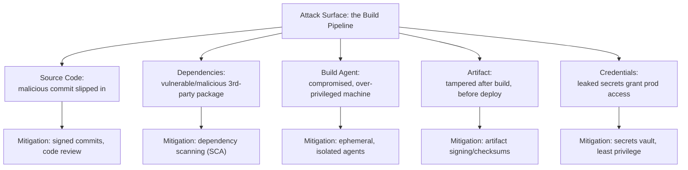
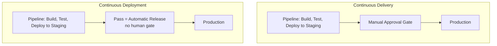
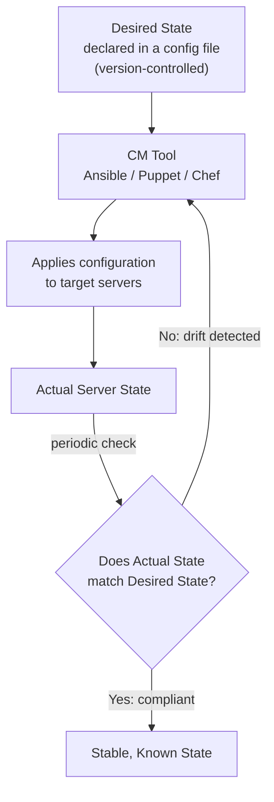
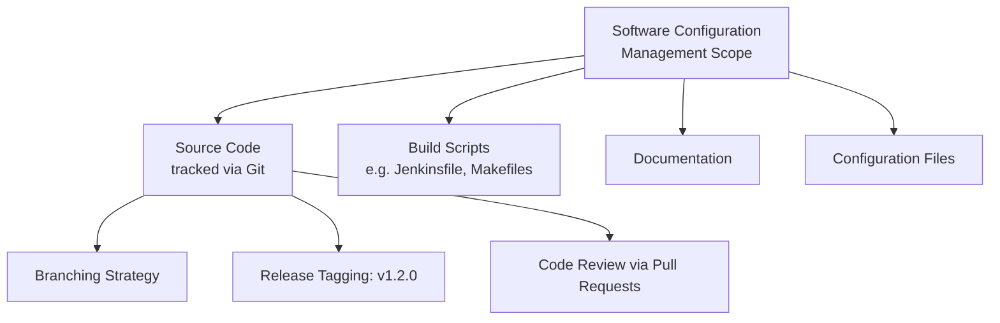
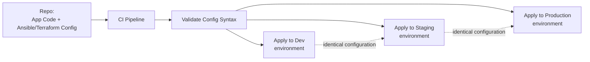

# DevOps Process Automation — Unit 2 (Deep-Dive Notes)
### Managing Source Code: Continuous Integration, Jenkins Pipelines, and Configuration Management

**How to use this document:** Every topic has five parts — **1. In plain words** — explained like a senior explaining it to a junior, no jargon-dump. **2. Formal definition** — the "textbook line" you write first in the exam so the examiner sees the keyword. **3. How it actually works** — the depth layer, so you understand it instead of memorizing it. **4. Diagram** — a Mermaid diagram you can redraw on paper in the exam. **5. Real-World Example + Exam Strategy** — a concrete scenario, plus how to structure the answer for marks.

This document covers the full Unit-2 syllabus in order: Continuous Integration and its tooling (Jenkins) first, then Configuration Management in DevOps.

---

## PART A — CONTINUOUS INTEGRATION AND ITS TOOLS

---

### 1. Introduction to Continuous Integration (CI)

**In plain words:** Instead of everyone on a team working alone for weeks and then trying to merge all their code together at the end (a nightmare), Continuous Integration means every developer merges their small changes into one shared codebase constantly — several times a day — and a robot (the CI server) immediately builds and tests that merged code to catch problems the moment they happen, not weeks later.

**Formal definition:** Continuous Integration (CI) is a software development practice in which developers frequently integrate their code changes into a shared repository, with each integration automatically verified by an automated build and test process, allowing integration problems to be detected and addressed early.

**How it actually works:**
- A developer commits and pushes a small, focused code change to the shared version control repository (Git).
- This push automatically triggers a CI server (like Jenkins), usually via a webhook, without any human needing to manually start anything.
- The CI server checks out the latest code, compiles/builds it, and runs the automated test suite against it.
- The result (pass or fail) is reported back immediately — usually within minutes — so the developer knows right away whether their change broke anything.
- The core insight that makes CI powerful: the smaller and more frequent the integrations, the smaller and easier-to-find any resulting bug is. Merging once a month means a bug could be hiding among thousands of changed lines; merging five times a day means a bug is almost always isolated to a handful of lines you just wrote.

**Diagram:**


**Real-World Example:** A team of eight developers all work on the same web application. Each one pushes small commits to a shared `main` branch multiple times per day. Jenkins is configured to build and run the full unit-test suite on every single push. When one developer accidentally breaks a shared utility function, Jenkins catches it within three minutes and posts a red build notification to the team's Slack channel — the developer fixes it immediately, before six other people have had a chance to build new work on top of the broken function.

**Exam Strategy:**
- State the core practice explicitly: frequent small commits combined with automated build/test on every integration — both halves are needed for full marks, not just "developers merge often."
- Emphasize the fast feedback loop as the mechanism that actually makes CI work — this is the most frequently tested nuance beyond the bare definition.
- Give the causal argument examiners want: smaller, more frequent integrations mean any resulting bug is isolated to a small, recent change, making it fast to find and fix.

---

### 2. Continuous Delivery Pipeline

**In plain words:** Think of a CD pipeline as a factory assembly line for your code. Every commit enters at one end and passes through a series of automated checkpoints — build it, test it, package it, deploy it somewhere safe to check it again — so that by the time it reaches the end of the line, you have proof that this exact version of the software actually works and is genuinely safe to release, at any moment, with just one click.

**Formal definition:** A Continuous Delivery (CD) pipeline is an automated sequence of stages — typically build, automated testing, artifact packaging, and deployment to a staging/pre-production environment — through which every code change passes, ensuring the software is always in a verified, deployable state, with the final decision to release to production made explicitly (usually by a human).

**How it actually works:**
- **Source stage** — the pipeline is triggered by a new commit in version control.
- **Build stage** — the code is compiled/built into a runnable form.
- **Automated test stages** — unit tests run first (fast, narrow), followed by broader integration tests (slower, checking that components work together correctly).
- **Package/artifact stage** — a versioned, immutable build artifact is produced (a JAR file, a Docker image, a deployable bundle) — this exact artifact, and no other, is what will eventually be released.
- **Deploy-to-staging stage** — that exact artifact is automatically deployed to a staging environment that closely mirrors production, where further acceptance/smoke tests run.
- **Release gate** — at this point the software is proven deployable. In Continuous Delivery specifically (as opposed to Continuous Deployment, covered in topic 5), a human makes the final call to actually push this artifact to production — the pipeline has done all the verification work, but the "go" decision is still manual.

**Diagram:**


**Real-World Example:** An online retailer's pipeline builds and tests every commit automatically, then deploys the resulting artifact to a staging environment where automated smoke tests confirm the checkout flow still works. At this point, the software is provably release-ready — but the QA lead still manually clicks "Promote to Production" once a day, after reviewing what's changed. This is Continuous Delivery: everything is automated up to the release decision itself.

**Exam Strategy:**
- List all pipeline stages in the correct order (Source, Build, Unit Test, Integration Test, Package, Deploy to Staging, Release Gate) — sequential completeness is directly graded for this topic.
- Clarify the relationship to CI: Continuous Integration is essentially the first part of this pipeline (build + test); Continuous Delivery extends it all the way to a release-ready artifact.
- State clearly that Continuous Delivery retains a manual release gate — this is the exact detail that sets up the contrast with Continuous Deployment in topic 5, and examiners often ask the two topics together.

---

### 3. Setting Up Delivery Pipelines in Jenkins

**In plain words:** Jenkins is the most widely used open-source automation server — it's the robot that actually runs all those build/test/deploy stages. You tell Jenkins what to do by writing a "Jenkinsfile" (a script, checked into your code repository itself) that defines each stage of the pipeline, and Jenkins executes it automatically every time new code shows up.

**Formal definition:** Setting up a delivery pipeline in Jenkins involves defining the CI/CD workflow as code — typically a `Jenkinsfile` written in Declarative or Scripted Pipeline syntax (a Groovy-based DSL) — which is checked into source control, triggered automatically via an SCM webhook on new commits, and executed by the Jenkins server across one or more distributed agent/worker nodes.

**How it actually works:**
- **Pipeline as Code** — instead of clicking through a UI to configure a job (the old way), you write a `Jenkinsfile` that lives right alongside your application code in the same Git repository. This means the pipeline itself gets version history, code review, and rollback, exactly like your application code does.
- **Declarative vs. Scripted syntax** — Declarative pipelines use a simpler, structured `pipeline { stages { ... } }` format (recommended for most teams, easier to read); Scripted pipelines use raw Groovy code for maximum flexibility when you need complex custom logic.
- **Jenkins Master and Agent nodes** — the Jenkins "master" schedules and coordinates jobs, but the actual build/test work runs on separate "agent" (worker) machines. This lets Jenkins scale — many builds can run in parallel across many agents, instead of overloading a single server.
- **SCM webhook trigger** — the Git repository is configured to notify Jenkins the moment a new commit is pushed, so the pipeline starts automatically without anyone manually clicking "build."
- **Plugins** — Jenkins itself is a fairly minimal core; almost all real functionality (Git integration, Docker support, Slack notifications, credential management) comes from its large plugin ecosystem.

**Diagram:**


**Real-World Example:** A team adds this Jenkinsfile to the root of their repository:
```
pipeline {
    agent any
    stages {
        stage('Build') { steps { sh 'mvn compile' } }
        stage('Test')  { steps { sh 'mvn test' } }
        stage('Deploy') { steps { sh './deploy.sh staging' } }
    }
}
```
Because this file lives in the repo itself, when a new developer joins the team, they don't need anyone to explain the pipeline verbally — they just read the Jenkinsfile, and if they need to change how deployment works, they submit a pull request against it just like any other code change.

**Exam Strategy:**
- Name Jenkinsfile, Declarative versus Scripted syntax, and the Master/Agent architecture explicitly — these are the specific keywords graded in Jenkins practical/theory questions.
- State "Pipeline as Code" as the core concept, and mention explicitly that the Jenkinsfile lives in the same repository as the application code.
- Mention webhooks as the automatic trigger mechanism and plugins as what extends Jenkins beyond its minimal core — both are commonly asked as short-answer sub-questions.

---

### 4. Security Aspects in the Build Process

**In plain words:** Your CI/CD pipeline isn't just a convenience tool — it's a machine with access to your source code, your credentials, and the power to deploy to production. If an attacker compromises that machine, they can inject malicious code into every single release you ship, without ever needing to breach your production servers directly. Securing the build process means treating the pipeline itself as a high-value target that needs real protection.

**Formal definition:** Build process security refers to the set of practices that protect a CI/CD pipeline — including its credentials, dependencies, build agents, and produced artifacts — from tampering, unauthorized access, and software supply chain attacks, ensuring that what gets deployed is exactly and verifiably what was intended to be built.

**How it actually works — the main protective practices:**
- **Secrets management** — credentials (API keys, deployment passwords, cloud access keys) must never be hardcoded in scripts or config files. They should live in a dedicated secrets store (Jenkins Credentials, HashiCorp Vault, AWS Secrets Manager) and be injected into the build only at runtime, scoped to only the specific job that needs them.
- **Dependency scanning (Software Composition Analysis)** — modern applications pull in dozens or hundreds of third-party libraries; each one is a potential attack vector if it contains a known vulnerability or has been maliciously tampered with upstream. Automated scanning tools (e.g., OWASP Dependency-Check, Snyk) check every dependency against known vulnerability databases as part of the build.
- **Artifact integrity/signing** — cryptographically signing build artifacts ensures that the exact thing tested in the pipeline is the exact thing that gets deployed, with no possibility of substitution or tampering in between.
- **Least-privilege build agents** — a build agent that only needs to compile code should not also hold production database credentials "just in case." Limiting what each part of the pipeline can access limits the blast radius if that part is ever compromised.
- **Ephemeral, isolated build environments** — spinning up a fresh, disposable container for each build (rather than reusing one long-lived build machine) means malware or a compromised state from one build cannot silently persist and infect the next one.

**Diagram:**


**Real-World Example:** This is exactly the class of attack behind the real-world SolarWinds supply-chain breach — attackers compromised a build process itself and injected malicious code that then got signed and shipped as "legitimate" software to thousands of downstream customers. A team defending against this pattern would run automated dependency vulnerability scans on every build, store all deployment credentials in a vault (never in plaintext config), and use short-lived, disposable build containers so a compromised agent can't quietly persist across multiple builds.

**Exam Strategy:**
- List all five protective practices by name: secrets management, dependency scanning (SCA), artifact signing, least-privilege build agents, and ephemeral/isolated build environments — completeness across this set is directly graded.
- Cite the SolarWinds-style supply chain attack as the standard real-world anchor example examiners expect for this topic.
- State explicitly why build servers are an attractive attack target: they combine high system access (source code, credentials, deploy rights) with often weaker security scrutiny than production itself — this is the applied-understanding point worth extra marks.

---

### 5. Basic Concept of Continuous Deployment

**In plain words:** Continuous Delivery (topic 2) gets your code to the edge of production and waits for a human to press "go." Continuous Deployment removes that last human click entirely — if a change passes every automated check in the pipeline, it goes straight to production, automatically, with zero manual approval. Same name-sounding term, genuinely different level of automation — and this distinction is one of the most commonly confused points in all of DevOps.

**Formal definition:** Continuous Deployment is a software release practice in which every code change that successfully passes the entire automated pipeline (build, tests, staging validation) is automatically released to production without any manual intervention or approval gate.

**How it actually works:**
- The pipeline stages are functionally the same as Continuous Delivery (build, test, package, deploy-to-staging) — the difference is entirely at the very last step.
- In Continuous Delivery, a human must explicitly approve the final promotion to production.
- In Continuous Deployment, that manual gate is removed: passing the pipeline is the approval. The moment a change passes every automated check, it ships.
- Because there's no human safety net at the very end, Continuous Deployment only works safely when the automated test suite is extremely thorough and trustworthy, and when the organization has strong production safety nets in place — things like feature flags (ship code dark, turn it on separately), canary releases (roll out to a small percentage of users first, watch for problems, then expand), and fast, automated rollback if something goes wrong.

**Diagram:**


**Real-World Example:** Companies like Amazon and Netflix are famous for deploying to production hundreds or even thousands of times per day using Continuous Deployment. This is only possible because they've invested heavily in automated test coverage, canary releases (a new version is first shown to a tiny fraction of real users), extensive production monitoring, and one-click/automatic rollback — so that if something does slip through, the "blast radius" is tiny and the fix is nearly instantaneous, rather than relying on a human reviewer to catch every possible problem before release.

**Exam Strategy:**
- Draw the direct side-by-side contrast with Continuous Delivery: Delivery keeps a manual approval gate before production; Deployment removes it entirely — this distinction, stated explicitly, is the single highest-value point in this topic.
- Name the supporting safety practices required to run Continuous Deployment responsibly: feature flags, canary releases, and automated rollback — examiners look for these as evidence you understand the risk trade-off, not just the definition.
- Use Netflix/Amazon as the standard real-world reference example when asked for a concrete case.

---

## PART B — MANAGING CONFIGURATION IN DEVOPS

---

### 6. Configuration Management

**In plain words:** Configuration Management is about making sure every one of your servers/systems is set up exactly the way it's supposed to be — the right software versions, the right settings, the right security rules — and staying that way over time, instead of slowly drifting into a unique, undocumented, "nobody knows why it's configured like this" snowflake that's terrifying to touch.

**Formal definition:** Configuration Management (CM) is the process of systematically handling changes to a system so that it maintains integrity and a known, consistent state over time — tracking and controlling the configuration of hardware, software, and network settings across an IT environment, typically through automated tooling rather than manual, ad-hoc changes.

**How it actually works:**
- You define the desired state of a system declaratively — a config file that says, in effect, "this server should have Nginx version 1.24 installed, these three firewall rules open, and this environment variable set" — rather than a list of manual steps to run.
- A CM tool (Ansible, Puppet, Chef, or SaltStack are the classic examples) reads that desired-state definition and automatically applies it to the target servers.
- A well-built CM tool is idempotent — running it once or running it a hundred times against the same target produces the exact same end state, with no harmful side effects from repeated runs.
- Drift detection — because systems can still be changed manually (someone SSHs in and tweaks something), good CM practice involves periodically re-checking that the actual state still matches the declared desired state, and correcting it if it doesn't ("drifted" back to compliance).
- The desired-state configuration files themselves are typically stored in version control, so changes to how systems are configured get the same history, review, and rollback capability as application code.

**Diagram:**


**Real-World Example:** An infrastructure team defines an Ansible playbook stating that every one of their fifty web servers must run a specific Nginx version, have a specific set of firewall rules open, and have particular environment variables set. When they run the playbook, all fifty servers converge to that exact state. If, three weeks later, an engineer manually SSHs into one server during an emergency fix and changes a setting, the next scheduled Ansible run detects that this one server has drifted from the defined desired state and automatically reverts it back — without anyone needing to remember to "undo" the manual change themselves.

**Exam Strategy:**
- Define desired state versus actual state, and idempotency, explicitly by name — these are the core keywords this entire topic is graded on.
- Name at least one concrete CM tool (Ansible, Puppet, Chef, or SaltStack) as the standard real-world reference point.
- Mention drift detection as the specific mechanism that keeps systems compliant over time, rather than describing CM as a one-time setup action.

---

### 7. Software Configuration Management (SCM)

**In plain words:** Software Configuration Management is Configuration Management's cousin, but focused specifically on your code and development artifacts rather than your servers — it's the discipline of tracking every version of your source code, build scripts, and documentation so that you can always know exactly what changed, when it changed, who changed it, and reproduce any past version on demand.

**Formal definition:** Software Configuration Management (SCM) is a discipline for tracking and controlling changes to software artifacts — source code, documentation, build scripts, and configuration files — throughout the software development lifecycle, primarily implemented through version control systems, with practices including branching, merging, tagging, and release versioning.

**How it actually works:**
- Version control (Git) is the core tool — every change to every tracked file is recorded as a commit, forming a complete, permanent history of the project.
- Branching strategy — teams adopt a defined approach for how new work gets developed in parallel without stepping on each other: common patterns include feature branches (each new feature developed in its own short-lived branch) and trunk-based development (very short-lived branches, merged back to the main line frequently, which pairs naturally with the CI practice from topic 1).
- Tagging and release versioning — specific commits are marked with a version tag (e.g., `v1.2.0`) at the moment they're released, so that "what exact code was running in production on this date" is always a precisely answerable question.
- Change tracking via code review — changes typically go through a pull/merge request process before being merged, creating a documented trail of who proposed a change, who reviewed it, and why it was approved.
- Build reproducibility — SCM extends beyond just source code to include locking the exact versions of dependencies used, so that building "version 1.2.0" produces an identical result today as it did the day it was released, not a subtly different one because a dependency silently updated in the background.

**Diagram:**


**Real-World Example:** A development team uses trunk-based development with short-lived feature branches, merges everything back into `main` frequently, and tags every production release (`v2.4.0`, `v2.4.1`, and so on). Six months later, a customer reports a bug that they say started "around version 2.4.0." Because that exact commit was tagged, the team can check out the precise state of the entire codebase as it existed at that release, reproduce the bug in that exact historical environment, and confirm precisely which later commit introduced the fix or the regression.

**Exam Strategy:**
- List the full SCM scope explicitly: source code, build scripts, documentation, and configuration files — not source code alone.
- Name branching strategy and release tagging as the two most commonly tested SCM practices, and briefly distinguish feature-branch workflows from trunk-based development.
- Emphasize build reproducibility (locked dependency versions) as the detail that separates SCM from "just using Git" — this is the applied-understanding point worth extra marks.

---

### 8. Configuration Management in DevOps

**In plain words:** This is where Configuration Management (topic 6) stops being just "a separate ops team's job" and becomes part of the actual CI/CD pipeline itself — infrastructure and environment configuration get written as code, stored in version control right alongside the application, and automatically applied as one of the pipeline's own stages, so that every environment (dev, staging, production) is provisioned and configured identically and automatically, not by a person following a checklist from memory.

**Formal definition:** Configuration Management in DevOps refers to the practice of applying Configuration Management principles and tooling — commonly summarized as Infrastructure as Code (IaC) — directly within the CI/CD pipeline, enabling automated, consistent, and version-controlled provisioning and configuration of infrastructure and application environments across the full software delivery lifecycle.

**How it actually works:**
- Infrastructure and environment configuration (server setup, network rules, installed packages, environment variables) is defined as code using IaC tools — Ansible, Terraform, Puppet, and Chef are the most common — rather than being manually configured by a human following runbook instructions.
- This infrastructure code lives in version control, often in the very same repository as the application code it supports, so infrastructure changes go through the same review and CI process as any other code change.
- The CI/CD pipeline itself gains a dedicated stage that applies this configuration automatically to the target environment as part of every deployment — meaning the pipeline isn't just deploying application code, it's also actively ensuring the environment underneath that code is in the exact correct, expected state.
- This produces environment parity — the property that dev, staging, and production environments are configured identically (aside from intentional differences like scale or secrets), which directly eliminates the classic and painful "it worked in staging but broke in production" class of bugs, since staging and production are no longer subtly different by accident.

**Diagram:**


**Real-World Example:** A team stores its Ansible playbooks in the same Git repository as its application code. Their Jenkins pipeline includes a dedicated stage that runs `ansible-playbook site.yml` against the target environment as part of every deployment, meaning the exact same automated process configures dev, staging, and production — same package versions, same security settings, same environment structure. This directly eliminates a recurring class of bug the team used to fight constantly: a feature that "worked fine in staging" but broke in production because the two environments had quietly, manually drifted apart over the previous six months.

**Exam Strategy:**
- Name Infrastructure as Code (IaC) explicitly as the core mechanism, with at least one named tool (Ansible or Terraform) as a concrete reference point.
- State environment parity as the key benefit, and explicitly connect it to eliminating the "worked in staging, broke in production" class of bug — this causal link is what examiners reward beyond the bare definition.
- Distinguish this topic from topic 6 by stating the specific addition: here, the configuration management step is integrated directly into the CI/CD pipeline itself, not run as a separate, disconnected ops activity.

---

## FINAL EXAM CHECKLIST

```
[ ] CI: small, frequent commits + automated build/test; fast feedback loop is the mechanism that makes it work
[ ] CD Pipeline: Source -> Build -> Unit Test -> Integration Test -> Package -> Deploy to Staging -> Manual Release Gate
[ ] Jenkins: Pipeline as Code (Jenkinsfile), Declarative vs Scripted, Master + Agent nodes, webhook triggers, plugins
[ ] Build Security: secrets vault (never hardcoded), dependency scanning (SCA), artifact signing, least privilege, ephemeral agents
[ ] Continuous Delivery = always release-ready, human clicks "go" | Continuous Deployment = ships automatically, no human gate
[ ] Continuous Deployment needs: feature flags, canary releases, automated rollback as safety nets
[ ] Configuration Management: desired state vs actual state, idempotency, drift detection, named tool (Ansible/Puppet/Chef)
[ ] Software Configuration Management: full scope (code, scripts, docs, config), branching strategy, tagging, build reproducibility
[ ] CM in DevOps: Infrastructure as Code integrated into the pipeline itself -> environment parity across dev/staging/prod
```
