# Docker — Unit 2 (Deep-Dive Notes)
### Docker Compose, Docker Swarm, Dockerfiles — MCA Exam Prep

**How to use this document:** Every topic has five parts — **1. In plain words** — explained like a senior explaining it to a junior, no jargon-dump. **2. Formal definition** — the "textbook line" you write first in the exam so the examiner sees the keyword. **3. How it actually works** — the depth layer, so you understand it instead of memorizing it. **4. Diagram** — a Mermaid diagram you can redraw on paper in the exam. **5. Real-world/DevOps example + Exam strategy** — a concrete scenario, plus how to structure the answer for marks.

This document follows your Unit-2 table in order: **Chapter 2.1 (Docker Compose + Docker Swarm)** and **Chapter 2.2 (Dockerfiles)**, with both lab experiments folded in as a practical command reference at the end.

---

## PART A — DOCKER COMPOSE

---

### 1. Introduction to Docker Compose

**In plain words:** Real applications are rarely just one container — a typical app needs a web server, a database, maybe a cache, all running together and talking to each other. Instead of manually running separate `docker run` commands for each one (and remembering all the flags, networks, and volumes every time), Docker Compose lets you describe your whole multi-container application in one file and start everything with a single command.

**Formal definition:** Docker Compose is a tool for defining and running multi-container Docker applications, using a single YAML configuration file (`docker-compose.yml`) to declare all the services, networks, and volumes an application needs, and a single CLI command to build, start, stop, and manage the entire application as one unit.

**How it actually works:**
- Instead of remembering and re-typing multiple `docker run` commands with all their flags, you describe the desired end-state (which images/builds, which ports, which volumes, which environment variables, which services talk to which) declaratively in `docker-compose.yml`.
- Running `docker compose up` reads that file and creates/starts every defined service together, automatically creating a shared network so the services can reach each other by name.
- Running `docker compose down` tears the whole application back down — every container, and optionally every network/volume — in one command.
- Compose is specifically meant for **single-host** multi-container applications (development, testing, small deployments) — for multi-host, production-grade orchestration at scale, Docker Swarm (Part B) or Kubernetes is used instead.

**Diagram:**
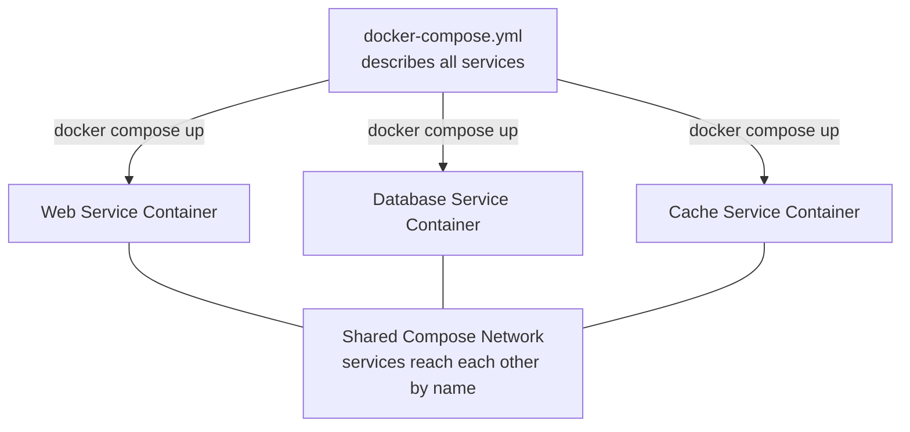

**Real-World Example:** A developer building a blog application needs a Node.js web server, a PostgreSQL database, and a Redis cache all running together; instead of three separate `docker run` commands with manually configured networking, one `docker-compose.yml` file describes all three services, and `docker compose up` starts the entire stack with the web container able to reach the database simply by using the hostname `db` (the service name) instead of an IP address.

**Exam Strategy:**
- Open by contrasting Compose against manually running multiple `docker run` commands — the "why it exists" framing is the expected opener.
- Name the core commands (`docker compose up`, `docker compose down`) and the config file name (`docker-compose.yml`) exactly.
- State clearly that Compose is single-host oriented, and name Swarm/Kubernetes as the multi-host alternative — this scoping distinction is a frequently tested point.

---

### 2. Docker Compose Installation

**In plain words:** Modern Docker installations already include Compose built in as the `docker compose` command (no separate install needed) — but it's still useful to know how to verify it's present and how the older standalone version worked, since some environments or exam questions reference the legacy setup.

**Formal definition:** Docker Compose is installed either as an integrated Docker CLI plugin (the modern `docker compose` subcommand, bundled with Docker Desktop and recent Docker Engine installations) or, in legacy setups, as a standalone binary (`docker-compose`, installed separately via package manager or direct binary download), with installation verified via a version check command.

**How it actually works:**
```
# Modern (Compose V2, integrated as a Docker CLI plugin) - verify it's present
docker compose version

# Legacy standalone installation on Linux (Compose V1, if not already bundled)
sudo curl -L "https://github.com/docker/compose/releases/latest/download/docker-compose-$(uname -s)-$(uname -m)" -o /usr/local/bin/docker-compose
sudo chmod +x /usr/local/bin/docker-compose
docker-compose --version
```
- **Compose V2** (current standard) is invoked as `docker compose` (with a space) and ships as a plugin bundled with Docker Desktop (Windows/Mac) and modern Docker Engine packages on Linux — no separate install step is usually needed.
- **Compose V1** (legacy) was invoked as `docker-compose` (with a hyphen, as a separate standalone binary) and required a manual download/install step, as shown above.
- Exam/lab environments may reference either syntax; functionally they do the same job, just invoked slightly differently (`docker compose ...` vs `docker-compose ...`).

**Diagram:**
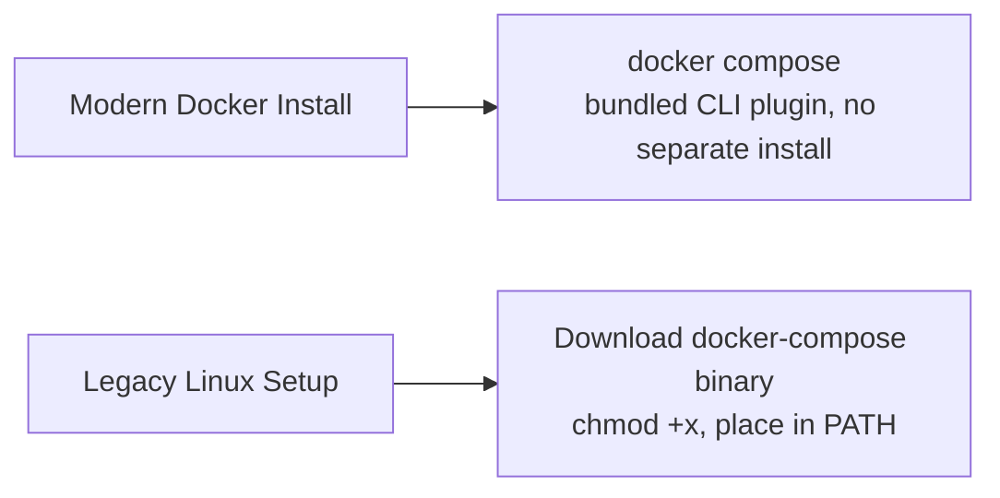

**Real-World Example:** A student setting up a fresh Ubuntu VM installs Docker Engine via `apt`, then confirms Compose is already available by running `docker compose version` — no separate installation step is required since modern Docker Engine packages already bundle the Compose plugin.

**Exam Strategy:**
- Mention both the modern integrated form (`docker compose`, no separate install) and the legacy standalone form (`docker-compose`, manual binary install) — examiners may test either, and knowing the difference between the two syntaxes is itself a gradable point.
- Give the exact verification command (`docker compose version`) as the standard way to confirm installation succeeded.
- Note the space-vs-hyphen distinction (`docker compose` vs `docker-compose`) explicitly, since it's an easy, specific detail to lose marks on if reversed.

---

### 3. YAML

**In plain words:** YAML is the plain-text format Docker Compose files (and many other configuration files) are written in — it uses indentation and simple key-value pairs instead of brackets and semicolons, making it easy for humans to read and write by hand.

**Formal definition:** YAML (YAML Ain't Markup Language) is a human-readable data serialization format used for configuration files, representing data as nested key-value pairs and lists using indentation (spaces, never tabs) to denote structure, rather than braces or explicit closing tags.

**How it actually works — core YAML syntax rules:**
- **Key-value pairs:** `key: value` (a colon followed by a space, then the value).
- **Nesting:** indentation (consistently using spaces, never tabs) indicates a value belongs to/under the key above it.
- **Lists:** items prefixed with a hyphen and a space (`- item`), either as a simple list of values or a list of nested key-value blocks.
- **Comments:** begin with `#`.
- **Strings** usually don't need quotes, but quotes (`'` or `"`) are used when a value could otherwise be misread (e.g., a value that looks like a number but should be text).
```yaml
service_name: web
build: .
ports:
  - "8080:80"
environment:
  - DEBUG=true
  - DB_HOST=db
```
- Indentation errors are the single most common YAML mistake — unlike many languages, YAML's structure is entirely defined by indentation, so a misaligned space changes what a value belongs to.

**Diagram:**
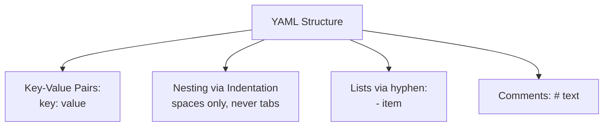

**Real-World Example:** A misconfigured `docker-compose.yml` fails to start correctly because one line under `environment:` was indented with a tab instead of spaces; YAML parsers reject tabs for indentation, causing a parsing error that a developer eventually traces back to that single whitespace character.

**Exam Strategy:**
- State explicitly that YAML uses indentation (spaces only, never tabs) to represent structure — this is the single most commonly tested "gotcha" fact about YAML.
- Give the basic syntax rules (key-value, nesting, lists with hyphens, comments with `#`) with a short example, exactly as shown.
- Mention that YAML is deliberately human-readable compared to JSON/XML, as the reason it was chosen for Compose files.

---

### 4. Creating a YAML File (docker-compose.yml)

**In plain words:** This is where you actually apply YAML syntax to describe a real multi-container application — naming each service, saying which image or Dockerfile it uses, what ports it exposes, and what it depends on.

**Formal definition:** Creating a `docker-compose.yml` file involves declaring the application's structure under standard top-level keys — `version` (Compose file format version, optional in recent versions), `services` (each container/service definition), `networks` (custom network definitions), and `volumes` (persistent storage definitions) — with each service specifying its image source, ports, environment variables, volumes, and dependencies.

**How it actually works — a complete example:**
```yaml
version: "3.9"

services:
  web:
    build: .
    ports:
      - "8080:80"
    depends_on:
      - db
    environment:
      - DB_HOST=db

  db:
    image: postgres:15
    environment:
      - POSTGRES_PASSWORD=secret
    volumes:
      - db_data:/var/lib/postgresql/data

volumes:
  db_data:
```
- `services:` — the main section; each key under it (`web`, `db`) is one container's definition.
- `build: .` — build this service's image from a Dockerfile in the current directory (instead of `image:`, which pulls a pre-built image).
- `image: postgres:15` — use a pre-built image directly, pulled from a registry, instead of building one.
- `ports:` — maps host:container ports, exactly like `docker run -p`.
- `depends_on:` — controls startup order (ensures `db` starts before `web`, though it does not wait for the database to be fully *ready*, only *started*).
- `environment:` — sets environment variables inside the container.
- `volumes:` (top-level) — declares named volumes that persist independently of the containers, exactly like Unit 1's volume concepts.
- Services in the same Compose file can reach each other using the **service name as the hostname** (e.g., `web` connects to the database at host `db`), because Compose automatically creates a shared network for all services in the file.

**Diagram:**
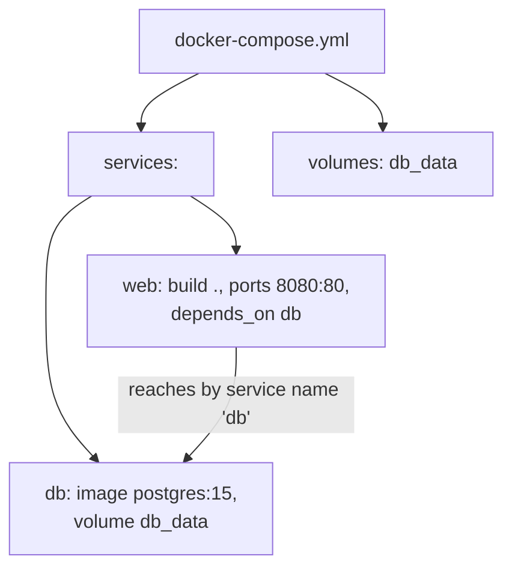

**Real-World Example:** A developer's `docker-compose.yml` defines a `web` service built from a local Dockerfile exposing port 8080, and a `db` service using the official `postgres:15` image with a named volume for persistent data; running `docker compose up` builds the web image, pulls postgres if not already local, starts both containers on a shared network, and the web application connects to the database simply by hostname `db`, with zero manual network configuration required.

**Exam Strategy:**
- Reproduce a complete, syntactically correct example `docker-compose.yml` from memory — this is the single most valuable thing to practice for this topic, since exam questions often ask you to write one for a given scenario.
- Name the top-level keys explicitly (`services`, `volumes`, `networks`) and the common per-service keys (`build`/`image`, `ports`, `environment`, `depends_on`, `volumes`).
- Explain the service-name-as-hostname behavior explicitly — this is the "magic" that makes Compose networking work, and is a frequently tested conceptual point beyond just syntax recall.

---

## PART B — DOCKER SWARM

---

### 5. Introduction to Docker Swarm

**In plain words:** Docker Compose is great for running multiple containers on one machine, but what happens when your application needs to run across many machines for scale and reliability? Docker Swarm is Docker's own built-in tool for turning a group of separate Docker hosts into one unified cluster that can run containers across all of them, automatically handling failures and scaling.

**Formal definition:** Docker Swarm is Docker's native clustering and orchestration tool that turns a group of Docker Engine hosts into a single virtual Docker host (a "swarm"), enabling containers (deployed as "services") to be scheduled, scaled, and load-balanced across multiple physical or virtual machines, with built-in high availability, service discovery, and rolling updates.

**How it actually works:**
- A swarm consists of two types of nodes: **manager nodes** (maintain cluster state, schedule services, and handle the swarm's control plane — analogous conceptually to Jenkins's controller from your DevOps unit) and **worker nodes** (execute the actual containers assigned to them by managers, analogous to Jenkins agents).
- Instead of running individual containers directly, Swarm runs **services** — a declarative description of a desired container state (which image, how many replicas/copies, which ports), and Swarm continuously works to keep that desired state true (e.g., if a container crashes, Swarm automatically starts a replacement).
- Swarm provides built-in **load balancing** — requests to a service are automatically distributed across all its running replicas.
- Swarm provides built-in **service discovery** — services can reach each other by name, similar to Compose, but now across multiple physical hosts.

**Diagram:**
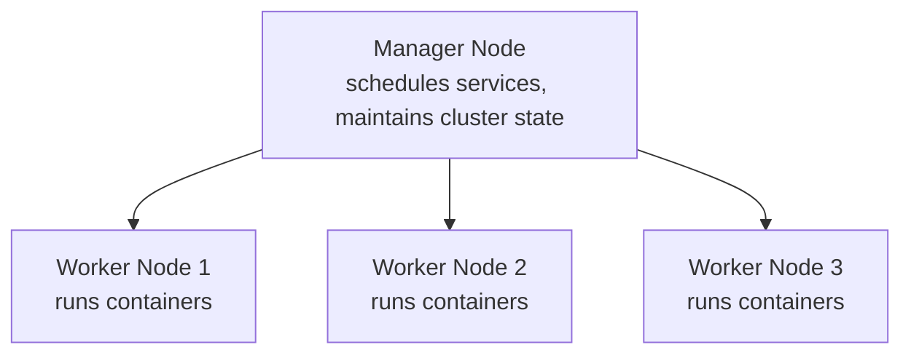

**Real-World Example:** An e-commerce company runs a Docker Swarm cluster with 1 manager and 5 worker nodes; when a worker node crashes unexpectedly, Swarm automatically reschedules the containers that were running on it onto the remaining healthy worker nodes, keeping the web application available without any manual intervention.

**Exam Strategy:**
- Name manager and worker nodes explicitly, and (if useful) draw the parallel to Jenkins's controller/agent architecture from your DevOps unit for a memorable cross-subject anchor.
- State the core value proposition clearly: Swarm turns multiple separate machines into one logical cluster, unlike Compose's single-host scope — this contrast with topic 1 is the key distinguishing idea.
- Name the three built-in capabilities explicitly: self-healing (automatic rescheduling), load balancing, and service discovery.

---

### 6. Creating a Swarm

**In plain words:** Setting up a swarm starts with turning one machine into the first manager node, which generates a special join token — other machines then use that token to join the cluster as either additional managers or as workers.

**Formal definition:** Creating a Docker Swarm involves initializing a swarm on a designated manager node using `docker swarm init`, which generates unique join tokens for adding further manager or worker nodes, after which other Docker hosts join the cluster using `docker swarm join` with the appropriate token and manager IP address.

**How it actually works:**
```
# On the first machine (becomes the initial manager)
docker swarm init --advertise-addr <MANAGER-IP>

# Output includes a join command for WORKER nodes, e.g.:
docker swarm join --token SWMTKN-1-xxxxx <MANAGER-IP>:2377

# To get the token for adding another MANAGER node instead:
docker swarm join-token manager

# On each worker machine, run the join command shown in the init output
docker swarm join --token SWMTKN-1-xxxxx <MANAGER-IP>:2377

# Verify cluster membership from a manager node
docker node ls
```
- `docker swarm init` designates the current machine as the first (leader) manager node and outputs a worker join token.
- Worker nodes run `docker swarm join` with that token to join the cluster; separately, `docker swarm join-token manager` generates a different token specifically for adding additional manager nodes (for manager high availability).
- `docker node ls` (run from any manager) lists all nodes in the swarm along with their role (Manager/Worker) and status.
- Once a swarm exists, services are deployed to it (not individual `docker run` containers) using `docker service create`.

**Diagram:**
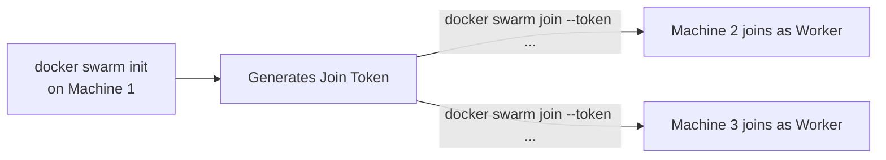

**Real-World Example:** An SRE initializes a swarm on a primary server with `docker swarm init --advertise-addr 192.168.1.10`, copies the resulting worker join token, and runs the given `docker swarm join` command on four other servers; running `docker node ls` from the manager then confirms all five machines (1 manager, 4 workers) are active members of the same swarm cluster.

**Exam Strategy:**
- Give the exact commands in sequence — `docker swarm init`, `docker swarm join`, `docker node ls` — command-recall is directly graded for this topic.
- Distinguish the worker join token from the manager join token (`docker swarm join-token manager`) explicitly, since this is a specific, easy-to-miss detail.
- Mention `--advertise-addr` as the flag specifying which IP other nodes should use to reach this manager, for a more complete, applied answer.

---

### 7. Maintaining a Swarm

**In plain words:** Once a swarm is running, ongoing operational tasks keep it healthy: adding or removing nodes as capacity needs change, scaling services up or down, updating running services without downtime, and monitoring overall cluster health.

**Formal definition:** Maintaining a Docker Swarm encompasses ongoing operational activities including node management (adding, draining, or removing nodes), service scaling (adjusting replica counts), rolling updates (deploying new service versions incrementally with zero downtime), and health monitoring — all performed through Swarm's built-in CLI commands without requiring external orchestration tools.

**How it actually works:**
```
# Scale a service up or down
docker service scale web=5

# Update a running service to a new image version (rolling update)
docker service update --image myapp:2.0 web

# List all running services and their replica status
docker service ls

# Drain a node (gracefully move its containers elsewhere) before maintenance
docker node update --availability drain <NODE-ID>

# Remove a node from the swarm
docker node rm <NODE-ID>

# Leave the swarm (run on the node itself)
docker swarm leave
```
- **Scaling** (`docker service scale`) changes the number of replica containers running for a service; Swarm automatically distributes the new replicas across available worker nodes.
- **Rolling updates** (`docker service update --image ...`) replace old container instances with new ones incrementally (a few at a time, configurable), so the service remains available throughout the update rather than all instances going down simultaneously.
- **Draining a node** (`docker node update --availability drain`) tells Swarm to gracefully reschedule that node's containers onto other nodes — used before planned maintenance (e.g., patching that node's OS).
- **Health monitoring** — `docker service ls` and `docker service ps <service>` show replica counts and the current state/health of each task.

**Diagram:**
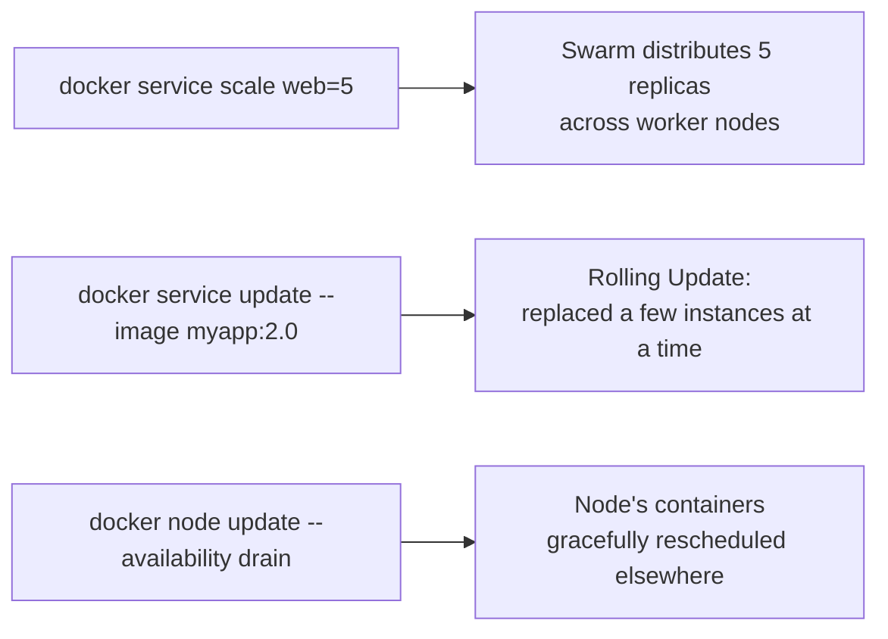

**Real-World Example:** Before applying OS security patches to a worker node, an SRE drains it with `docker node update --availability drain worker-3`, allowing Swarm to gracefully reschedule its running containers onto other healthy nodes with zero downtime, patches the now-empty node, then sets its availability back to active so it can rejoin the workload rotation.

**Exam Strategy:**
- Give exact commands for scaling, rolling updates, draining, and node removal — this topic is heavily command-recall based.
- Explain the rolling update mechanism explicitly (incremental replacement, not all-at-once) as the mechanism enabling zero-downtime deployment, echoing the same "zero-downtime deployment" concept from your DevOps unit's patch management topic.
- Mention draining specifically as the correct, graceful way to take a node offline for maintenance — a distinctive, frequently tested operational best practice.

---

### 8. Docker Network Security: Architecture and Security Model

**In plain words:** When containers run across multiple machines in a swarm, their network traffic needs to be both connectable (so services can reach each other across hosts) and secure (so nobody outside the swarm can eavesdrop on or tamper with that traffic). Docker's swarm networking is built with encryption and access control baked in by default.

**Formal definition:** Docker's swarm network security architecture is built on an **overlay network** model that spans all nodes in the swarm, using VXLAN encapsulation to connect containers across different physical hosts, with built-in mutual TLS (mTLS) securing all manager-to-manager and manager-to-worker control-plane communication, and optional IPsec encryption for the actual data-plane traffic between containers on the overlay network.

**How it actually works:**
- **Overlay networks** are Swarm's native multi-host networking type — they create a single logical network spanning every node in the swarm, letting containers on different physical machines communicate as if they were on the same LAN, using VXLAN encapsulation under the hood to tunnel traffic between hosts.
- **Control-plane security (mTLS):** every manager and worker node authenticates to the swarm using mutual TLS certificates, automatically issued and rotated by Swarm itself when the cluster is created — this secures all cluster management traffic (node join requests, service scheduling decisions) by default, with no manual certificate setup required.
- **Data-plane encryption (IPsec):** the actual application traffic flowing between containers on an overlay network can optionally be encrypted using IPsec, enabled per-network with the `--opt encrypted` flag when creating the overlay network — this protects application data as it crosses the physical network between hosts.
- **Least-privilege node roles:** worker nodes cannot access swarm management functions (they only execute assigned containers), limiting the blast radius if a worker node is compromised — a direct application of the least-privilege principle from your Cloud Computing security unit.

**Diagram:**
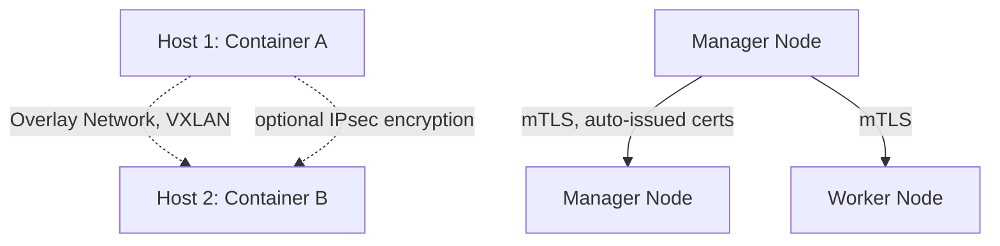

**Real-World Example:** A financial services company running a Swarm cluster across three data centers creates its overlay network with `docker network create --opt encrypted --driver overlay secure-net`, ensuring all inter-container traffic between data centers is IPsec-encrypted, while the swarm's manager nodes automatically maintain mTLS-secured control-plane communication with zero manual certificate management required.

**Exam Strategy:**
- Name the overlay network / VXLAN mechanism explicitly as how Swarm connects containers across multiple physical hosts — the core architectural fact this topic tests.
- Distinguish control-plane security (mTLS, automatic, always-on) from data-plane security (IPsec, optional, opt-in per network) — this distinction is a frequently tested nuance.
- Connect the worker-node least-privilege design back to the least-privilege principle from your Cloud Computing security content, for strong cross-subject consistency.

---

## PART C — DOCKER FILES

---

### 9. Introduction to Dockerfile

**In plain words:** A Dockerfile is the recipe Docker follows to automatically build an image — a plain text file listing, step by step, exactly what should go into the image: which base system to start from, what to install, what files to copy in, and what command to run when a container starts.

**Formal definition:** A Dockerfile is a text file containing a sequential set of instructions that Docker's build engine executes to automatically assemble a Docker image, with each instruction creating a new, cached layer in the resulting image, providing a reproducible, version-controllable definition of exactly how an image is constructed.

**How it actually works:**
- Each line in a Dockerfile is an instruction (a keyword like `FROM`, `RUN`, `COPY`) followed by arguments; Docker executes these top to bottom during `docker build`.
- Each instruction produces a new image **layer**, which Docker caches — if a Dockerfile is rebuilt and an earlier instruction hasn't changed, Docker reuses the cached layer instead of re-executing it, significantly speeding up repeated builds.
- Because the Dockerfile is a plain text file, it can (and should) be checked into version control alongside the application source code, making the build process reviewable and reproducible — the same Pipeline-as-Code principle from your DevOps unit's Jenkinsfile topic.
- The Dockerfile is what you feed to `docker build` (as introduced in Unit 1) to actually produce an image.

**Diagram:**
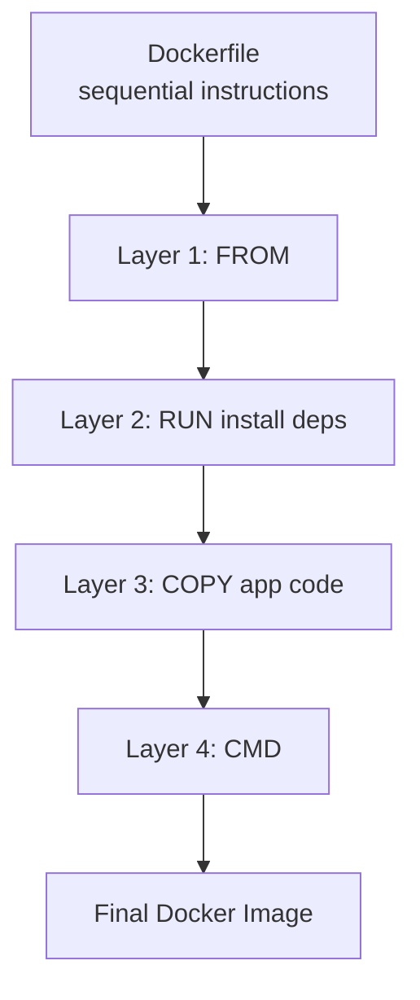

**Real-World Example:** A team's Dockerfile is stored in the same Git repository as their application code, version-controlled and reviewed via pull request just like any other code change; when a teammate modifies only the application source (not the dependency-installation step earlier in the file), the next build reuses the cached dependency-installation layer and only rebuilds the layers after that change, finishing in seconds instead of minutes.

**Exam Strategy:**
- Define the Dockerfile as a sequential, layer-producing set of build instructions — the core mental model expected before diving into specific instructions (topic 13).
- Mention layer caching explicitly as the mechanism that makes repeated builds fast — a frequently tested "why" behind Dockerfile design.
- Connect the "checked into version control" point to Pipeline-as-Code (Jenkinsfile) from your DevOps unit, for a strong cross-subject consistency point.

---

### 10. Building Images Using Dockerfile

**In plain words:** Once you've written a Dockerfile, turning it into an actual usable image is one command — `docker build` — which reads the file, executes every instruction in order, and produces a tagged, ready-to-run image.

**Formal definition:** Building an image using a Dockerfile is performed via `docker build -t <name>:<tag> <context-path>`, where Docker reads the specified Dockerfile, executes each instruction sequentially within the given build context (the set of files accessible to the build, typically the current directory), and produces a tagged image that can subsequently be run as a container or pushed to a registry.

**How it actually works:**
```
# Build from a Dockerfile in the current directory, tagging the result
docker build -t myapp:1.0 .

# Build using a Dockerfile with a different name/location
docker build -t myapp:1.0 -f Dockerfile.prod .

# Build without using the layer cache (forces a full rebuild)
docker build --no-cache -t myapp:1.0 .
```
- The trailing `.` specifies the **build context** — the directory whose contents are sent to the Docker daemon and made available to `COPY`/`ADD` instructions; only files within this context can be copied into the image.
- The `-t` flag tags the resulting image with a name and version, exactly as introduced in Unit 1.
- The `-f` flag lets you specify a Dockerfile with a non-default name or location (useful when maintaining multiple Dockerfiles for different purposes, e.g., `Dockerfile.dev` vs `Dockerfile.prod`).
- `--no-cache` forces Docker to re-execute every instruction from scratch, ignoring any cached layers — useful when you suspect stale cached layers are causing a problem.
- A `.dockerignore` file (working like `.gitignore`) can exclude specific files/directories from the build context, keeping images smaller and builds faster.

**Diagram:**
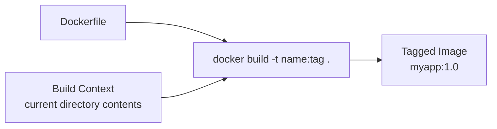

**Real-World Example:** A CI pipeline builds a production image with `docker build -t myapp:prod -f Dockerfile.prod .`, using a dedicated production Dockerfile that differs from the developer's local `Dockerfile.dev`, and includes a `.dockerignore` file excluding local test artifacts and the `.git` directory from the build context to keep the resulting image lean.

**Exam Strategy:**
- Give the exact build command syntax including the trailing dot (build context) — a commonly forgotten but directly gradable detail, consistent with Unit 1's coverage.
- Explain the build context concept explicitly (only files within it are available to `COPY`) — a frequently tested conceptual point, not just command syntax.
- Mention `.dockerignore` and the `-f` flag as practical refinements that show deeper, applied knowledge beyond the bare minimum command.

---

### 11. Deploying a Docker Image on Public Repositories

**In plain words:** Once you've built an image, sharing it with the world (or your team) means pushing it to a public registry like Docker Hub — the same `docker push` mechanism from Unit 1, applied here specifically to publishing images you've built from your own Dockerfiles.

**Formal definition:** Deploying a Docker image to a public repository involves tagging a locally built image with the target registry's naming convention (`<username-or-org>/<repository>:<tag>`), authenticating to the registry via `docker login`, and uploading the image via `docker push`, making it publicly (or privately, depending on repository settings) available for anyone to pull and run.

**How it actually works:**
```
# Authenticate to Docker Hub
docker login

# Tag a locally built image to match the target repository naming convention
docker tag myapp:1.0 myusername/myapp:1.0

# Push the tagged image to Docker Hub
docker push myusername/myapp:1.0

# Anyone can now pull and run it
docker pull myusername/myapp:1.0
docker run myusername/myapp:1.0
```
- Docker Hub (and most registries) require images to be named with the pattern `<account>/<repository>:<tag>` — a locally built image usually needs to be re-tagged (`docker tag`) to match this convention before it can be pushed.
- `docker login` authenticates your CLI session to the registry using your account credentials (or an access token).
- After a successful `docker push`, the image is available on the registry, and can be set as public (anyone can pull) or private (only authorized accounts can pull), depending on the repository's visibility settings.
- This directly builds on Unit 1's Docker Hub topic (`docker pull`/`docker push`), now applied specifically to an image you built yourself from a Dockerfile, rather than an existing official image.

**Diagram:**


**Real-World Example:** A student builds a personal Python application image locally, runs `docker login` with their Docker Hub credentials, tags the image as `student123/python-app:1.0` to match their Docker Hub username, and pushes it with `docker push student123/python-app:1.0`, after which anyone (including a grader) can pull and run the exact same image with `docker pull student123/python-app:1.0`.

**Exam Strategy:**
- Give the exact command sequence in order — `docker login`, `docker tag`, `docker push` — this sequence, and specifically the necessity of re-tagging to match the `account/repo:tag` naming convention, is the core gradable content here.
- Explain why re-tagging is necessary (registry naming convention requirement) rather than just listing the command.
- Connect this explicitly back to Unit 1's Docker Hub `pull`/`push` coverage as the same underlying mechanism, now applied to a self-built image.

---

### 12. Building a Web Server Dockerfile

**In plain words:** This is a concrete, applied example pulling everything together — writing an actual Dockerfile that packages a working web server (commonly Nginx, Apache, or a simple app framework) into an image, which is exactly the kind of Dockerfile you'd be asked to write from scratch in an exam or lab.

**Formal definition:** Building a web server Dockerfile involves writing a Dockerfile that starts from a base OS or language-runtime image, installs and configures a web server (or web application framework), copies in the application's static files or source code, exposes the appropriate network port, and defines the command to start the server when a container is launched.

**How it actually works — a complete worked example (simple Nginx-based static site):**
```dockerfile
FROM nginx:alpine

# Copy custom website files into Nginx's default serving directory
COPY ./website /usr/share/nginx/html

# Document that this container listens on port 80
EXPOSE 80

# Nginx's base image already defines the correct CMD to start the server,
# so no CMD override is needed here for this simple case
```
- **A worked example for a Python web app instead (Flask):**
```dockerfile
FROM python:3.11-slim
WORKDIR /app
COPY requirements.txt .
RUN pip install -r requirements.txt
COPY . .
EXPOSE 5000
CMD ["python", "app.py"]
```
- `FROM` picks an appropriate base image — a pre-built web server image (like `nginx`) for static content, or a language runtime image (like `python`) for a dynamic application you're running yourself.
- `WORKDIR` sets the working directory inside the container for all subsequent instructions, avoiding the need to repeat long paths.
- `COPY requirements.txt .` followed by `RUN pip install` before `COPY . .` (copying the rest of the code) is a deliberate layer-caching optimization: dependencies only get reinstalled when `requirements.txt` itself changes, not on every code change.
- `EXPOSE` documents which port the container listens on (informational — it does not itself publish the port to the host; that's done at `docker run -p` or in Compose's `ports:`).
- `CMD` defines the default command that starts the server process when the container launches.

**Diagram:**
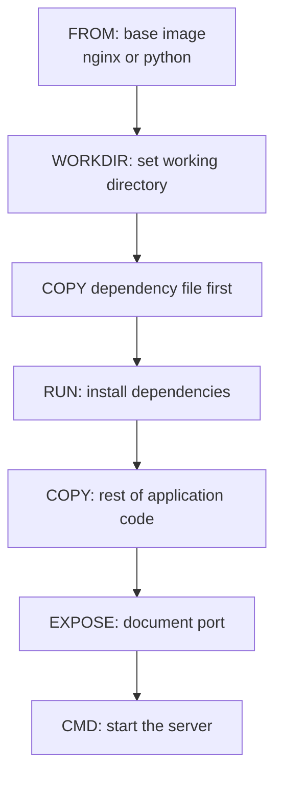

**Real-World Example:** A student builds a Dockerfile for a personal Flask web application exactly following the dependency-first-then-code-copy pattern above, so that when they later change only their Python source code (not `requirements.txt`), rebuilding the image reuses the cached dependency-installation layer and completes in a couple of seconds instead of reinstalling all packages from scratch every time.

**Exam Strategy:**
- Be able to write a complete, syntactically correct web server Dockerfile from memory for at least one common case (Nginx static site or a Python/Flask app) — this is very likely to be a direct "write a Dockerfile for X" exam question.
- Explain the dependency-before-code COPY ordering explicitly as a deliberate caching optimization, not an arbitrary choice — this specific reasoning is a high-value, frequently rewarded detail.
- Distinguish `EXPOSE` (documentation only) from actually publishing a port via `docker run -p` or Compose's `ports:` — a commonly confused, specifically testable point.

---

### 13. Dockerfile Instruction Commands

**In plain words:** This topic asks you to know the full toolbox of Dockerfile keywords — not just the four or five used in a simple example, but the complete, standard set of instructions and exactly what each one does.

**Formal definition:** Dockerfile instruction commands are the standardized keywords that define each build step, including: `FROM` (base image), `RUN` (execute a command at build time), `COPY` (copy files from build context into the image), `ADD` (like COPY, with added support for remote URLs and automatic archive extraction), `WORKDIR` (set the working directory), `ENV` (set environment variables persisting into the running container), `EXPOSE` (document the listening port), `CMD` (default command when the container starts, overridable at runtime), `ENTRYPOINT` (the fixed main command, harder to override than CMD), `VOLUME` (declare a persistent storage mount point, covered in Unit 1), `ARG` (build-time-only variable), and `USER` (set the user the container runs as).

**How it actually works — the full instruction set, one line each:**
- **FROM** — specifies the base image to build on top of; must be the first instruction (aside from optional `ARG` before it).
- **RUN** — executes a command during the build and commits the result as a new layer (e.g., installing packages).
- **COPY** — copies files/directories from the build context into the image.
- **ADD** — like `COPY`, but can also fetch a remote URL directly and automatically extract local `.tar` archives; `COPY` is generally preferred unless these extra features are specifically needed, since `ADD`'s extra behavior can be a source of surprises.
- **WORKDIR** — sets the working directory for all following instructions and for the container at runtime.
- **ENV** — sets an environment variable that persists into the running container (unlike `ARG`, which is build-time only).
- **EXPOSE** — documents which port the container listens on (informational, does not publish the port itself).
- **CMD** — specifies the default command to run when the container starts; can be overridden by a command passed to `docker run`.
- **ENTRYPOINT** — specifies the fixed main command for the container; arguments passed to `docker run` are appended to it rather than replacing it (unlike `CMD`, which is fully replaced).
- **VOLUME** — declares a mount point intended for persistent storage (detailed fully in Unit 1, Part C).
- **ARG** — defines a build-time-only variable, available during `docker build` but not present in the final running container (unlike `ENV`).
- **USER** — sets which user (rather than the default root) subsequent instructions and the running container execute as, for improved security.

**Diagram:**
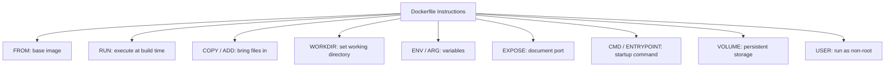

**Real-World Example:** A security-conscious Dockerfile uses `ARG APP_VERSION` to pass a build-time version number (not present in the final image), `ENV NODE_ENV=production` to set a runtime variable, `COPY` (not `ADD`) to bring in application files predictably, and a final `USER appuser` instruction so the container runs as a non-root user rather than the risky default root, directly applying the least-privilege principle from earlier units.

**Exam Strategy:**
- Be able to list and define every instruction in this set — this topic is explicitly a comprehensive-recall question, and missing instructions costs marks proportionally.
- Explain the CMD-vs-ENTRYPOINT distinction precisely (CMD is fully overridden by `docker run` arguments; ENTRYPOINT's arguments are appended to, not replaced) — this is one of the most commonly tested, commonly confused pairs in the whole Dockerfile topic.
- Explain the ENV-vs-ARG distinction precisely (ENV persists into the running container; ARG exists only during the build) — the second most commonly tested pair, and mention `COPY` vs `ADD` preference for a third strong differentiator point.

---

### 14. Self Study: Adding Ports in the YAML File

**In plain words:** Just like `docker run -p` and a Dockerfile's `EXPOSE` instruction, a Compose YAML file has its own dedicated way to map ports between the host machine and each service's container, using the same `ports:` key you saw in topic 4's example.

**Formal definition:** Adding ports in a Compose YAML file is done via the `ports:` key under a service definition, listing one or more host-to-container port mappings in the format `"HOST_PORT:CONTAINER_PORT"`, exposing the specified container port to the host machine (and, by extension, the outside network) exactly as the `-p` flag does for `docker run`.

**How it actually works:**
```yaml
services:
  web:
    build: .
    ports:
      - "8080:80"     # host port 8080 maps to container port 80
      - "443:443"     # host port 443 maps to container port 443
  api:
    build: ./api
    ports:
      - "5000:5000"
```
- The format is always `"HOST_PORT:CONTAINER_PORT"` — traffic arriving at the host machine on `HOST_PORT` is forwarded to `CONTAINER_PORT` inside that service's container.
- A service can list multiple port mappings, one per line under `ports:`, if it needs to expose more than one port.
- If only a single number is given (e.g., `"80"` instead of `"8080:80"`), Compose publishes that container port to a random available host port instead of a fixed one — using the explicit `HOST:CONTAINER` format is standard practice for predictable access.
- This is functionally identical to Unit 1's `docker run -p HOST:CONTAINER` flag, just expressed declaratively in the Compose file instead of as a command-line flag.

**Diagram:**
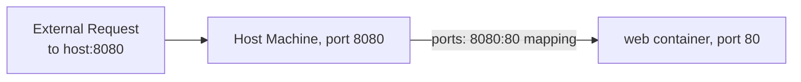

**Real-World Example:** A `docker-compose.yml` for a web application maps host port 8080 to the web container's internal port 80, and separately maps host port 5432 to the database container's internal port 5432 for local debugging access; a developer opens a browser to `localhost:8080` to reach the web app, with Compose handling the port forwarding entirely through the YAML declaration rather than any manual `docker run` flag.

**Exam Strategy:**
- Give the exact `ports:` YAML syntax, including the quoted `"HOST:CONTAINER"` format — command/syntax-recall matters here, consistent with the rest of this unit.
- Explain explicitly what happens with only one port number given (random host port assignment) versus the full `HOST:CONTAINER` pair (fixed, predictable mapping) — a specific, gradable nuance.
- Connect this directly back to `docker run -p` from Unit 1 as the same underlying concept, now expressed in YAML — cross-topic connections are consistently rewarded throughout this document.

---

## LAB EXPERIMENT QUICK REFERENCE

### Experiment 3 — Write a Dockerfile to Build a Personal Image of a Python Program

```dockerfile
FROM python:3.11-slim
WORKDIR /app
COPY requirements.txt .
RUN pip install --no-cache-dir -r requirements.txt
COPY . .
CMD ["python", "app.py"]
```
```
docker build -t my-python-app:1.0 .
docker run my-python-app:1.0
```
**Exam Strategy:** This experiment directly applies topics 9-13 (Dockerfile introduction, building images, and the full instruction set); be ready to write this exact pattern from memory, and explain the dependency-before-code copy ordering (topic 12) if asked why the Dockerfile is structured this way.

### Experiment 4 — Write a Docker Compose Script to Run Multiple Images in a Single Application

```yaml
version: "3.9"
services:
  app:
    build: .
    ports:
      - "5000:5000"
    depends_on:
      - db
  db:
    image: postgres:15
    environment:
      - POSTGRES_PASSWORD=secret
    volumes:
      - db_data:/var/lib/postgresql/data
volumes:
  db_data:
```
```
docker compose up -d
docker compose ps
docker compose down
```
**Exam Strategy:** Note that "multiple images in a single container" in casual phrasing actually means multiple services (each its own container) orchestrated together by one Compose file — clarify this distinction if the question's wording is ambiguous, since a single container running multiple unrelated images is not how Docker works; this experiment directly applies topics 1-4 and 14 (Compose basics, YAML syntax, and port mapping).

---

## FINAL EXAM CHECKLIST

```
[ ] Docker Compose: single-host multi-container tool, docker-compose.yml, up/down commands
[ ] Compose installation: modern "docker compose" (bundled plugin) vs legacy "docker-compose" (standalone binary)
[ ] YAML rules: indentation with spaces only (never tabs), key:value, lists with hyphens, comments with #
[ ] docker-compose.yml structure: services/volumes/networks keys; build vs image; depends_on; service-name-as-hostname
[ ] Docker Swarm: manager vs worker nodes (parallel to Jenkins controller/agent), services not raw containers
[ ] Swarm creation commands: docker swarm init, docker swarm join (worker token vs manager token), docker node ls
[ ] Swarm maintenance: docker service scale, docker service update (rolling update), docker node update --availability drain
[ ] Swarm network security: overlay network + VXLAN (multi-host connectivity), mTLS (control-plane, automatic), IPsec (data-plane, optional --opt encrypted)
[ ] Dockerfile: sequential instructions, each producing a cached layer, version-controlled like Jenkinsfile
[ ] docker build command: -t tag, trailing dot = build context, -f for alternate Dockerfile name, .dockerignore
[ ] Deploying to public repos: docker login -> docker tag (account/repo:tag) -> docker push -> anyone docker pull
[ ] Web server Dockerfile: FROM base image, WORKDIR, dependency-file-COPY before code-COPY (caching), EXPOSE, CMD
[ ] Full Dockerfile instruction set: FROM/RUN/COPY/ADD/WORKDIR/ENV/EXPOSE/CMD/ENTRYPOINT/VOLUME/ARG/USER all defined
[ ] CMD vs ENTRYPOINT: CMD fully overridden by docker run args; ENTRYPOINT args are appended, not replaced
[ ] ENV vs ARG: ENV persists into running container; ARG is build-time only, not in final image
[ ] COPY vs ADD: COPY preferred/predictable; ADD adds URL-fetch and auto-extract behavior
[ ] YAML ports: "HOST:CONTAINER" format exact syntax; single number = random host port assigned
```
